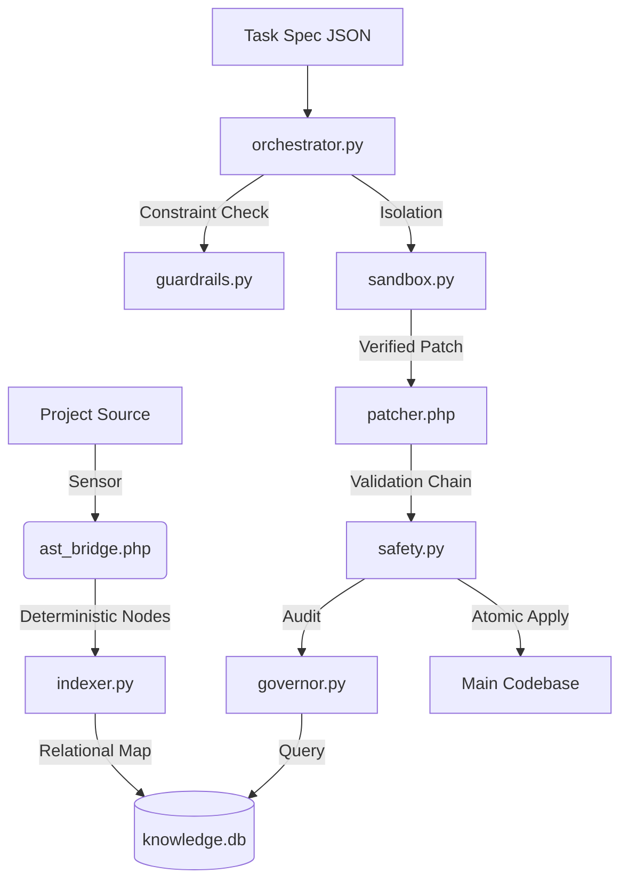

# BGL3 Agent Core: System Specification & Trust Contract 📜

> [!IMPORTANT]
> This manual serves as the **Technical Constitution** for the BGL3 Agent. It is designed for engineers seeking to understand the "Why" and "How" of our autonomous governance layer.

---

## 🎨 1. Architecture Overview

The system follows a decoupled sensory-motor architecture, where observation is separated from execution through a persistent relational memory.

---

## 🧬 2. Evolution: From Heuristics to Determinism

The most significant achievement in BGL3 is the transition from **Probabilistic Observation** to **Deterministic Reasoning**.

### 🚫 The Regex/JSON Legacy (The "Why")

Previously, we used Regex-based scanners. This led to:

- **Shadow Failures**: Regex might match a class name in a string or comment, leading to "Ghost Dependencies".
- **Context Blindness**: Metadata lacked relational context, making it impossible to predict the downstream effects of a method deletion.
- **Trust Erosion**: Small manual fixes were needed for every "automated" task.

### ✅ The AST & SQL Epoch (The "How")

By introducing **`nikic/php-parser`** and **SQLite**, we achieved:

- **True Perception**: We parse the actual Syntax Tree. If it's not a `Node\Stmt\Class_`, it's not a class. No ambiguity.
- **Relational Integrity**: `knowledge.db` allows recursive queries like: *"Find all methods in any Controller that call this specific Service method via the app() helper."*

---

## 🛡️ 3. The Trust Model & Threat Analysis

Autonomous agents possess the technical power to corrupt a codebase. We mitigate this through a strict **Trust Contract**.

### � Trust Levels (Based on Evidence)

The agent assigns a `confidence` level to every piece of memory:

- **HIGH (Constructor Typehints)**: PHP's engine guarantees these dependencies. We trust them for refactoring.
- **MED (app() Helpers / Internal Refs)**: Likely accurate, but requires the **Validation Chain** to confirm behavior.
- **LOW (Inferred/Dynamic)**: Used for monitoring only. The agent **will not** perform structural modifications based on LOW confidence data.

### � Failure Modes & Mitigation

| Scenario | Detection | Action |
| :--- | :--- | :--- |
| **AST Parse Fail** | PHP-Parser Error | Immediate halt. No "Heuristic Guestimation". |
| **Architectural Violation** | `governor.py` Audit | Immediate Rollback. Even if syntax is valid. |
| **Sandbox Corruption** | Git Integrity Check | System Lock. Prevents partial/dirty applies. |

---

## 🖇️ 4. The Execution Contract (Non-Negotiables)

The Orchestrator is more than a runner; it is a **Guardian**. It enforces four immutable laws:

1. **Isolation (Sandbox First)**: No direct project edits. All work is performed in a transient Git clone.
2. **Atomicity**: Execution is binary. If the **Validation Chain** fails at step 99/100, the project is restored to state 0.
3. **The 3-Tier Validation Chain**:
    - **`php -l`**: Ensures target is syntactically sound.
    - **`PHPUnit`**: Ensures functional behavior is preserved.
    - **`Architectural Audit`**: Ensures the change doesn't break domain rules (e.g., circular dependencies).
4. **Style Preservation**: Uses `CloningVisitor` and `FormatPreservingPrinter` to ensure the diff only reflects the intentional change, not a reformat.

---

## 🏗️ 5. Technical Layers

### 📡 Perception (Sensors)

- **`ast_bridge.php`**: Extracts nodes with context stack (tracks parent class/method).
- **`indexer.py`**: Manages the persistent indexing of the project `knowledge.db`.

### 🧠 Cognition (Memory & Logic)

- **`memory.py`**: Relational mapping of `entities`, `methods`, and `calls`.
- **`governor.py`**: Audits the memory against `domain_rules.yml`.

### 🛠️ Actuation (Actuators)

- **`patcher.php`**: The "Scalpel". Performs targeted node modifications.
- **`orchestrator.py`**: The "Surgeon". Manages the sandbox life cycle and validation.

---

## 🚫 6. Non-Goals

The agent is designed **NOT** to:

- Resolve human-introduced merge conflicts.
- Make "guesses" about intent where AST is ambiguous.
- Modify system files or the `.bgl_core` itself.
- Operate outside the `BGL_VENDOR_PATH` boundary.
