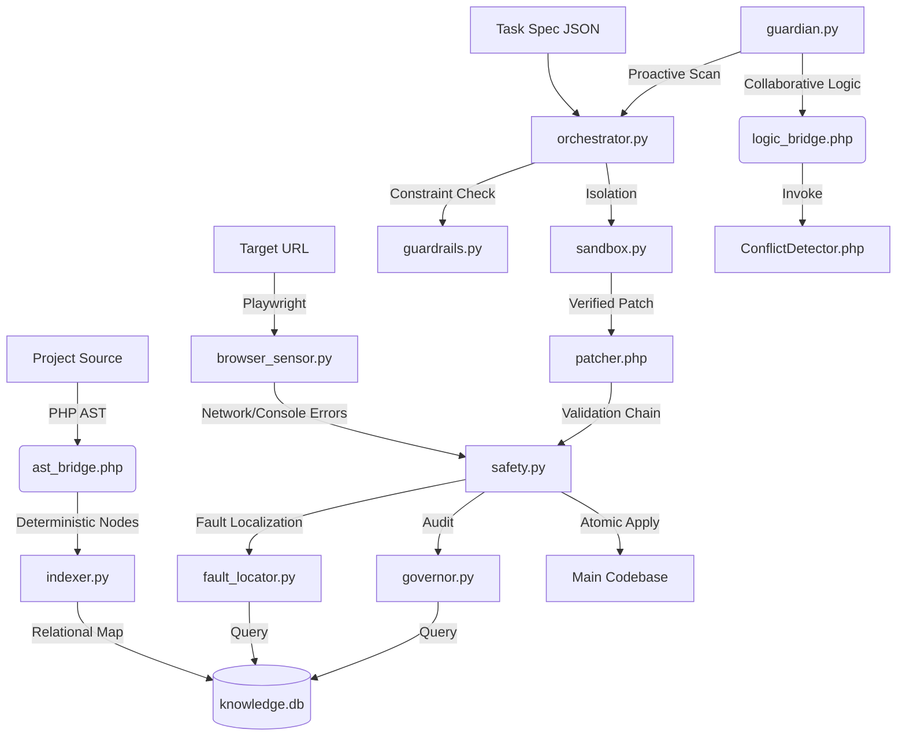

# BGL3 Agent Core: System Specification & Trust Contract 📜

> [!IMPORTANT]
> This manual serves as the **Technical Constitution** for the BGL3 Agent. It is designed for engineers seeking to understand the "Why" and "How" of our autonomous governance layer.

---

## 🎨 1. Architecture Overview

The system follows a decoupled sensory-motor architecture, where observation is separated from execution through a persistent relational memory.

---

## 🧬 2. Evolution: From Heuristics to Determinism

The most significant achievement in BGL3 is the transition from **Probabilistic Observation** to **Deterministic Reasoning**.

### 🚫 The Regex/JSON Legacy (The "Why")

Previously, we used Regex-based scanners. This led to:

- **Shadow Failures**: Regex might match a class name in a string or comment, leading to "Ghost Dependencies".
- **Context Blindness**: Metadata lacked relational context, making it impossible to predict the downstream effects of a method deletion.
- **Trust Erosion**: Small manual fixes were needed for every "automated" task.

### ✅ The AST & SQL Epoch (The "How")

By introducing **`nikic/php-parser`** and **SQLite**, we achieved:

- **True Perception**: We parse the actual Syntax Tree. If it's not a `Node\Stmt\Class_`, it's not a class. No ambiguity.
- **Relational Integrity**: `knowledge.db` allows recursive queries like: *"Find all methods in any Controller that call this specific Service method via the app() helper."*

---

## 🛡️ 3. The Trust Model & Threat Analysis

Autonomous agents possess the technical power to corrupt a codebase. We mitigate this through a strict **Trust Contract**.

### � Trust Levels (Based on Evidence)

The agent assigns a `confidence` level to every piece of memory:

- **HIGH (Constructor Typehints)**: PHP's engine guarantees these dependencies. We trust them for refactoring.
- **MED (app() Helpers / Internal Refs)**: Likely accurate, but requires the **Validation Chain** to confirm behavior.
- **LOW (Inferred/Dynamic)**: Used for monitoring only. The agent **will not** perform structural modifications based on LOW confidence data.

### � Failure Modes & Mitigation

| Scenario | Detection | Action |
| :--- | :--- | :--- |
| **AST Parse Fail** | PHP-Parser Error | Immediate halt. No "Heuristic Guestimation". |
| **Architectural Violation** | `governor.py` Audit | Immediate Rollback. Even if syntax is valid. |
| **Sandbox Corruption** | Git Integrity Check | System Lock. Prevents partial/dirty applies. |

---

### �️ 4. The Guardian & Rule-Guided Remediation (New)

The system now includes an autonomous **Guardian** layer designed for proactive health monitoring and deterministic recovery.

- **Proactive Health Audits**: The agent periodically scans top system routes using `Playwright` to detect frontend/network regressions.
- **Rule-Guided Remediation**: For high-confidence failure patterns (e.g., explicit syntax errors or missing configs), the agent can trigger automated remediation using pre-defined safety rules.
- **Fault Localization (URL ↔ Code)**: Using the Knowledge Graph, the agent maps runtime failures directly to the suspect PHP methods and controllers.

### 🖇️ 5. The Execution Contract (Non-Negotiables)

The Orchestrator enforces five immutable laws:

1. **Isolation (Sandbox First)**: No direct project edits. All work is performed in a transient Git clone.
2. **Atomicity**: Execution is binary. If the **Validation Chain** fails, the project is restored to state 0.
3. **The 4-Tier Validation Chain**:
    - **`php -l`**: Syntax soundness.
    - **`PHPUnit`**: Functional preservation.
    - **`Browser Scan`**: Runtime integrity (No new console/network errors).
    - **`Architectural Audit`**: Domain rule compliance.
4. **Style Preservation**: Uses `FormatPreservingPrinter` to minimize diff noise.
5. **Trust Bounds**: No automated changes are performed on LOW confidence data; these remain as "Suggestions" only.

---

## 🏗️ 6. Technical Layers

### 📡 Perception (Sensors)

- **`ast_bridge.php`**: Extracts PHP nodes with relational context.
- **`browser_sensor.py`**: A Playwright-powered sensor for runtime health.
- **`indexer.py`**: Manages the persistent project indexing.

### 🧠 Cognition (Memory & Logic)

- **`memory.py`**: Relational mapping of types, routes, and health scores.
- **`fault_locator.py`**: Translates URLs to code coordinates.
- **`governor.py`**: Audits memory against `domain_rules.yml`.

### 🛠️ Actuation (Actuators)

- **`patcher.php`**: Targeted AST-based modification.
- **`guardian.py`**: Proactive monitoring and remediation orchestration.
- **`orchestrator.py`**: Sandbox life cycle and collective validation.

---

## 🚫 6. Non-Goals

The agent is designed **NOT** to:

- Resolve human-introduced merge conflicts.
- Make "guesses" about intent where AST is ambiguous.
- Modify system files or the `.bgl_core` itself.
- Operate outside the `BGL_VENDOR_PATH` boundary.

---

## 🔧 7. Hardening Notes (Jan 30, 2026)

- SafetyNet/Guardian now wire `FaultLocator` with project context correctly to avoid initialization crashes.
- Guardrails allowlist widened (app/api/public/resources/config/templates/views/partials/docs) while still blocking vendor/system paths.
- Sandbox apply copies all modified files (git-aware) back to main, skipping vendor/system paths and logging deletions for manual review.
- PHPUnit step now runs matching tests when available; otherwise it skips explicitly.
- BrowserSensor logs are anchored under `.bgl_core/logs/browser_reports` at project root for consistent evidence.
- Route health updates are upserts, preventing SQLite errors when records are missing.
- Patcher hardening: validates inputs, prevents duplicate methods, supports custom method bodies, renames in-file references, and renames files on class rename when applicable.
- Browser runtime sensor + event bridge: frontend emits navigation, UI, API, and JS error events to `/api/agent-event.php`, persisted in `knowledge.db.runtime_events`.
- Context digest job: `.bgl_core/brain/context_digest.py` summarizes recent runtime events into `experiences` for Guardian/Safety insights.
- Scenario scaffolding: `.bgl_core/brain/scenarios/sample.yaml` for Playwright-driven exploration without duplicating sensors.
- Scenario runner: `.bgl_core/brain/scenario_runner.py` executes YAML scenarios via Playwright. Guardian runs it by default (`BGL_RUN_SCENARIOS=1`). المتصفح يظهر افتراضياً (`BGL_HEADLESS` افتراضياً 0); عيّنه 1 للتشغيل الصامت.
- إبقاء المتصفح مفتوحاً: استخدم `BGL_KEEP_BROWSER=1` أو مرر `--keep-open 1` لـ scenario_runner لترك النافذة مفتوحة بعد انتهاء الخطوات (افتراضياً تُغلق لتوفير الموارد).
- قواعد مهيكلة:
  - Domain rules: `.bgl_core/brain/domain_rules.yml` (قواعد نطاق مصنّفة، مع rationale/severity)
  - Style rules: `.bgl_core/brain/style_rules.yml` (قواعد تسمية/تنسيق غير حاجبة)
  - Runtime safety: `.bgl_core/brain/runtime_safety.yml` (فحوص تشغيلية مثل إذونات الكتابة)
- الإعدادات المركزية: `.bgl_core/config.yml` (base_url, headless, run_scenarios, keep_browser, diagnostic_timeout_sec) تُقرأ تلقائياً من Guardian/Master Verify/Scenario Runner.
- AST rename references: `patcher.py` الآن يستخدم action `rename_reference` (AST) لتحديث use/import والمراجع بدلاً من استبدال نصي.
- إعادة التحقق الانتقائي: SafetyNet يشتق اختبارات متأثرة من جدول `calls` و/أو `experiences` لتشغيل PHPUnit بدقة أعلى.
- أولوية الخبرة: Guardian يرتب المسارات بناءً على `experiences` ذات الثقة العالية قبل الفحص الدوري.
- أدلة المتصفح: BrowserSensor يدعم لقطات فشل وHAR عند ضبط `BGL_CAPTURE_HAR=1` و `BGL_CAPTURE_FAILURES` (افتراضياً مفعلة).
- السيناريوهات منظمة هرميًا: `.bgl_core/brain/scenarios/` يدعم ملفات YAML متداخلة (مثال: `scenarios/smoke/home.yaml`, `scenarios/critical/api_smoke.yaml`).
- Playbook rename: `.bgl_core/brain/playbooks/rename_class.md` إلزامي لمسار rename. ADR: `docs/adr/ADR-rename-class-sandbox-autoload.md`.
- مسار تحقق موحّد: `agent_verify.ps1` يشغّل (indexer → scenarios → context_digest → master_verify) مع احترام الإعدادات.
