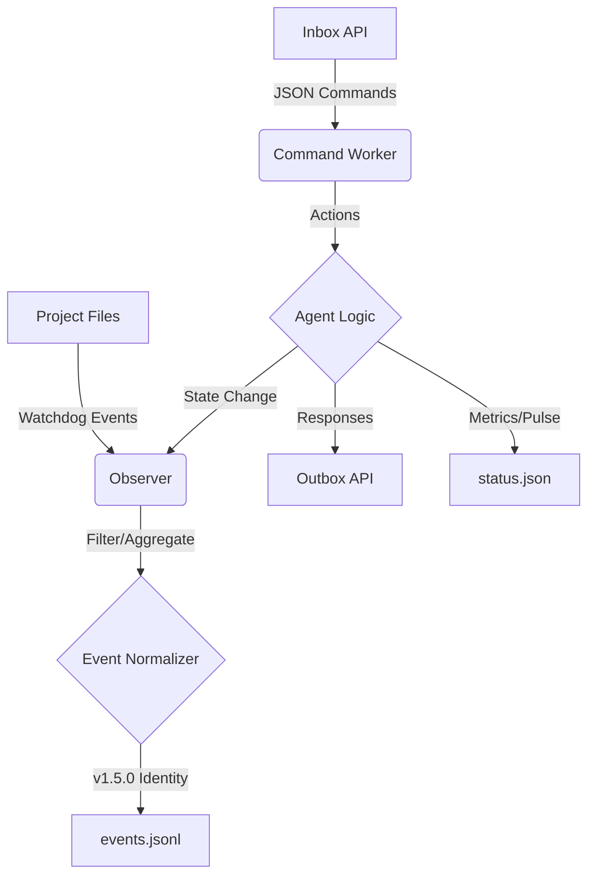

# BGL3 Agent (v1.5.0) 🚀

هذا المجلد يحتوي على "الوكيل" (Agent) الخاص بنظام BGL3، وهو نظام مراقبة أحداث واستشعار (Event Sensor) مصمم لرصد التغييرات في ملفات المشروع والتعامل معها بذكاء.

## 🏗️ المعمارية (Architecture)

يعتمد الوكيل على ثلاث ركائز أساسية تعمل بشكل متناغم:



1. **المراقب (Observer):** يستمع لتغييرات نظام الملفات (إنشاء، تعديل، حذف) باستخدام مكتبة `watchdog`.
2. **تنميط الأحداث (Event Normalization):** يتم تجميع الأحداث وتصفيتها (Debouncing & Aggregation) لتقليل "الضجيج" البرمجي وتحويلها لصيغة معيارية.
3. **قناة الأوامر (Command Channel):** يعمل بنظام `inbox/outbox` عبر ملفات JSON، مما يجعله مستقلاً تماماً عن التطبيق الرئيسي.

## 📂 هيكلية المجلد (Directory Structure)

- `main.py`: القلب النابض للوكيل، مكتوب بلغة Python.
- `config.yml`: ملف الإعدادات الرئيسي (Features & Behavior).
- `commands/`:
  - `inbox/`: ضع ملفات JSON هنا لإصدار أوامر للوكيل.
  - `outbox/`: هنا تجد ردود الوكيل على أوامرك.
- `scripts/`: أدوات مساعدة للاختبار، تدوير السجلات، والتهيئة.
- `events.jsonl`: سجل الأحداث التاريخي بصيغة JSON Structured.
- `status.json`: نبض النظام (Heartbeat) يعرض الحالة الحالية للوكيل.

## 🚀 التشغيل (Getting Started)

1. **التثبيت:** تأكد من تثبيت المكتبات المطلوبة:

    ```bash
    pip install watchdog pyyaml
    ```

2. **التشغيل:**

    ```bash
    python .guardian/agent/main.py
    ```

    أو استخدم سكربت تشغيل PowerShell المهيأ مسبقاً.

## 🛠️ الأوامر المدعومة (Supported Commands)

يمكنك التحكم في الوكيل عبر إرسال ملفات JSON إلى `agent/commands/inbox/`:

- `ping`: للتأكد من استجابة الوكيل.
- `pause` / `resume`: لإيقاف المراقبة مؤقتاً أو استئنافها.
- `rotate_logs`: لتدوير السجلات القديمة وتصفير الملفات الحالية بأمان.
- `set_ignored` / `add_ignored`: لتعديل قواعد التجاهل أثناء التشغيل.

## 📝 نموذج بيانات الأحداث (Event Schema)

الأحداث في `events.jsonl` تتبع هيكلية ثابتة (v1.4.0):

```json
{
  "id": "ee230e4f-b4ab-42aa-b72e-e59ab2096ad6",
  "seq": 4,
  "ts": "2026-01-29T15:25:07.038128+00:00",
  "event": "modified",
  "path_rel": "index.php",
  "path_abs": "C:\\path\\to\\index.php",
  "is_dir": false
}
```

## ⚠️ ملاحظات هامة (Troubleshooting)

- **بيئة Windows:** في حالات نادرة عند تدوير السجلات، قد يظهر خطأ `[WinError 32]` بسبب قفل الملفات من النظام. الوكيل سيكمل عمله تلقائياً دون فقدان أحداث.
- **التجاهل (Ignore):** يتم تجاهل المجلدات الثقيلة مثل `vendor` و `node_modules` افتراضياً لضمان الأداء.

- [Evaluation Report v1.5.0](file:///c:/Users/Bakheet/Documents/Projects/BGL3/agent/docs/evaluation_v1.5.0.md)

## 🧭 التكامل مع الدماغ (Brain Integration)

بدءاً من الإصدار **1.5.0**، لم يعد الوكيل يعمل بمفرده. هو يشكل "طبقة الاستشعار" (Sensing Layer)، بينما تتم معالجة المعنى في مجلد `brain/`:

- **مهمة الوكيل:** رصد الأحداث، تسجيلها، وإدارة الأوامر الخام.
- **مهمة الدماغ:** تحليل الأنماط الدلالية، فهم جغرافيا المشروع، واتخاذ القرارات (قيد التطوير).

---
**ملاحظة للمطورين:** الوكيل مصمم ليكون "مستشعراً" (Sensor) صادقاً ودقيقاً. للحصول على تحليل ذكي لما يحدث في الكود، يرجى مراجعة [Brain README](../brain/README.md).
