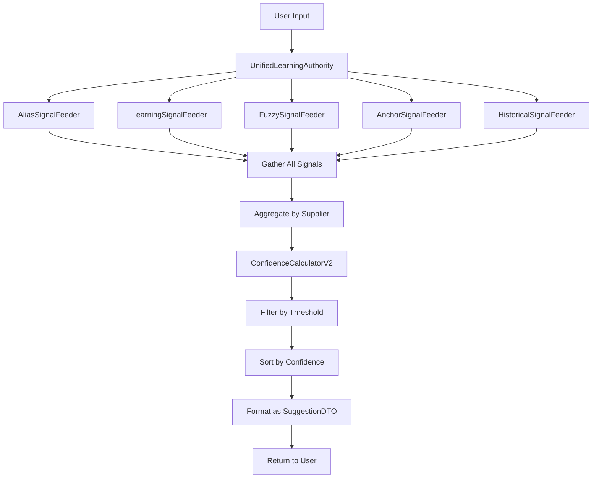

# Learning Canonical Model

## Deliverable #1 - Phase Contract: Learning Merge

**التاريخ**: 2026-01-03  
**الحالة**: Canonical Reference (Single Source of Truth)  
**الغرض**: توثيق كامل لكل signal في النظام مع حساباته الدقيقة

---

## 📋 Signal Types Inventory

**Total Signal Types**: **10 distinct signals**

| Signal ID | Signal Type | Source System | Strength | Base Score |
|-----------|-------------|---------------|----------|------------|
| S1 | `alias_exact` | System #2 (Aliases) | 1.0 | 100 |
| S2 | `entity_anchor_unique` | System #5 (Anchors) | 0.9-1.0 | 90 |
| S3 | `entity_anchor_generic` | System #5 (Anchors) | 0.5-0.7 | 75 |
| S4 | `fuzzy_official_strong` | System #4 (Fuzzy) | 0.85+ | 85 |
| S5 | `fuzzy_official_medium` | System #4 (Fuzzy) | 0.70-0.84 | 70 |
| S6 | `fuzzy_official_weak` | System #4 (Fuzzy) | 0.55-0.69 | 55 |
| S7 | `historical_frequent` | System #3 (Historical) | log-scale | 60 |
| S8 | `historical_occasional` | System #3 (Historical) | log-scale | 45 |
| S9 | `learning_confirmation` | System #1 (Explicit) | count/10 | (booster) |
| S10 | `learning_rejection` | System #1 (Explicit) | count/5 | (penalty) |

---

## 🔍 Signal Detailed Specifications

### SIGNAL S1: `alias_exact`

**Source**: System #2 - Alternative Names (Aliases)

#### Definition
Exact normalized match found in `supplier_alternative_names` table.

#### Generation Logic
**File**: `app/Services/Learning/Feeders/AliasSignalFeeder.php:32-56`

```php
// Query: findAllByNormalizedName($normalizedInput)
SELECT * FROM supplier_alternative_names
WHERE normalized_name = ?
-- NO usage_count filtering (compliant query)

// For each alias:
SignalDTO(
    supplier_id: alias.supplier_id,
    signal_type: 'alias_exact',
    raw_strength: 1.0,  // Always maximum
    metadata: {
        source: 'alias',
        alternative_name: alias.alternative_name,
        alias_source: alias.source  // 'learning' | 'manual' | 'import'
        usage_count: alias.usage_count  // For context only
    }
)
```

#### Base Score
**Value**: `100` (highest possible)  
**Source**: `ConfidenceCalculatorV2.php:35`

#### Effect on Confidence
```
Base Confidence = 100
+ Confirmation Boost (if any)
+ Strength Modifier (0 for non-fuzzy)
- Rejection Penalty (if any)
= Final Confidence
```

#### Special Behavior
- **Trust Gate Integration**: 
  - If `alias.source == 'learning'` AND conflicts exist → **BLOCK auto-match**
  - Location: `SmartProcessingService.php:443`

#### Data Source
**Table**: `supplier_alternative_names`  
**Query Pattern**: Direct match on `normalized_name` (indexed)

---

### SIGNAL S2: `entity_anchor_unique`

**Source**: System #5 - Entity Anchor Extraction

#### Definition
Distinctive anchor (appearing in ≤2 suppliers) extracted from input and matched.

#### Generation Logic
**File**: `app/Services/Learning/Feeders/AnchorSignalFeeder.php:38-74`

```php
// 1. Extract anchors
anchors = ArabicEntityExtractor::extractAnchors($normalizedInput)
// Removes common words: شركة, مؤسسة, مكتب, دار

// 2. For each anchor:
matchingSuppliers = SupplierRepository::findByAnchor(anchor)
  // SELECT * FROM suppliers WHERE official_name LIKE '%anchor%'

frequency = countSuppliersWithAnchor(anchor)
  // SELECT COUNT(*) FROM suppliers WHERE official_name LIKE '%anchor%'

// 3. If frequency <= 2:
SignalDTO(
    supplier_id: supplier.id,
    signal_type: 'entity_anchor_unique',
    raw_strength: (frequency == 1) ? 1.0 : 0.9,
    metadata: {
        source: 'entity_anchor',
        matched_anchor: anchor,
        anchor_frequency: frequency,
        anchor_type: classifyAnchorType(anchor)  // 'legal_prefix' | 'distinctive_name'
    }
)
```

#### Strength Calculation
**Formula**: Based on anchor frequency
```
frequency == 1 → strength = 1.0  (perfectly unique)
frequency == 2 → strength = 0.9  (very distinctive)
```

**Code**: `AnchorSignalFeeder.php:118-129`

#### Base Score
**Value**: `90`  
**Source**: `ConfidenceCalculatorV2.php:36`

#### Effect on Confidence
```
Base Confidence = 90
+ Confirmation Boost
+ Strength Modifier (0 for non-fuzzy)
- Rejection Penalty
= Final Confidence
```

#### Data Source
**Table**: `suppliers.official_name`  
**Query Pattern**: `LIKE '%anchor%'` (multiple queries per request)

---

### SIGNAL S3: `entity_anchor_generic`

**Source**: System #5 - Entity Anchor Extraction

#### Definition
Common anchor (appearing in 3+ suppliers) matched.

#### Generation Logic
**Same as S2**, but different tier based on frequency:

```php
// If frequency >= 3:
SignalDTO(
    signal_type: 'entity_anchor_generic',
    raw_strength: (frequency <= 5) ? 0.7 : 0.5,
    ...
)
```

#### Strength Calculation
```
frequency 3-5  → strength = 0.7  (somewhat distinctive)
frequency > 5  → strength = 0.5  (generic/common)
```

#### Base Score
**Value**: `75`  
**Source**: `ConfidenceCalculatorV2.php:37`

#### Rationale
Generic anchors (like "شركة", "التجارة") match too many suppliers → lower confidence.

---

### SIGNAL S4: `fuzzy_official_strong`

**Source**: System #4 - Fuzzy Matching

#### Definition
High similarity (≥0.85) between normalized input and supplier's official name using Levenshtein distance.

#### Generation Logic
**File**: `app/Services/Learning/Feeders/FuzzySignalFeeder.php:42-75`

```php
// Get ALL suppliers
allSuppliers = SupplierRepository::getAllSuppliers()

// For each supplier:
similarity = calculateSimilarity(input, supplier.normalized_name)
  // Formula: 1 - (levenshtein(str1, str2) / max_length)

// If similarity >= 0.85:
SignalDTO(
    signal_type: 'fuzzy_official_strong',
    raw_strength: similarity,  // 0.85 - 1.0
    metadata: {
        source: 'fuzzy_official',
        match_method: 'levenshtein',
        similarity: similarity,
        matched_name: supplier.normalized_name
    }
)
```

#### Strength Calculation
**Formula**: Levenshtein-based similarity
```
distance = levenshtein(input, supplier_name)
max_length = max(length(input), length(supplier_name))
similarity = 1 - (distance / max_length)
```

**Code**: `FuzzySignalFeeder.php:86-103`

#### Base Score
**Value**: `85`  
**Source**: `ConfidenceCalculatorV2.php:38`

#### Effect on Confidence
```
Base Confidence = 85
+ Confirmation Boost
+ Strength Modifier  ← Special for fuzzy signals!
- Rejection Penalty
= Final Confidence
```

#### Strength Modifier (Fuzzy Only)
**Formula**:
```php
// ConfidenceCalculatorV2.php:209-219
strengthModifier = (raw_strength - 0.9) × 50

Examples:
  similarity = 1.0  → modifier = (1.0 - 0.9) × 50 = +5
  similarity = 0.9  → modifier = 0
  similarity = 0.85 → modifier = (0.85 - 0.9) × 50 = -2.5 → -2
```

**Range**: -10 to +5

#### Data Source
**Table**: `suppliers.normalized_name`  
**Query Pattern**: Full table scan, compute similarity for ALL suppliers

---

### SIGNAL S5: `fuzzy_official_medium`

**Source**: System #4 - Fuzzy Matching

#### Definition
Medium similarity (0.70 - 0.84) using same logic as S4.

#### Base Score
**Value**: `70`  
**Source**: `ConfidenceCalculatorV2.php:39`

#### Strength Modifier
Same formula as S4, applied to medium-tier fuzzy matches.

---

### SIGNAL S6: `fuzzy_official_weak`

**Source**: System #4 - Fuzzy Matching

#### Definition  
Low similarity (0.55 - 0.69) using same logic as S4.

#### Base Score
**Value**: `55`  
**Source**: `ConfidenceCalculatorV2.php:40`

#### Minimum Threshold
**Cutoff**: `0.55`  
Below this, no signal is emitted.  
**Code**: `FuzzySignalFeeder.php:30`

---

### SIGNAL S7: `historical_frequent`

**Source**: System #3 - Historical Selections

#### Definition
Supplier was selected ≥5 times historically for this supplier name (from raw_data).

#### Generation Logic
**File**: `app/Services/Learning/Feeders/HistoricalSignalFeeder.php:36-65`

```php
// Query: getHistoricalSelections($normalizedInput)
$pattern = '%"supplier":"' . $normalizedInput . '"%';

SELECT d.supplier_id, COUNT(*) as count
FROM guarantees g
JOIN guarantee_decisions d ON g.id = d.guarantee_id
WHERE g.raw_data LIKE ? 
  AND d.supplier_id IS NOT NULL
GROUP BY d.supplier_id

// For each with count >= 5:
SignalDTO(
    signal_type: 'historical_frequent',
    raw_strength: calculateHistoricalStrength(count),
    metadata: {
        source: 'historical',
        selection_count: count,
        data_source: 'guarantee_decisions'
    }
)
```

#### Strength Calculation
**Formula**: Logarithmic scale (diminishing returns)

```php
// HistoricalSignalFeeder.php:88-103
if (count == 0) return 0.0;

strength = 0.3 + (0.5 × log(count + 1) / log(20))

Examples:
  count = 1  → strength = 0.3
  count = 5  → strength ≈ 0.6
  count = 10 → strength ≈ 0.7
  count = 20 → strength ≈ 0.8
  count = 50 → strength ≈ 0.85 (capped at 1.0)
```

**Rationale**: After initial selections, additional history has diminishing impact.

#### Base Score
**Value**: `60`  
**Source**: `ConfidenceCalculatorV2.php:41`

#### Data Source
**Tables**: `guarantees.raw_data` + `guarantee_decisions.supplier_id`  
**Query Pattern**: ⚠️ **FRAGILE JSON LIKE** (must be replaced in merge)

---

### SIGNAL S8: `historical_occasional`

**Source**: System #3 - Historical Selections

#### Definition
Supplier was selected 1-4 times historically.

#### Same Logic as S7
Different tier based on count:
```php
if (count < 5) signal_type = 'historical_occasional'
```

#### Base Score
**Value**: `45`  
**Source**: `ConfidenceCalculatorV2.php:42`

---

### SIGNAL S9: `learning_confirmation`

**Source**: System #1 - Explicit Learning

#### Definition
User explicitly confirmed this supplier for this input (via save-and-next).

#### Generation Logic
**File**: `app/Services/Learning/Feeders/LearningSignalFeeder.php:36-77`

```php
// Query: getUserFeedback($normalizedInput)
SELECT supplier_id, action, COUNT(*) as count
FROM learning_confirmations
WHERE raw_supplier_name = ?
GROUP BY supplier_id, action

// For each with action == 'confirm':
SignalDTO(
    signal_type: 'learning_confirmation',
    raw_strength: min(1.0, count / 10),  // Normalized
    metadata: {
        source: 'learning',
        confirmation_count: count,
        action: 'confirm'
    }
)
```

#### Strength Calculation
**Formula**:
```
strength = min(1.0, count / 10)

Examples:
  1 confirmation  → strength = 0.1
  5 confirmations → strength = 0.5
  10+ confirmations → strength = 1.0 (capped)
```

**Code**: `LearningSignalFeeder.php:54`

#### Base Score
**N/A** - This signal is a **BOOSTER**, not a primary signal.

#### Effect on Confidence
**Applied as Confirmation Boost**:

```php
// ConfidenceCalculatorV2.php:165-176
if (count == 0) boost = 0
else if (count <= 2) boost = +5
else if (count <= 5) boost = +10
else boost = +15  // 6+ confirmations
```

**Contribution**:
```
Base Confidence (from primary signal)
+ Confirmation Boost  ← S9 effect here
- Rejection Penalty
= Final Confidence
```

#### Data Source
**Table**: `learning_confirmations` (action='confirm')  
**Write Point**: `api/save-and-next.php:273-281`

---

### SIGNAL S10: `learning_rejection`

**Source**: System #1 - Explicit Learning

#### Definition
User explicitly or implicitly rejected this supplier for this input.

#### Generation Logic
**Same as S9**, but for rejections:

```php
// For each with action == 'reject':
SignalDTO(
    signal_type: 'learning_rejection',
    raw_strength: min(1.0, count / 5),  // Faster accumulation
    metadata: {
        source: 'learning',
        rejection_count: count,
        action: 'reject'
    }
)
```

#### Strength Calculation
**Formula**: Faster accumulation than confirmations
```
strength = min(1.0, count / 5)

Examples:
  1 rejection  → strength = 0.2
  3 rejections → strength = 0.6
  5+ rejections → strength = 1.0 (capped)
```

**Rationale**: Rejections should have faster impact to suppress bad suggestions.

**Code**: `LearningSignalFeeder.php:65`

#### Base Score
**N/A** - This signal is a **PENALTY**, not a primary signal.

#### Effect on Confidence
**Applied as Rejection Penalty**:

```php
// ConfidenceCalculatorV2.php:191-202
// Multiplicative penalty: 25% per rejection
penaltyFactor = pow(0.75, rejectionCount)
finalConfidence = baseConfidence × penaltyFactor

Examples:
  0 rejections → 100% (no penalty)
  1 rejection  → 75% of base
  2 rejections → 56.25% of base
  3 rejections → 42.2% of base
  4+ rejections → 31.6% of base (effectively hidden)
```

**Phase Contract Decision**: 
- ✅ Implicit rejection has **same penalty** as explicit
- ✅ Penalty is **lighter** than removing suggestion (multiplicative vs absolute)

#### Data Source
**Table**: `learning_confirmations` (action='reject')  
**Write Points**:
- Explicit: (not seen in current code - only implicit)
- **Implicit**: `api/save-and-next.php:290-298` ← **ACTIVE**

---

## 🎯 Confidence Calculation Formula

### Master Formula

**File**: `app/Services/Learning/ConfidenceCalculatorV2.php:59-86`

```
Step 1: Identify Primary Signal
  → Select signal with highest BASE_SCORE

Step 2: Get Base Score
  baseScore = BASE_SCORES[primary.signal_type] ?? 40

Step 3: Calculate Confirmation Boost
  if (confirmCount == 0) boost = 0
  else if (confirmCount <= 2) boost = +5
  else if (confirmCount <= 5) boost = +10
  else boost = +15

Step 4: Calculate Strength Modifier (fuzzy only)
  if (signal_type starts with 'fuzzy_'):
    modifier = (raw_strength - 0.9) × 50
  else:
    modifier = 0

Step 5: Compute Base Confidence
  baseConfidence = baseScore + boost + modifier
  baseConfidence = clamp(baseConfidence, 0, 100)

Step 6: Apply Rejection Penalty
  penaltyFactor = 0.75 ^ rejectionCount
  finalConfidence = baseConfidence × penaltyFactor

Step 7: Clamp Final Result
  result = clamp(finalConfidence, 0, 100)
```

### Example Calculation

**Input**: "شركة النورس"

**Signals Received**:
1. `alias_exact` (strength=1.0) → base=100
2. `fuzzy_official_strong` (strength=0.92) → base=85
3. `historical_frequent` (count=7, strength=0.65) → base=60
4. `learning_confirmation` (count=3)
5. `learning_rejection` (count=1)

**Calculation**:
```
Primary Signal: alias_exact (highest base score = 100)
Base Score: 100
Confirmation Boost: count=3 → +10
Strength Modifier: 0 (not fuzzy)
Base Confidence: 100 + 10 + 0 = 110 → clamped to 100
Rejection Penalty: 1 rejection → × 0.75 = 75
Final Confidence: 75
```

**Result**: **75% confidence** (Level C - Medium)

---

## 📊 Signal Priority Matrix

When multiple signals exist for same supplier, which takes precedence?

### Priority Order (by Base Score)

| Rank | Signal Type | Base Score | Notes |
|------|-------------|------------|-------|
| 1 | `alias_exact` | 100 | Always wins if present |
| 2 | `entity_anchor_unique` | 90 | Very distinctive match |
| 3 | `fuzzy_official_strong` | 85 | High similarity |
| 4 | `entity_anchor_generic` | 75 | Common anchor |
| 5 | `fuzzy_official_medium` | 70 | Medium similarity |
| 6 | `historical_frequent` | 60 | Pattern-based |
| 7 | `fuzzy_official_weak` | 55 | Low similarity |
| 8 | `historical_occasional` | 45 | Weak pattern |
| - | `learning_confirmation` | (boost) | Not primary |
| - | `learning_rejection` | (penalty) | Not primary |

**Selection Logic**: `ConfidenceCalculatorV2.php:133-147`

```php
// Identify primary signal (highest base score)
foreach (signals as signal) {
    baseScore = BASE_SCORES[signal.signal_type] ?? 0;
    if (baseScore > highestBaseScore) {
        primarySignal = signal;
    }
}
```

---

## ⚙️ Settings & Thresholds

### Display Thresholds

**File**: `app/Support/Settings.php`

|Setting | Value | Purpose |
|--------|-------|---------|
| `MATCH_AUTO_THRESHOLD` | 0.90 (90%) | Auto-accept without review |
| `MATCH_REVIEW_THRESHOLD` | 0.70 (70%) | Minimum to show in list |
| `MATCH_WEAK_THRESHOLD` | 0.70 (70%) | Synced with review |
| `LEARNING_SCORE_CAP` | 0.90 (90%) | Max score for learning-based |

### Confidence Levels

**File**: `ConfidenceCalculatorV2.php:94-111`

```
Level A: >= 90% → Auto-accept (handled by SmartProcessingService)
Level B: >= 85% → High confidence
Level C: >= 70% → Medium confidence (above review threshold)
Level D: < 70%  → Low confidence (below review threshold)
```

### Minimum Display

**Hard Floor**: `40%`  
Below this, suggestions are **not shown** to user.  
**Code**: `ConfidenceCalculatorV2.php:124`

---

## 🗄️ Data Sources Summary

### Tables Used by Learning Systems

| Table | Signals Using It | Query Type | Indexed? |
|-------|------------------|------------|----------|
| `supplier_alternative_names` | S1 (alias_exact) | Exact match | ✅ Yes |
| `suppliers` | S2, S3, S4, S5, S6 | LIKE / Full scan | ⚠️ Partial |
| `guarantees.raw_data` | S7, S8 | JSON LIKE | ❌ No |
| `guarantee_decisions` | S7, S8 | JOIN + GROUP | ❌ No |
| `learning_confirmations` | S9, S10 | Exact match + GROUP | ❌ No |

### Performance Notes

**Fast Queries**: ✅
- S1: indexed lookup on `normalized_name`

**Medium Queries**: ⚠️
- S9, S10: group by on raw_supplier_name (no index)

**Slow Queries**: 🔴
- S2, S3: LIKE '%anchor%' (multiple times)
- S4, S5, S6: full table scan + lev computation
- S7, S8: JSON LIKE '%"key":"%' (full scan)

---

## 🔄 Signal Lifecycle

### Flow Diagram



### Code Path

**Entry Point**: `UnifiedLearningAuthority::getSuggestions()`

```php
// 1. Normalize input
normalized = Normalizer::normalize(rawInput)

// 2. Gather signals from ALL feeders
signals = []
foreach (feeders as feeder) {
    signals.append(feeder->getSignals(normalized))
}

// 3. Aggregate by supplier_id
grouped = groupBySupplier(signals)

// 4. Calculate confidence for each
foreach (supplier in grouped) {
    confidence = ConfidenceCalculatorV2::calculate(
        signals: supplier.signals,
        confirmationCount: supplier.confirmations,
        rejectionCount: supplier.rejections
    )
}

// 5. Filter by threshold (70%)
candidates = suppliers WHERE confidence >= 70

// 6. Sort descending
candidates.sort(by: confidence DESC)

// 7. Format
suggestions = SuggestionFormatter::format(candidates)

// 8. Return
return suggestions
```

---

## ✅ Canonical Assertions

### Assertion #1: Signal Independence
**Each feeder MUST emit signals independently**  
No feeder may read signals from another feeder.

**Verification**: All feeders implement `SignalFeederInterface` with single method `getSignals()`.

---

### Assertion #2: Primary Signal Selection
**Confidence is based on ONE primary signal, not weighted average**  
Other signals provide context (confirmations/rejections).

**Code**: `ConfidenceCalculatorV2.php:66`

---

### Assertion #3: Confirmation Boost is Additive
**Confirmations add fixed amounts (+5/+10/+15), not multiplicative**

**Code**: `ConfidenceCalculatorV2.php:165-176`

---

### Assertion #4: Rejection Penalty is Multiplicative
**Each rejection reduces confidence by 25% (not fixed amount)**

**Formula**: `confidence × 0.75^rejectionCount`  
**Code**: `ConfidenceCalculatorV2.php:191-202`

---

### Assertion #5: Fuzzy Signals Have Strength Modifier
**Only fuzzy signals adjust base score by raw_strength**  
All other signals use fixed base scores.

**Code**: `ConfidenceCalculatorV2.php:209-219`

---

### Assertion #6: Implicit Rejection == Explicit Rejection
**Both have same penalty (25% per rejection)**

**Evidence**:
- Implicit rejection logged with `action='reject'` (save-and-next.php:296)
- Same query groups both: `WHERE action='reject'` (LearningRepository.php:41)
- Same penalty applied (ConfidenceCalculatorV2.php:191)

**Phase Contract**: ✅ Confirmed and binding

---

## 🎯 Merge Compatibility Matrix

### Which Signals Can Share Tables?

| Signal(s) | Current Table | Proposed Unified Table | Conflict? |
|-----------|---------------|------------------------|-----------|
| S9, S10 | `learning_confirmations` | ✅ Same (already unified) | ❌ No |
| S7, S8 | `guarantees` + `guarantee_decisions` | ⚠️ Separate system | ⚠️ Maybe |
| S1 | `supplier_alternative_names` | ✅ Keep separate | ❌ No |
| S2, S3 | Computed (suppliers) | N/A (computational) | ❌ No |
| S4, S5, S6 | Computed (suppliers) | N/A (computational) | ❌ No |

### Recommendation

**Merge S9 + S10**: Already in same table ✅  
**Keep S7, S8 separate**: Different purpose (historical patterns vs explicit feedback)  
**Keep S1 separate**: Alias management is distinct domain  
**S2-S6**: Computational, no storage

---

## 📋 Validation Checklist

Before considering canonical model complete:

- [x] ✅ All 10 signal types documented
- [x] ✅ Strength calculation formulas provided
- [x] ✅ Base scores from ConfidenceCalculatorV2 referenced
- [x] ✅ Code locations cited (file:line)
- [x] ✅ Data sources identified
- [x] ✅ Confidence formula documented
- [x] ✅ Priority matrix provided
- [x] ✅ Signal lifecycle mapped
- [x] ✅ Performance characteristics noted
- [x] ✅ Phase Contract assertions verified

---

**Canonical Model Version**: 1.0  
**Last Updated**: 2026-01-03  
**Status**: ✅ **Complete and Binding**

*This document is the single source of truth for all learning signals in BGL3.*

---

## 📎 Quick Reference Card

### Signal Types (Copy-Paste Ready)

```
S1:  alias_exact              → base=100 → Exact alias match
S2:  entity_anchor_unique      → base=90  → Distinctive anchor (freq≤2)
S3:  entity_anchor_generic     → base=75  → Common anchor (freq≥3)
S4:  fuzzy_official_strong     → base=85  → High fuzzy (sim≥0.85)
S5:  fuzzy_official_medium     → base=70  → Med fuzzy (sim 0.70-0.84)
S6:  fuzzy_official_weak       → base=55  → Low fuzzy (sim 0.55-0.69)
S7:  historical_frequent       → base=60  → Historical (count≥5)
S8:  historical_occasional     → base=45  → Historical (count 1-4)
S9:  learning_confirmation     → boost    → User confirmed (count/10)
S10: learning_rejection        → penalty  → User rejected (count/5, ×0.75per)
```

### Formula Quick Ref

```
Confidence = clamp(
    (BaseScore + ConfirmBoost + StrengthMod) × (0.75^rejections),
    0, 100
)

ConfirmBoost: count≤2→+5, count≤5→+10, count>5→+15
StrengthMod: fuzzy only, (strength-0.9)×50, range -10 to +5
Rejection: 25% per rejection (multiplicative)
```

---

*End of Learning Canonical Model*
