# Verification & Comparison Plan

## Document #3 - Learning Merge Phase

**التاريخ**: 2026-01-03  
**الحالة**: Testing Strategy  
**الهدف**: تعريف كيفية إثبات أن الدمج ناجح (same input → same output)

---

## 🎯 Testing Philosophy

**Core Principle**: **Regression Testing**

```
Before Merge: Input X → Output Y
After Merge:  Input X → Output Y (SAME)
```

**Not**:
- ❌ Unit testing individual methods
- ❌ Integration testing new features
- ❌ Performance benchmarking (nice-to-have, not blocking)

**But**:
- ✅ **End-to-end comparison** (before vs after)
- ✅ **Behavioral verification** (same suggestions, same confidence)
- ✅ **Data integrity** (no data loss)

---

## 📋 Test Strategy Overview

### 3-Tier Testing Approach

```mermaid
graph TD
    A[Tier 1: Data Validation] --> B{Data OK?}
    B -->|YES| C[Tier 2: Signal Comparison]
    B -->|NO| F[❌ STOP - Fix Migration]
    C --> D{Signals OK?}
    D -->|YES| E[Tier 3: End-to-End Comparison]
    D -->|NO| F
    E --> G{E2E OK?}
    G -->|YES| H[✅ MERGE SUCCESS]
    G -->|NO| F
```



**Tier 1**: Schema & Data  
**Tier 2**: Signals (per system)  
**Tier 3**: Full suggestions (integrated)

---

## TIER 1: Data Validation Tests

### Purpose
Verify database migration completed successfully with no data loss.

---

### Test 1.1: Schema Changes Applied

**Objective**: Verify all new columns and indexes exist.

**Commands**:
```bash
sqlite3 storage/database/app.sqlite "
  PRAGMA table_info(guarantees);
" | grep normalized_supplier_name

sqlite3 storage/database/app.sqlite "
  PRAGMA table_info(learning_confirmations);
" | grep normalized_supplier_name

sqlite3 storage/database/app.sqlite "
  PRAGMA index_list(guarantees);
" | grep idx_guarantees_normalized_supplier

sqlite3 storage/database/app.sqlite "
  PRAGMA index_list(learning_confirmations);
" | grep idx_learning_confirmations_normalized
```

**Success Criteria**:
- ✅ All columns exist
- ✅ All indexes exist

---

### Test 1.2: Data Population Completeness

**Objective**: Verify all rows have normalized values populated.

**SQL**:
```sql
-- guarantees
SELECT 
    COUNT(*) as total,
    COUNT(normalized_supplier_name) as populated,
    COUNT(*) - COUNT(normalized_supplier_name) as missing
FROM guarantees;

-- Expected: missing = 0
```

```sql
-- learning_confirmations
SELECT 
    COUNT(*) as total,
    COUNT(normalized_supplier_name) as populated,
    COUNT(*) - COUNT(normalized_supplier_name) as missing
FROM learning_confirmations;

-- Expected: missing = 0
```

**Acceptance**: `missing = 0` for both tables

---

### Test 1.3: Normalization Correctness

**Objective**: Verify normalized values match manual normalization.

**PHP Script**:
```php
// scripts/verify_normalization.php

require __DIR__ . '/../app/Utils/ArabicNormalizer.php';
require __DIR__ . '/../app/Support/Database.php';

$db = \App\Support\Database::connect();

// Sample check: 100 random guarantees
$stmt = $db->query("
    SELECT id, raw_data, normalized_supplier_name 
    FROM guarantees 
    WHERE normalized_supplier_name IS NOT NULL
    ORDER BY RANDOM() 
    LIMIT 100
");

$errors = 0;
while ($row = $stmt->fetch(PDO::FETCH_ASSOC)) {
    $rawData = json_decode($row['raw_data'], true);
    $supplierName = $rawData['supplier'] ?? null;
    
    if ($supplierName) {
        $expected = \App\Utils\ArabicNormalizer::normalize($supplierName);
        $actual = $row['normalized_supplier_name'];
        
        if ($expected !== $actual) {
            echo "❌ Mismatch on ID {$row['id']}: expected='$expected', actual='$actual'\n";
            $errors++;
        }
    }
}

if ($errors === 0) {
    echo "✅ All 100 samples normalized correctly\n";
} else {
    echo "❌ Found $errors mismatches\n";
    exit(1);
}
```

**Run**:
```bash
php scripts/verify_normalization.php
```

**Acceptance**: ✅ 0 errors

---

### Test 1.4: Row Count Verification

**Objective**: Ensure no data was lost or duplicated.

**SQL**:
```sql
-- Compare row counts (should be SAME as before migration)
SELECT 'guarantees' as table_name, COUNT(*) as count FROM guarantees
UNION ALL
SELECT 'learning_confirmations', COUNT(*) FROM learning_confirmations
UNION ALL
SELECT 'guarantee_decisions', COUNT(*) FROM guarantee_decisions;
```

**Execution**:
```bash
# Before migration
sqlite3 app.sqlite.backup "..." > before_counts.txt

# After migration
sqlite3 app.sqlite "..." > after_counts.txt

# Compare
diff before_counts.txt after_counts.txt
```

**Acceptance**: ✅ Identical counts

---

## TIER 2: Signal Comparison Tests

### Purpose
Verify each signal type produces identical results before/after.

---

### Test 2.1: Alias Signal (S1)

**Test File**: `tests/SignalComparisonTest.php`

```php
<?php
namespace Tests;

class SignalComparisonTest {
    
    public function testAliasSignalPreservation() {
        // Test input with known alias
        $input = 'شركة النورس';
        
        // Get signals (post-merge code)
        $feeder = new \App\Services\Learning\Feeders\AliasSignalFeeder(...);
        $signals = $feeder->getSignals($input);
        
        // Expected: Same signals as documented in baseline
        $this->assertNotEmpty($signals);
        $this->assertEquals('alias_exact', $signals[0]->signal_type);
        $this->assertEquals(1.0, $signals[0]->raw_strength);
    }
}
```

**Baseline**: Capture before merge
```bash
php scripts/capture_baseline.php alias "شركة النورس" > baselines/alias_test1.json
```

**Comparison**: After merge
```bash
php scripts/capture_signals.php alias "شركة النورس" > results/alias_test1.json
diff baselines/alias_test1.json results/alias_test1.json
```

**Acceptance**: ✅ Identical JSON output

---

### Test 2.2: Historical Signal (S7, S8)

**CRITICAL TEST** - This is where JSON LIKE → indexed column change happens.

**Test**:
```php
public function testHistoricalSignalAfterQueryChange() {
    $input = 'شركة النورس';
    
    // Post-merge: uses normalized_supplier_name column
    $repo = new \App\Repositories\GuaranteeDecisionRepository();
    $selections = $repo->getHistoricalSelections($input);
    
    // Load expected results (captured before merge)
    $expected = json_decode(file_get_contents('baselines/historical_test1.json'), true);
    
    // Compare
    $this->assertEquals($expected, $selections);
}
```

**Baseline Creation** (BEFORE merge):
```php
// scripts/capture_historical_baseline.php
$repo = new \App\Repositories\GuaranteeDecisionRepository();

$testInputs = [
    'شركة النورس',
    'شركة الصقر',
    'مؤسسة البناء'
    // ... 20 real supplier names
];

$baseline = [];
foreach ($testInputs as $input) {
    $baseline[$input] = $repo->getHistoricalSelections($input);
}

file_put_contents('baselines/historical_all.json', json_encode($baseline, JSON_UNESCAPED_UNICODE));
```

**Verification** (AFTER merge):
```php
// scripts/verify_historical.php
$baseline = json_decode(file_get_contents('baselines/historical_all.json'), true);
$repo = new \App\Repositories\GuaranteeDecisionRepository();

$errors = 0;
foreach ($baseline as $input => $expected) {
    $actual = $repo->getHistoricalSelections($input);
    
    if ($expected !== $actual) {
        echo "❌ Mismatch for '$input'\n";
        echo "Expected: " . json_encode($expected) . "\n";
        echo "Actual: " . json_encode($actual) . "\n";
        $errors++;
    }
}

if ($errors === 0) {
    echo "✅ All historical queries matching baseline\n";
} else {
    echo "❌ Found $errors mismatches - MERGE FAILED\n";
    exit(1);
}
```

**Acceptance**: ✅ 0 mismatches

---

### Test 2.3: Learning Signal (S9, S10)

**Test**: Verify same aggregation after normalization column added.

```php
public function testLearningSignalAfterColumnChange() {
    $input = 'شركة النورس';
    
    // Post-merge: uses normalized_supplier_name
    $repo = new \App\Repositories\LearningRepository();
    $feedback = $repo->getUserFeedback($input);
    
    // Load baseline
    $expected = json_decode(file_get_contents('baselines/learning_test1.json'), true);
    
    $this->assertEquals($expected, $feedback);
}
```

**Special Case**: Test fragmentation fix

```php
public function testFragmentationFixed() {
    // Setup: Insert learning with variations
    $db->exec("INSERT INTO learning_confirmations (raw_supplier_name, normalized_supplier_name, supplier_id, action) VALUES
        ('شركة النورس', 'شركة النورس', 5, 'confirm'),
        ('شركة النورس ', 'شركة النورس', 5, 'confirm')  -- extra space
    ");
    
    // Query with normalized column
    $repo = new \App\Repositories\LearningRepository();
    $feedback = $repo->getUserFeedback('شركة النورس');
    
    // Expected: BOTH rows aggregated (count=2)
    $confirm = array_filter($feedback, fn($f) => $f['action'] == 'confirm' && $f['supplier_id'] == 5);
    $this->assertEquals(2, $confirm[0]['count']);  // Fixed fragmentation!
}
```

---

### Test 2.4: Fuzzy & Anchor Signals (S2-S6)

**Test**: Verify computational signals unchanged.

```php
public function testFuzzySignalsUnchanged() {
    $input = 'شركة النورس';
    
    // Fuzzy signals should be IDENTICAL (no schema changes)
    $feeder = new \App\Services\Learning\Feeders\FuzzySignalFeeder(...);
    $signals = $feeder->getSignals($input);
    
    $expected = json_decode(file_get_contents('baselines/fuzzy_test1.json'), true);
    $this->assertEquals($expected, $signals);
}

public function testAnchorSignalsUnchanged() {
    $input = 'شركة النورس الذهبي';
    
    // Anchor signals should be IDENTICAL
    $feeder = new \App\Services\Learning\Feeders\AnchorSignalFeeder(...);
    $signals = $feeder->getSignals($input);
    
    $expected = json_decode(file_get_contents('baselines/anchor_test1.json'), true);
    $this->assertEquals($expected, $signals);
}
```

**Acceptance**: ✅ Identical output (no changes expected for these)

---

## TIER 3: End-to-End Comparison Tests

### Purpose
Verify final suggestions (after all signals aggregated) are identical.

---

### Test 3.1: Suggestion Comparison (Master Test)

**Test File**: `tests/E2EComparisonTest.php`

```php
<?php
namespace Tests;

class E2EComparisonTest {
    
    /**
     * Master test: 100 real inputs → compare suggestions
     */
    public function testSuggestionIdentity() {
        // Load test inputs (real supplier names from production)
        $testInputs = json_decode(file_get_contents('test_data/production_samples_100.json'), true);
        
        // Load baseline (captured before merge)
        $baseline = json_decode(file_get_contents('baselines/e2e_baseline_100.json'), true);
        
        $authority = \App\Services\Learning\AuthorityFactory::create();
        
        $errors = [];
        foreach ($testInputs as $input) {
            $actual = $authority->getSuggestions($input);
            $expected = $baseline[$input] ?? null;
            
            if (!$expected) {
                echo "⚠️ No baseline for '$input', skipping\n";
                continue;
            }
            
            // Compare count
            if (count($actual) !== count($expected)) {
                $errors[] = "Count mismatch for '$input': expected " . count($expected) . ", got " . count($actual);
                continue;
            }
            
            // Compare each suggestion
            for ($i = 0; $i < count($actual); $i++) {
                if ($actual[$i]->supplier_id !== $expected[$i]['supplier_id']) {
                    $errors[] = "Supplier mismatch at position $i for '$input'";
                }
                
                if (abs($actual[$i]->confidence - $expected[$i]['confidence']) > 1) {
                    $errors[] = "Confidence mismatch for '$input' supplier {$actual[$i]->supplier_id}: expected {$expected[$i]['confidence']}, got {$actual[$i]->confidence}";
                }
            }
        }
        
        if (empty($errors)) {
            echo "✅ All 100 test cases PASS - suggestions identical\n";
            $this->assertTrue(true);
        } else {
            echo "❌ Found " . count($errors) . " mismatches:\n";
            foreach ($errors as $error) {
                echo "  - $error\n";
            }
            $this->fail("E2E comparison failed");
        }
    }
}
```

**Baseline Creation**:
```php
// scripts/create_e2e_baseline.php (RUN BEFORE MERGE)

$inputs = loadProductionSamples(100);  // Real supplier names
$authority = \App\Services\Learning\AuthorityFactory::create();

$baseline = [];
foreach ($inputs as $input) {
    $suggestions = $authority->getSuggestions($input);
    
    // Serialize for comparison
    $baseline[$input] = array_map(fn($s) => [
        'supplier_id' => $s->supplier_id,
        'confidence' => $s->confidence,
        'level' => $s->level,
        'official_name' => $s->official_name
    ], $suggestions);
}

file_put_contents('baselines/e2e_baseline_100.json', json_encode($baseline, JSON_UNESCAPED_UNICODE | JSON_PRETTY_PRINT));
echo "✅ Baseline created with 100 samples\n";
```

**Verification** (RUN AFTER MERGE):
```bash
php vendor/bin/phpunit tests/E2EComparisonTest.php::testSuggestionIdentity
```

**Acceptance**: ✅ **100% match** (or 99%+ with documented exceptions)

---

### Test 3.2: Confidence Calculation Verification

**Test**: Verify confidence formula unchanged.

```php
public function testConfidenceCalculationPreserved() {
    // Known scenario
    $signals = [
        new SignalDTO(supplier_id: 5, signal_type: 'alias_exact', raw_strength: 1.0, metadata: [])
    ];
    $confirmations = 3;
    $rejections = 1;
    
    $calculator = new \App\Services\Learning\ConfidenceCalculatorV2();
    $confidence = $calculator->calculate($signals, $confirmations, $rejections);
    
    // Expected: base=100, boost=+10 (3 confirms), penalty=×0.75 (1 reject)
    // = (100 + 10) × 0.75 = 82.5 → 82
    $this->assertEquals(82, $confidence);
}
```

**Acceptance**: ✅ Formula matches canonical model

---

### Test 3.3: Implicit Rejection Still Works

**Test**: Verify implicit rejection logging after code changes.

```php
public function testImplicitRejectionStillLogged() {
    // Setup: top suggestion is supplier A
    $topSuggestion = (object)['supplier_id' => 5];
    $chosenSupplierId = 7;  // User chose B, not A
    
    // Simulate save-and-next logic
    $rawSupplierName = 'شركة النورس';
    $normalizedName = \App\Utils\ArabicNormalizer::normalize($rawSupplierName);
    
    // Mock: log rejection
    $repo = new \App\Repositories\LearningRepository();
    $repo->logDecision([
        'raw_supplier_name' => $rawSupplierName,
        'supplier_id' => $topSuggestion->supplier_id,  // The IGNORED one
        'action' => 'reject',
        'confidence' => 0.85,
        'matched_anchor' => null,
        'anchor_type' => null,
        'decision_time_seconds' => 0,
        'guarantee_id' => 999
    ]);
    
    // Verify logged
    $feedback = $repo->getUserFeedback($normalizedName);
    $reject = array_filter($feedback, fn($f) => $f['action'] == 'reject' && $f['supplier_id'] == 5);
    
    $this->assertNotEmpty($reject);  // Implicit rejection LOGGED
}
```

**Acceptance**: ✅ Implicit rejection still works (Phase Contract requirement)

---

## 📊 Test Execution Plan

### Pre-Merge: Baseline Capture

**Step 1**: Create test data
```bash
php scripts/extract_production_samples.php 100 > test_data/production_samples_100.json
```

**Step 2**: Capture baselines
```bash
# Signal baselines
php scripts/capture_signal_baselines.php

# Historical baseline (CRITICAL)
php scripts/capture_historical_baseline.php

# Learning baseline
php scripts/capture_learning_baseline.php

# E2E baseline (master)
php scripts/create_e2e_baseline.php
```

**Step 3**: Save row counts
```bash
sqlite3 storage/database/app.sqlite "
  SELECT 'guarantees', COUNT(*) FROM guarantees
  UNION ALL SELECT 'learning_confirmations', COUNT(*) FROM learning_confirmations
" > baselines/row_counts.txt
```

---

### Post-Merge: Verification

**Phase 1**: Data Validation (Tier 1)
```bash
# Test 1.1: Schema check
php scripts/verify_schema.php

# Test 1.2: Population check
sqlite3 storage/database/app.sqlite < tests/sql/verify_population.sql

# Test 1.3: Normalization correctness
php scripts/verify_normalization.php

# Test 1.4: Row counts
diff baselines/row_counts.txt <(sqlite3 storage/database/app.sqlite < tests/sql/row_counts.sql)
```

**Phase 2**: Signal Comparison (Tier 2)
```bash
# Run all signal comparison tests
php vendor/bin/phpunit tests/SignalComparisonTest.php
```

**Phase 3**: E2E Comparison (Tier 3)
```bash
# Master test
php vendor/bin/phpunit tests/E2EComparisonTest.php

# Implicit rejection test
php tests/implicit_rejection_test.php
```

---

### Acceptance Gate

**ALL tests must PASS**:

- [ ] ✅ Tier 1: All data validation tests pass
- [ ] ✅ Tier 2: All 10 signal types preserved
- [ ] ✅ Tier 3: E2E test passes (99%+ match)
- [ ] ✅ Implicit rejection still works
- [ ] ✅ No JSON LIKE queries remain (grep check)

**If ANY test fails**: 🔴 **STOP** - Investigation required before proceeding.

---

## 🎯 Success Metrics

### Quantitative Metrics

| Metric | Target | Measurement |
|--------|--------|-------------|
| E2E Match Rate | 100% | E2EComparisonTest |
| Data Completeness | 100% | Population check SQL |
| Query Performance | < 2x slower | Benchmark (optional) |
| Code Coverage | No JSON LIKE | grep check |

### Qualitative Checks

- [ ] Code is cleaner (no fragile patterns)
- [ ] Indexes exist and are used (EXPLAIN QUERY PLAN)
- [ ] Backward compatibility preserved
- [ ] Phase Contract requirements met

---

## 🚨 Failure Scenarios & Response

### Scenario #1: E2E Test Fails (< 100% match)

**Diagnosis**:
```bash
# Find mismatches
php scripts/find_e2e_mismatches.php > mismatches.txt

# Analyze patterns
cat mismatches.txt | grep "Confidence mismatch" | wc -l
cat mismatches.txt | grep "Supplier mismatch" | wc -l
```

**Response**:
- If < 5% mismatch: Investigate each case, document exceptions
- If > 5% mismatch: **ROLLBACK** and fix root cause

---

### Scenario #2: Historical Query Returns Different Results

**Diagnosis**:
```php
// Compare old vs new query on same data
$old = getHistoricalSelections_JSONLike('شركة النورس');
$new = getHistoricalSelections_IndexedColumn('شركة النورس');

print_r(array_diff($old, $new));
```

**Response**:
- Check normalization consistency
- Verify migration script populated correctly
- **CRITICAL**: This is blocking - must fix before proceeding

---

### Scenario #3: Performance Regression

**Diagnosis**:
```bash
php scripts/benchmark_queries.php
```

**Response**:
- Check if indexes are being used (EXPLAIN QUERY PLAN)
- Analyze slow queries (SQLite ANALYZE)
- If > 2x slower: investigate, but **NOT blocking** (Phase Contract allows this)

---

## ✅ Final Checklist

Before declaring Learning Merge successful:

- [ ] All Tier 1 tests pass (data validation)
- [ ] All Tier 2 tests pass (signal preservation)
- [ ] Tier 3 E2E test passes (99%+ match)
- [ ] Documented any exceptions (with justification)
- [ ] No JSON LIKE queries remain
- [ ] Implicit rejection verified working
- [ ] Signal Preservation Checklist completed
- [ ] Backward Compatibility Map written
- [ ] Diff Report created
- [ ] Risk Acknowledgment documented

---

**Plan Version**: 1.0  
**Status**: 🟢 **Ready**  
**Next**: Execute Data Refactor Plan → Run Tests

*Testing is how we PROVE the merge succeeded. No shortcuts.*

---

## 📎 Quick Test Commands

```bash
# Full test suite
./run_learning_merge_tests.sh

# Individual tiers
php tests/tier1_data_validation.php
php tests/tier2_signal_comparison.php
php tests/tier3_e2e_comparison.php

# Quick smoke test
php tests/smoke_test.php  # Should take < 1 min
```

*End of Verification & Comparison Plan*
