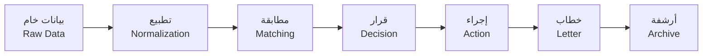
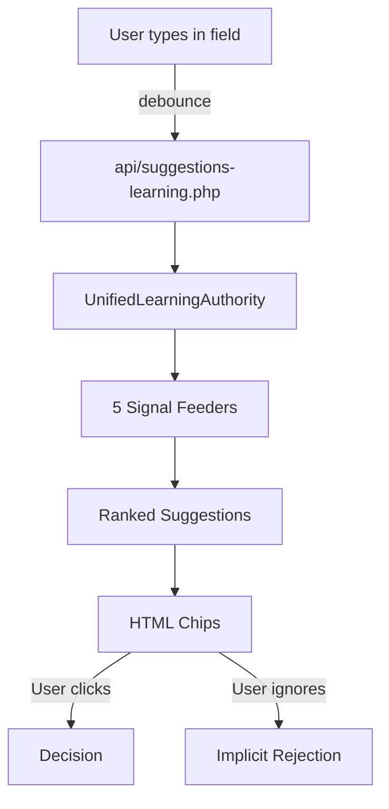

# الخريطة 1: System Mental Model
## النموذج الذهني للنظام - العقد الفكري

> **الهدف**: فهم **كيف يعمل النظام ككل** - من إدخال المستخدم إلى الأثر النهائي  
> **التاريخ**: 2026-01-04  
> **الحالة**: Diagnosis - No Implementation

---

## 1. ما هو هدف النظام؟

### الهدف المركزي
```
تحويل "بيانات خام غير منظمة" لضمانات بنكية
        ↓
إلى "قرارات معالجة موثقة" جاهزة لإصدار خطابات رسمية
```

### الدورة الكاملة



### نقاط التوقف الحرجة

| المرحلة | التوقف عند | السبب |
|---------|------------|-------|
| **Import** | بيانات ناقصة | لا يمكن إنشاء guarantee بدون BG Number + Amount |
| **Matching** | غموض | Multiple suppliers match بنفس الـ confidence |
| **Decision** | بيانات غير مكتملة | لا Supplier ID **أو** لا Bank ID |
| **Action** | حالة خاطئة | لا يمكن Extend إذا Released |
| **Letter** | قرار غير نهائي | لا يمكن Print إذا Status = Pending |

---

## 2. ما هي الحالات الجوهرية؟

### الحالة الرئيسية: `guarantee_decisions.status`

```
┌─────────────────────────────────────────────┐
│  Guarantee Lifecycle States                │
├─────────────────────────────────────────────┤
│                                             │
│  raw_imported  →  pending  →  ready  →  released
│       ↓            ↓          ↓
│   (no decision) (incomplete) (complete)     │
│                                             │
└─────────────────────────────────────────────┘
```

#### التعريفات الدقيقة

| State | التعريف | شرط الدخول | شرط الخروج |
|-------|---------|------------|-----------|
| **raw_imported** | Data موجودة، لا decision | Import successful | أول decision created |
| **pending** | Decision موجودة، بيانات ناقصة | Supplier **أو** Bank مفقود | كلاهما موجود |
| **ready** | Decision كاملة، جاهزة للـ action | Supplier **و** Bank موجودان | Action issued (extend/release) |
| **released** | تم الإفراج، النظام "مغلق" | Release issued | **لا يمكن** (نهائي) |

#### الانتقالات الممنوعة

```
❌ ready → pending   (لا يمكن "إلغاء" readiness)
❌ released → *      (Released نهائي ولا رجعة)
❌ * → raw_imported  (لا يمكن "مسح" decision)
```

---

## 3. ما الذي يعتبر "قرارًا"؟

### Decision vs Suggestion

| النوع | التعريف | من ينشئه | هل ملزم؟ |
|-------|---------|----------|----------|
| **Suggestion** | اقتراح من النظام | Learning Authority | لا - المستخدم يختار |
| **Decision** | اختيار نهائي | المستخدم (save-and-next) | نعم - يُكتب في DB |
| **Auto-Decision** | اختيار تلقائي عالي الثقة | SmartProcessingService | شبه ملزم - يمكن تعديل |

### متى يتحول Suggestion إلى Decision؟

```
1. User clicks على supplier chip → Decision
2. User types + auto-complete → Suggestion أولاً
3. Confidence >= 90% → Auto-Decision (مباشرة)
```

### أين يُخزّن القرار؟

```
guarantee_decisions table
├── supplier_id      ← القرار النهائي
├── bank_id          ← القرار النهائي  
├── status           ← نتيجة القرار
├── decided_at       ← متى
└── decision_source  ← كيف (manual/auto/ai)
```

**Critical**: `raw_data` في `guarantees` **ليس** source of truth للقرار!

---

## 4. ما الذي يعتبر "اقتراحًا"؟

### Suggestion Lifecycle



### مصادر الاقتراحات (بالترتيب)

| المصدر | الوزن | متى يُستخدم |
|--------|------|-------------|
| **Alias Match** | Highest | Exact normalized match |
| **Anchor Match** | High | Entity name inside raw text |
| **Historical** | Medium | Previously used for this raw name |
| **Fuzzy Match** | Low | String similarity >= threshold |
| **Learning Feedback** | Variable | User confirmations/rejections |

### هل الاقتراح "يتذكر"؟

✅ **نعم** - في `learning_confirmations`:
- User confirmations
- User rejections  
- Confidence scores

❌ **لا** - ليس في cache دائم:
- `supplier_learning_cache` مؤقت (expires)

---

## 5. متى يُسمح للنظام أن يتدخل؟

### Auto-Decision Rules (SmartProcessingService)

```
IF Confidence >= 90%
AND Source = 'alias' OR 'historical_confirmed'
AND No manual decision exists
THEN:
  Create auto-decision
  Set status = 'ready' (if both supplier+bank)
  Record timeline event
```

### Auto-Matching Rules (Bank)

```
Bank matching is ALWAYS automatic:
  - Deterministic (BankNormalizer)
  - No confidence threshold
  - Direct match or fail
```

### متى **لا** يتدخل النظام؟

```
❌ إذا User changed supplier manually (مرة واحدة = preference)
❌ إذا Confidence < 90%
❌ إذا Multiple matches بنفس الـ confidence
❌ إذا Decision already exists (لا override)
```

---

## 6. متى يجب أن يصمت النظام؟

### Silent Failures (By Design)

| الحالة | السلوك | السبب |
|--------|---------|-------|
| **No supplier match** | Show "Add New" button | User knows best |
| **Low confidence (< 70)** | Don't show suggestion | Unhelpful noise |
| **Bank not in DB** | Leave bank_name as raw text | Manual intervention needed |
| **Duplicate import** | Record event, don't block | Transparency over prevention |

### Loud Failures (User Must Know)

| الحالة | السلوك | السبب |
|--------|---------|-------|
| **Missing required fields** | Block save + show error | Data integrity |
| **Action on wrong status** | HTTP 400 + error message | Prevent invalid state |
| **Supplier name mismatch** | Clear ID + warn user | Safeguard against stale data |

---

## 7. نقطة "الحقيقة" لكل حالة

### Source of Truth Map

| البيانة | Source of Truth | **ليس** Source of Truth |
|---------|----------------|------------------------|
| **Guarantee Number** | `guarantees.guarantee_number` | `raw_data.bg_number` |
| **Supplier Decision** | `guarantee_decisions.supplier_id` | `raw_data.supplier` |
| **Bank Decision** | `guarantee_decisions.bank_id` | `raw_data.bank` |
| **Status** | `guarantee_decisions.status` | ❌ لا يوجد في `guarantees` |
| **Current Expiry** | `raw_data.expiry_date` + latest extension | ❌ Timeline events (for history only) |
| **Current Amount** | `raw_data.amount` + latest reduction | ❌ Timeline events (for history only) |
| **Active Action** | `guarantee_decisions.active_action` | ❌ `guarantee_actions` (for queue) |

### Why This Matters

```
خطأ شائع: قراءة status من Timeline أحدث event
الصحيح: قراءة status من guarantee_decisions.status

خطأ شائع: قراءة amount من guarantee_actions
الصحيح: قراءة amount من raw_data (updated after action)
```

---

## 8. Timeline of Effects (تسلسل الأفعال)

### السيناريو الكامل: من Import إلى Letter

```
00:00 - User pastes text
00:01 - parse-paste.php analyzes
00:02 - Guarantee created (status: raw_imported)
00:03 - Timeline: Import event recorded
---
00:05 - SmartProcessingService runs
00:06 - Supplier auto-matched (90% confidence)
00:07 - Bank auto-matched (exact)
00:08 - Decision created (status: ready)
00:09 - Timeline: Auto-match events x2
---
01:00 - User opens index.php
01:01 - get-record.php loads guarantee
01:02 - Suggestions loaded (even though auto-matched)
01:03 - Preview rendered
---
02:00 - User clicks "حفظ والتالي"
02:01 - save-and-next.php validates
02:02 - Decision confirmed (no change)
02:03 - Timeline: Decision event (manual confirmation)
02:04 - Learning: Confirmation logged
02:05 - Navigate to next record
---
03:00 - User clicks "تمديد"
03:01 - extend.php validates (status must be ready)
03:02 - Action created (action_status: pending)
03:03 - Timeline: Extension event
03:04 - Preview updates (new expiry)
---
04:00 - User clicks "طباعة - تمديد"
04:01 - Letter HTML generated
04:02 - Letter snapshot saved to timeline
04:03 - Action marked (action_status: issued)
04:04 - active_action updated
04:05 - User prints
```

### نقاط الكسر المحتملة

| الوقت | إذا حدث | النتيجة |
|-------|---------|---------|
| 00:06 | Auto-match fails | Status يبقى pending |
| 01:02 | Suggestions API fails | User can't change supplier |
| 02:01 | Supplier mismatch detected | Save blocked + warning |
| 03:01 | Status != ready | Extension blocked |
| 04:02 | Letter generation fails | No snapshot + error |

---

## 9. State Building & Breaking Points

### أين تُبنى الحالة؟

```
1. Import Phase
   └─ guarantees table (raw_data)
   
2. Processing Phase
   └─ guarantee_decisions (supplier_id, bank_id, status)
   
3. Action Phase
   └─ guarantee_actions (queue)
   └─ raw_data (update expiry/amount)
   └─ active_action (current)
   
4. Archive Phase
   └─ timeline_events (history)
```

### أين تُكسر الحالة؟

#### عن قصد:
```
✅ User changes supplier → Old decision overwritten
✅ Release issued → Status = released (final)
✅ Data changed → active_action cleared (ADR-007)
```

#### بدون قصد (Bugs Potential):
```
⚠️ Update raw_data بدون updating decision
⚠️ Create action بدون checking status
⚠️ Save without validating supplier/bank IDs
⚠️ Clear active_action عند الخطأ
```

### أين تُعاد كتابة الحالة؟

```
🔴 DANGEROUS - Multiple Writers:

Supplier ID:
  - SmartProcessingService (auto)
  - save-and-next.php (manual)
  - get-record.php (auto if pending)
  
Bank ID:
  - SmartProcessingService (auto)
  - get-record.php (auto if pending)
  
Status:
  - StatusEvaluator (calculated)
  - ActionService (on release)
```

**Risk**: Race conditions إذا concurrent requests

---

## 10. الفهم الجوهري: ما هو هذا النظام فعلاً؟

### ليس نظام CRUD
```
❌ Create guarantee
❌ Read guarantee
❌ Update guarantee  
❌ Delete guarantee
```

### بل هو State Machine + Decision Support System
```
✅ Import uncertain data
✅ Suggest possible matches
✅ Capture user decision
✅ Validate state transitions
✅ Generate official documents
✅ Archive full history
```

### القواعد الذهبية

1. **Raw Data Never Changes** (إلا بـ action)
2. **Decisions Can Override** (لكن مع timeline)
3. **Status is Calculated** (من supplier + bank)
4. **Timeline is Append-Only** (لا حذف)
5. **Released is Final** (لا رجعة)

---

## 11. الأسئلة الحرجة (للمستقبل)

### غير مُجاب عليها الآن:

1. **Concurrency**: ماذا لو user فتح نفس الضمان من جهازين؟
2. **Rollback**: كيف نتراجع عن action خاطئ؟
3. **Audit**: من غيّر الـ supplier من X إلى Y؟ (Timeline يجيب)
4. **Trust**: متى نثق بـ auto-decision بنسبة < 90%؟
5. **Merge**: ماذا لو discovered duplicate بعد شهور؟

### محلولة جزئياً:

1. ✅ **Duplicate Detection**: Logged في timeline
2. ✅ **Learning Feedback**: Logged في learning_confirmations
3. ✅ **Action Lock**: ADR-007 (active_action)

---

**Status**: ✅ Mental Model Documented  
**Next**: State & Authority Map  
**Date**: 2026-01-04
