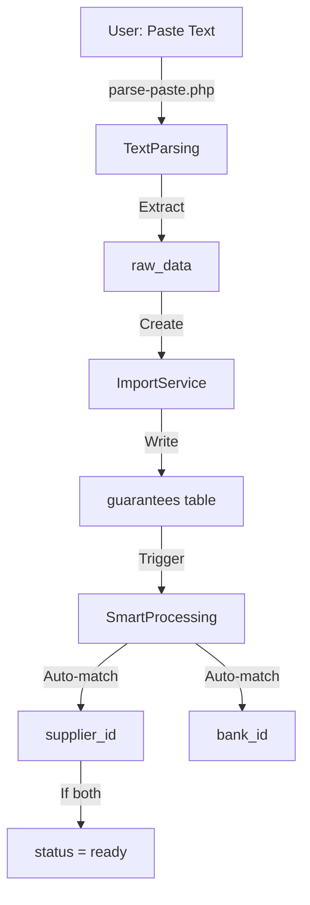
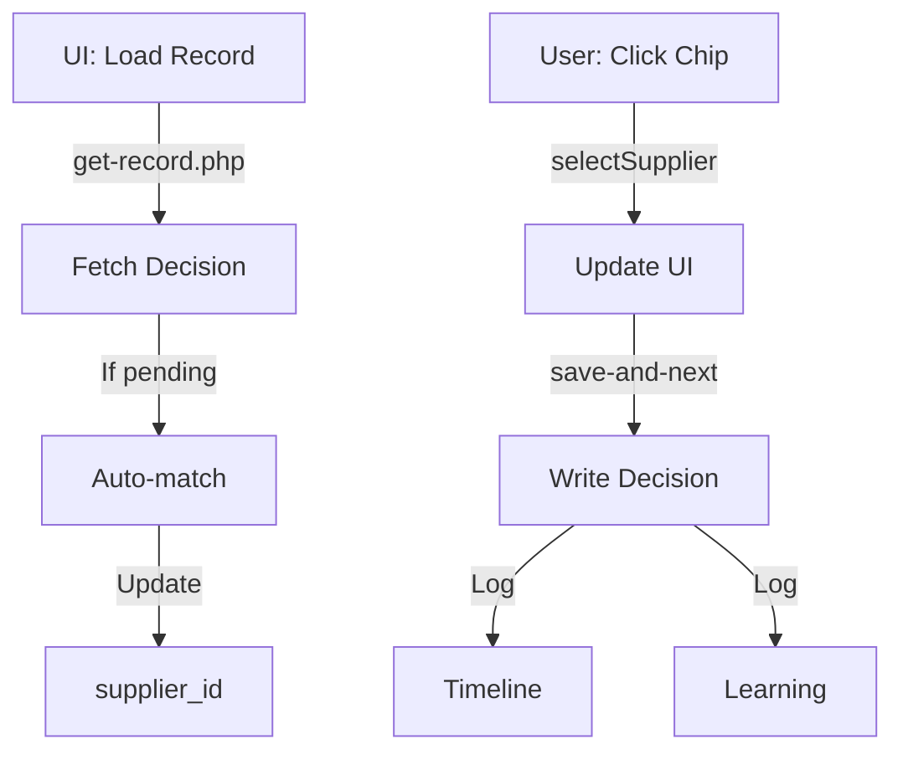
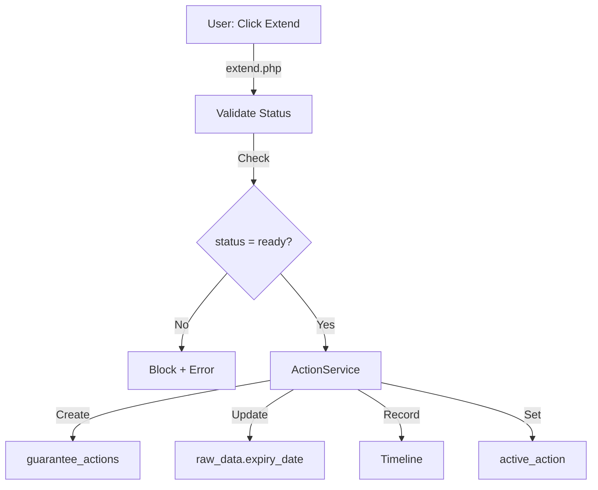
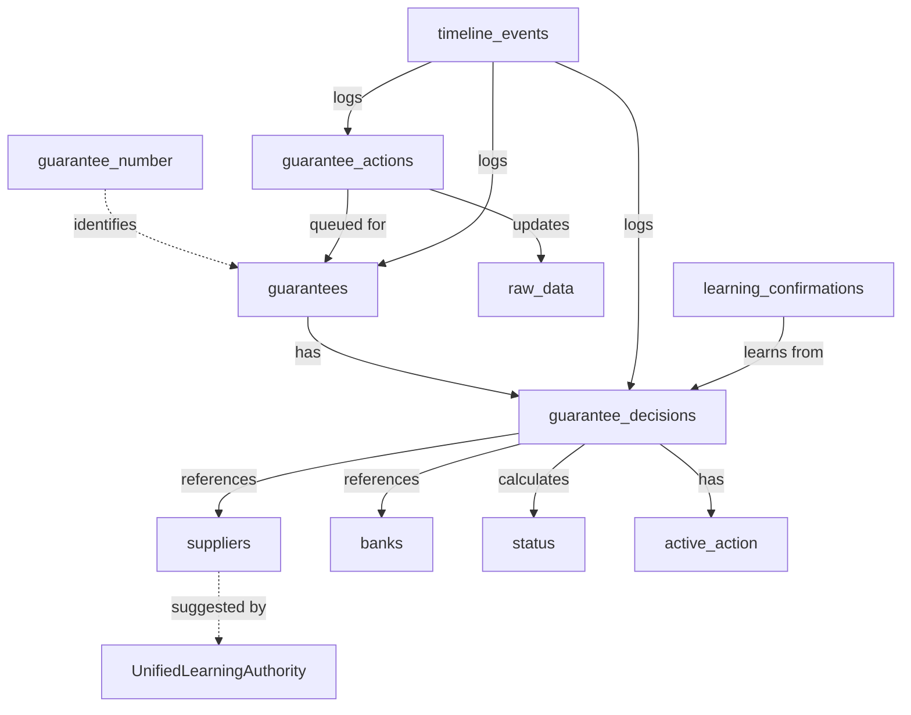

# الخريطة 2: State & Authority Map
## خريطة الملكية والسلطة - من يملك ماذا؟

> **الهدف**: تحديد **من يكتب/يقرأ/يقرر** لكل كيان في النظام  
> **التاريخ**: 2026-01-04  
> **الحالة**: Diagnosis - No Implementation

---

## 1. الجدول الرئيسي: Authority Matrix

| الكيان | من يكتب؟ | من يقرأ؟ | من يقرر؟ | هل يمكن تجاوزه؟ | المصدر/الدليل |
|--------|----------|---------|----------|----------------|---------------|
| **guarantee_number** | ImportService | Everyone | ImportService | ❌ لا - Unique constraint | guarantees table |
| **raw_data.supplier** | ImportService | Suggestions APIs | - | ✅ نعم - Display only | parse-paste.php |
| **raw_data.bank** | ImportService | get-record.php | BankNormalizer | ✅ نعم - Auto-matched | parse-paste.php |
| **raw_data.amount** | ImportService → ActionService | index.php | ImportService (initial)<br/>ActionService (reduce) | ❌ لا - بعد import | guarantee_actions |
| **raw_data.expiry_date** | ImportService → ActionService | index.php | ImportService (initial)<br/>ActionService (extend) | ❌ لا - بعد import | guarantee_actions |
| **normalized_supplier_name** | ImportService | LearningRepository | ArabicNormalizer | ❌ لا - Deterministic | guarantees table |
| **supplier_id** (Decision) | SmartProcessing (auto)<br/>save-and-next.php (manual)<br/>get-record.php (auto) | index.php | **User** (final authority) | ✅ نعم - User override | guarantee_decisions |
| **bank_id** (Decision) | SmartProcessing (auto)<br/>get-record.php (auto) | index.php | BankNormalizer | ❌ لا - Deterministic | guarantee_decisions |
| **status** | **لا أحد** (Calculated) | Everyone | StatusEvaluator | ❌ لا - Pure function | guarantee_decisions |
| **active_action** | ActionService (set)<br/>save-and-next.php (clear) | index.php | **System** (ADR-007) | ⚠️ Partial - Clear on data change | guarantee_decisions |
| **Supplier Name** (Master) | create-supplier.php<br/>create_supplier.php | get_suppliers.php | **User** | ✅ نعم - CRUD | suppliers table |
| **Bank Name** (Master) | add-bank.php<br/>create_bank.php | get_banks.php | **User** | ✅ نعم - CRUD | banks table |
| **Learning Confirmation** | suggestions-learning.php | UnifiedLearningAuthority | **User** (implicit) | ❌ لا - Append-only | learning_confirmations |
| **Timeline Event** | TimelineRecorder | get-timeline.php | **System** | ❌ لا - Append-only | timeline_events |

---

## 2. تفصيل السلطة حسب الكيان

### 2.1 Guarantee Number

```
Writer: ImportService ONLY
├─ Source: Excel, Paste, Manual
├─ Validation: Must be unique
└─ Cannot be changed after creation

Reader: Everyone
Decision: ImportService (creates)
Override: ❌ IMPOSSIBLE (DB constraint)
```

**لماذا؟**: معرّف فريد - أي تغيير = ضمان جديد

---

### 2.2 raw_data.supplier (النص الخام)

```
Writer: ImportService
├─ parse-paste.php: Extracts from text
├─ manual-en try.php: User input
└─ import.php: From Excel

Reader: 
├─ suggestions-learning.php (للمطابقة)
├─ index.php (للعرض فقط)
└─ parse-paste.php (للتحليل)

Decision: NONE - هذا ليس قرار، بل بيانات خام

Override: ✅ نعم - لكن لا فائدة (للعرض فقط)
```

**Critical**: `raw_data.supplier` **ليس** هو القرار!  
**القرار الفعلي**: `guarantee_decisions.supplier_id`

---

### 2.3 supplier_id (القرار الحقيقي)

```
┌─────────────────────────────────────────┐
│  WHO OWNS SUPPLIER DECISION?            │
├─────────────────────────────────────────┤
│                                         │
│  Writers (3):                           │
│  1. SmartProcessingService (auto)      │
│     └─ IF confidence >= 90%            │
│                                         │
│  2. get-record.php (auto)               │
│     └─ IF status = pending             │
│     └─ Called when loading record      │
│                                         │
│  3. save-and-next.php (manual)          │
│     └─ User final choice               │
│     └─ ALWAYS wins (even over auto)    │
│                                         │
│  Decision Authority: USER               │
│  └─ System suggests, User decides      │
│                                         │
│  Override: ✅ YES                       │
│  └─ User can change anytime            │
│  └─ Timeline records all changes       │
│                                         │
└─────────────────────────────────────────┘
```

#### Conflict Resolution

```
IF SmartProcessing sets supplier_id = 5
AND User later selects supplier_id = 7
THEN:
  ✅ supplier_id becomes 7 (User wins)
  ✅ Timeline records both events
  ✅ Learning logs "rejection" of 5
```

**Evidence**: [api_inventory.md](./api_inventory.md) - save-and-next.php lines 85-95

---

### 2.4 bank_id (المطابقة الحتمية)

```
┌─────────────────────────────────────────┐
│  WHO OWNS BANK DECISION?                │
├─────────────────────────────────────────┤
│                                         │
│  Writers (2):                           │
│  1. SmartProcessingService              │
│     └─ Uses BankNormalizer              │
│                                         │
│  2. get-record.php                      │
│     └─ Uses BankNormalizer              │
│     └─ Same logic as SmartProcessing   │
│                                         │
│  Decision Authority: BankNormalizer     │
│  └─ Deterministic algorithm             │
│  └─ NO user choice                      │
│  └─ Match or NULL (no ambiguity)        │
│                                         │
│  Override: ❌ NO                        │
│  └─ Must add bank to DB first          │
│  └─ Then reimport/reprocess             │
│                                         │
└─────────────────────────────────────────┘
```

**Why Different from Supplier?**:
- Banks: Limited set, deterministic matching
- Suppliers: Open set, fuzzy matching, user knows context

**Evidence**: [services_analysis.md](./services_analysis.md) - SmartProcessingService

---

### 2.5 status (Calculated - No Owner!)

```
┌─────────────────────────────────────────┐
│  WHO OWNS STATUS?                       │
├─────────────────────────────────────────┤
│                                         │
│  Writer: NONE ❗                        │
│  └─ Pure function of supplier_id + bank_id
│                                         │
│  Calculator: StatusEvaluator            │
│                                         │
│  Logic:                                 │
│    IF supplier_id AND bank_id:         │
│      status = 'ready'                  │
│    ELSE IF supplier_id OR bank_id:     │
│      status = 'pending'                │
│    ELSE:                                │
│      status = (undefined)              │
│                                         │
│  Decision: DERIVED                      │
│  Override: ❌ IMPOSSIBLE                │
│  └─ Change supplier/bank instead       │
│                                         │
└─────────────────────────────────────────┘
```

**Evidence**: [services_analysis.md](./services_analysis.md) - StatusEvaluator

**Critical Bug Potential**:
```
❌ WRONG: UPDATE guarantee_decisions SET status = 'ready'
✅ RIGHT: Ensure supplier_id AND bank_id are set
```

---

### 2.6 active_action (System Lock - ADR-007)

```
┌─────────────────────────────────────────┐
│  WHO OWNS ACTIVE_ACTION?                │
├─────────────────────────────────────────┤
│                                         │
│  Writer (Set):                          │
│    ActionService                        │
│    └─ When action issued (printed)     │
│                                         │
│  Writer (Clear):                        │
│    save-and-next.php                   │
│    └─ When supplier/bank/amount change │
│    └─ ADR-007 Self-Healing Logic       │
│                                         │
│  Decision Authority: SYSTEM             │
│  └─ Automatic lock/unlock               │
│                                         │
│  Override: ⚠️ PARTIAL                   │
│  └─ Manual clear = OK                   │
│  └─ Manual set = DANGEROUS              │
│  └─ Must follow ADR-007 rules           │
│                                         │
└─────────────────────────────────────────┘
```

**The Rule**:
```
IF user changes ANY of [supplier, bank, amount, expiry]
THEN active_action MUST be cleared
WHY? Printed letter is now stale/invalid
```

**Evidence**: ADR-007 (mentioned in код), [api_inventory.md](./api_inventory.md) - save-and-next.php

---

### 2.7 Timeline Events (Append-Only Log)

```
┌─────────────────────────────────────────┐
│  WHO OWNS TIMELINE?                     │
├─────────────────────────────────────────┤
│                                         │
│  Writer: TimelineRecorder (ONLY)       │
│  └─ Called by:                          │
│      - ImportService                    │
│      - SmartProcessingService           │
│      - save-and-next.php                │
│      - extend/reduce/release.php        │
│      - ActionService                    │
│                                         │
│  Reader: get-timeline.php               │
│                                         │
│  Decision: SYSTEM (automatic)           │
│  Override: ❌ IMPOSSIBLE                │
│  └─ Append-only (no UPDATE/DELETE)     │
│  └─ Immutable audit trail               │
│                                         │
└─────────────────────────────────────────┘
```

**Evidence**: [services_analysis.md](./services_analysis.md) - TimelineRecorder

---

## 3. خريطة التدفق: من يقرر ماذا ومتى؟

### 3.1 Import Phase



**Authority Transitions**:
- User owns: Text input
- System owns: Extraction, Matching
- DB owns: Storage

---

### 3.2 Decision Phase



**Authority Transitions**:
- System owns: Auto-matching
- User owns: Final decision
- Timeline owns: History

---

### 3.3 Action Phase



**Authority Transitions**:
- User owns: Action request
- System owns: Validation, Execution
- ActionService owns: State update

---

## 4. Conflict Resolution Rules

### 4.1 Multiple Writers Conflict

| الكيان | Conflict Scenario | Resolution | مثبت أين |
|--------|-------------------|------------|---------|
| **supplier_id** | SmartProcessing vs User | **User wins** always | save-and-next.php |
| **bank_id** | SmartProcessing vs get-record | **Same algorithm** (no conflict) | BankNormalizer |
| **status** | Multiple calculations | **Idempotent** (same input = same output) | StatusEvaluator |
| **active_action** | extend vs save-and-next | **Last write wins** (race possible) | ⚠️ No lock |

### 4.2 Read-After-Write Consistency

```
Question: إذا SmartProcessing كتب supplier_id = 5
         وفوراً User فتح الصفحة
         هل سيرى 5 أم NULL؟

Answer: يعتمد على timing:
  ✅ IF SmartProcessing committed: يرى 5
  ❌ IF SmartProcessing still running: يرى NULL
  ⚠️ No transaction isolation guaranteed
```

**Evidence**: لا يوجد DB locks في الكود

---

## 5. مصفوفة: هل يمكن التجاوز؟

| الكيان | تجاوز يدوي | تجاوز برمجي | التأثير | المخاطر |
|--------|-----------|-------------|---------|---------|
| **guarantee_number** | ❌ | ❌ | Break uniqueness | Data corruption |
| **supplier_id** | ✅ | ✅ | Override auto-match | Timeline logs it |
| **bank_id** | ⚠️ | ⚠️ | Must add bank first | Process break |
| **status** | ❌ | ❌ | Breaks business logic | Invalid state |
| **raw_data.amount** | ❌ | ✅ (ActionService only) | Financial impact | Audit required |
| **raw_data.expiry_date** | ❌ | ✅ (ActionService only) | Legal impact | Audit required |
| **active_action** | ⚠️ | ✅ | Clear lock | Stale letters |
| **Timeline** | ❌ | ❌ | Break audit trail | Compliance issue |

### Legend:
- ✅ تجاوز آمن
- ⚠️ تجاوز خطر (بشروط)
- ❌ تجاوز ممنوع (by design)

---

## 6. الملكية الفعلية: من الذي نسأله؟

### السيناريو: تضارب في supplier_id

```
User: "لماذا supplier_id = 7 بينما كتبت 'شركة ABC'؟"

Question: من نسأله؟

❌ WRONG Answers:
  - ImportService (لا يملك القرار)
  - raw_data.supplier (مجرد نص خام)
  - SmartProcessing (يقترح فقط)

✅ CORRECT Answer:
  - guarantee_decisions.supplier_id
  - CHECK: guarantee_decisions.decision_source
    - IF 'auto': SmartProcessing suggested it
    - IF 'manual': User selected it
  - CHECK: timeline_events
    - Find decision event
    - See who created it (created_by)
```

**Authority Chain**:
```
raw_data.supplier  →  (suggestion)  →  supplier_id  →  (audit)  →  Timeline
     (input)             (matching)        (decision)      (proof)
```

---

## 7. خريطة Dependencies: من يعتمد على من؟



**Critical Dependencies**:
- `status` depends on `supplier_id` + `bank_id`
- `active_action` depends on printed letter
- `Timeline` depends on ALL changes

---

## 8. الخلاصة: قواعد الملكية

### القاعدة الذهبية #1
```
لا تكتب مباشرة إلى:
  - status (calculated)
  - normalized_supplier_name (derived)
  - timeline_events (via recorder only)
```

### القاعدة الذهبية #2
```
User owns decisions:
  - supplier_id (final choice)
  - when to extend/reduce/release

System owns validation:
  - status calculation
  - bank matching
  - action eligibility
```

### القاعدة الذهبية #3
```
Timeline owns history:
  - All changes logged
  - Append-only
  - Never modify

Active_action owns lock:
  - One action at a time
  - Clear on data change
  - Set on print
```

### القاعدة الذهبية #4
```
Raw data owns facts:
  - guarantee_number: immutable
  - amount/expiry: ActionService only
  - supplier/bank text: display only
```

---

## 9. نقاط القرار الحرجة (Critical Decision Points)

| الموقف | من يقرر؟ | ماذا لو فشل؟ | الحل |
|--------|-----------|--------------|------|
| **Duplicate BG Number** | ImportService | Block import | Error message |
| **Low Confidence Match** | User (manual) | No auto-decision | Force manual |
| **Status = Pending** | StatusEvaluator | Can't take action | Complete decision |
| **Released Guarantee** | System (block) | Can't extend | Final state |
| **Active Action Exists** | ADR-007 (clear on change) | Stale letter | Clear + warn |

---

**Status**: ✅ State & Authority Map Complete  
**Next**: index.php Decomposition Map  
**Date**: 2026-01-04
