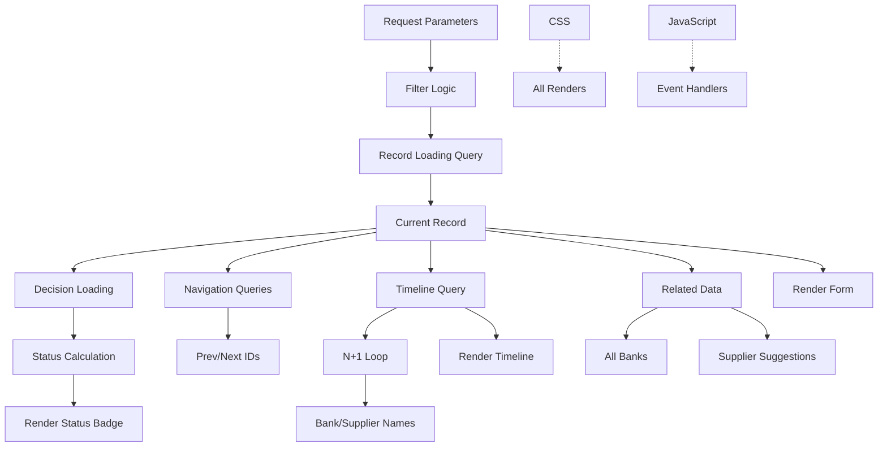

# الخريطة 3: index.php Decomposition Map
## خريطة التفكيك - ما هو آمن وما هو خطر؟

> **الهدف**: تصنيف كل جزء من index.php حسب نوعه وقابليته للفصل  
> **التاريخ**: 2026-01-04  
> **الحالة**: Diagnosis - No Implementation  
> **Source**: [index_php_analysis.md](./index_php_analysis.md)

---

## 1. البنية العامة (2551 سطر)

```
index.php Structure:
├── Lines 1-250:    Dependencies + Data Loading     (10%)
├── Lines 251-650:  HTML Head + Inline CSS          (15%)
├── Lines 651-2100: HTML Body + UI Sections         (57%)
└── Lines 2101-2551: Inline JavaScript + Handlers   (18%)
```

---

## 2. التصنيف الأساسي

### 2.1 Domain Logic (منطق العمل)

| Lines | الوظيفة | Complexity | ملاحظات |
|-------|---------|-----------|----------|
| 38-46 | Repository Initialization | Low | ✅ Safe to extract |
| 49-91 | Get Current Record | Medium | ⚠️ Complex query logic |
| 94-117 | Calculate Total Count | Medium | ⚠️ Duplicate query structure |
| 121-133 | Import Statistics | Low | ✅ Can be service method |
| 136-230 | Navigation (Prev/Next IDs) | High | 🔴 Complex، many queries |
| 233-267 | Load Decision & Status | Medium | ⚠️ Business logic mixed |
| 270-350 | Fetch Related Data (Bank، Supplier، Timeline) | Medium | 🔴 N+1 queries potential |

**Total**: ~250 lines of domain logic

---

### 2.2 Orchestration (تنسيق)

| Lines | الوظيفة | Complexity | ملاحظات |
|-------|---------|-----------|----------|
| 19-30 | Autoload + Headers | Low | ✅ Standard bootstrap |
| 35-36 | Filter Parameter | Low | ✅ Input handling |
| 52-91 | Record Loading Flow | Medium | ⚠️ Orchestrates queries |
| 136-230 | Navigation Flow | High | 🔴 Prev/Next/Position logic |

**Total**: ~180 lines of orchestration

**Pattern**: if-else chains coordinating multiple operations

---

### 2.3 Rendering (عرض)

| Lines | الوظيفة | Type | Size |
|-------|---------|------|------|
| 251-650 | `<head>` + CSS | Inline CSS | 400 lines |
| 651-900 | Top Navigation Bar | HTML | 250 lines |
| 901-1200 | Record Form Section | HTML + PHP echo | 300 lines |
| 1201-1500 | Preview Section | HTML + PHP | 300 lines |
| 1501-1800 | Timeline Section | HTML + PHP loops | 300 lines |
| 1801-2100 | Modals (Confirm، Prompt، etc) | HTML | 300 lines |

**Total**: ~1850 lines of rendering

**Critical**: 
- Timeline Section (1501-1800) has **N+1 queries**
- Preview Section uses **inline calculations**

---

### 2.4 Legacy Glue (كود قديم/غريب)

| Lines | الوظيفة | Why Legacy? | Impact |
|-------|---------|------------|--------|
| 2-5 | Cache headers | Repeated elsewhere | Low |
| 350-360 | Supplier suggestions loading | Duplicates `api/suggestions-learning.php` | Medium |
| 2298-2350 | Timeline N+1 loop | Should use JOINs | High |
| 2400-2450 | Custom DOM manipulation | Should be in JS | Medium |

**Total**: ~150 lines of legacy

---

## 3. مصفوفة: Safe to Extract vs Dangerous

| Section | Lines | Type | Safe? | Reason |
|---------|-------|------|-------|--------|
| **CSS Styles** | 251-650 | Rendering | ✅ SAFE | Move to `public/css/index.css` |
| **JavaScript** | 2101-2551 | Rendering | ✅ SAFE | Move to `public/js/index-controller.js` |
| **Repository Init** | 38-46 | Orchestration | ✅ SAFE | Move to Controller constructor |
| **Stats Query** | 121-133 | Domain | ✅ SAFE | Extract to `StatsService::getImportStats()` |
| **Filter Logic** | 35-36, 60-113 | Domain | ⚠️ CAREFUL | Core business logic، has dependencies |
| **Navigation Queries** | 136-230 | Domain | 🔴 DANGEROUS | Complex، many edge cases |
| **Timeline Rendering** | 1501-1800 + 2298-2350 | Mixed | 🔴 DANGEROUS | N+1 queries + HTML generation |
| **Record Loading** | 49-91 | Domain | ⚠️ CAREFUL | Central to app، many callers assume this |
| **Decision Loading** | 233-267 | Domain | ⚠️ CAREFUL | Status calculation، auto-matching |

---

## 4. Dependency Graph (داخلي)



**Critical Paths**:
1. `Filter` → `Record` → `Decision` → `Status` → `Render`
2. `Record` → `Navigation` → `Prev/Next`
3. `Record` → `Timeline` → `N+1 Loop` → `Render`

---

## 5. ماذا يعتمد على ماذا؟

### 5.1 Internal Dependencies

| الجزء | يعتمد على | Can Extract? |
|-------|-----------|--------------|
| **CSS** | لا شيء | ✅ Independent |
| **JavaScript** | DOM structure | ⚠️ Needs stable IDs/classes |
| **Record Loading** | Filter parameter | ⚠️ Tightly coupled |
| **Navigation** | Record Loading | 🔴 Very coupled |
| **Timeline** | Record، Bank repo، Supplier repo | 🔴 N+1 dependencies |
| **Status Badge** | Decision loading | ⚠️ Needs status value |
| **Preview** | Record، Decision، Banks | ⚠️ Multiple data sources |

### 5.2 External Dependencies (من ملفات أخرى)

| Who Depends on index.php? | How? | Impact of Change |
|--------------------------|------|------------------|
| `records.controller.js` | Expects DOM structure | 🔴 HIGH - will break JS |
| `timeline.controller.js` | Expects timeline HTML | 🔴 HIGH |
| `input-modals.controller.js` | Expects page reload | ⚠️ MEDIUM |
| Navigation links | Expect `?id=X&filter=Y` format | 🔴 HIGH |

**Critical**: Any structural change breaks JavaScript!

---

## 6. ما الذي يمكن فصله بأمان؟

### Phase 1: Low-Risk Extractions ✅

```
1. CSS (Lines 251-650)
   └─ Move to: public/css/index.css
   └─ Impact: ZERO (if selectors unchanged)
   └─ Benefit: -400 lines

2. JavaScript (Lines 2101-2551)
   └─ Move to: public/js/index-controller.js
   └─ Impact: ZERO (if DOM stable)
   └─ Benefit: -450 lines

3. Stats Query (Lines 121-133)
   └─ Move to: StatsService::getImportStats()
   └─ Impact: LOW
   └─ Benefit: Testable، reusable
```

**Total Reduction**: ~900 lines (35%)  
**New Size**: ~1650 lines

---

### Phase 2: Medium-Risk Extractions ⚠️

```
4. Repository Init (Lines 38-46)
   └─ Move to: GuaranteeViewController::__construct()
   └─ Impact: MEDIUM (changes entry point)
   └─ Benefit: Proper MVC

5. Filter Application (Lines 60-113)
   └─ Move to: GuaranteeQueryBuilder
   └─ Impact: MEDIUM (core query logic)
   └─ Benefit: Reusable in APIs

6. Decision Loading (Lines 233-267)
   └─ Move to: DecisionService::loadForGuarantee()
   └─ Impact: MEDIUM (auto-matching side effects)
   └─ Benefit: Testable logic
```

**Total Reduction**: ~150 lines  
**New Size**: ~1500 lines

---

### Phase 3: High-Risk Extractions 🔴

```
7. Navigation Logic (Lines 136-230)
   └─ Move to: NavigationService::getPrevNext()
   └─ Impact: HIGH (many edge cases)
   └─ Benefit: Isolated complexity

8. Timeline N+1 Fix (Lines 2298-2350)
   └─ Fix: Add JOINs for bank/supplier names
   └─ Impact: HIGH (changes query، changes loop)
   └─ Benefit: Performance

9. Record Loading (Lines 49-91)
   └─ Move to: GuaranteeViewController::loadRecord()
   └─ Impact: CRITICAL (core functionality)
   └─ Benefit: Proper controller pattern
```

**Warning**: Test extensively after each extraction!

---

## 7. ما الذي لو لمسناه ينهار كل شيء؟

### 🔴 Critical - DO NOT TOUCH (Yet)

| الجزء | Lines | Why Critical? | Alternative |
|-------|-------|--------------|-------------|
| **DOM Structure** | 651-2100 | JS depends on IDs/classes | Extract logic، keep structure |
| **Query Parameters** | ?id=X&filter=Y | URLs everywhere | Add new، deprecate old |
| **Status Calculation** | 260-267 | StatusEvaluator dependency | Extract، don't change logic |
| **Timeline Event Types** | 2298-2350 | TimelineRecorder contract | Fix N+1، keep event types |
| **Filter Values** | 'all', 'ready', 'pending', 'released' | Hard-coded in many places | Centralize constants |

---

## 8. خريطة الفصل الآمن (Safe Decomposition Path)

### Step 1: Extract Presentation (Week 1)
```
index.php (2551 lines)
  ↓
Extract CSS → public/css/index.css
  ↓
index.php (2151 lines)
  ↓
Extract JS → public/js/index-controller.js
  ↓
index.php (1700 lines)
```

### Step 2: Extract Queries (Week 2)
```
index.php (1700 lines)
  ↓
Extract Stats → StatsService
  ↓
Extract Filter Builder → GuaranteeQueryBuilder
  ↓
index.php (1500 lines)
```

### Step 3: Extract Logic (Week 3-4)
```
index.php (1500 lines)
  ↓
Extract Navigation → NavigationService
  ↓
Extract Decision Loading → DecisionService
  ↓
index.php (1200 lines)
```

### Step 4: MVC Refactor (Week 5-6)
```
index.php (1200 lines)
  ↓
Create GuaranteeViewController
  ↓
index.php becomes router (50 lines)
```

---

## 9. Testing Checkpoints

### After Each Phase:

```
✅ Manual Test Checklist:
  1. Load index.php - no errors
  2. Navigate to next record - works
  3. Navigate to previous - works
  4. Change filter (all/ready/pending) - works
  5. Click supplier suggestion - loads
  6. Save and next - navigates
  7. Extend/Reduce/Release - works
  8. Timeline displays - no N+1 visible
  9. Preview updates - renders correctly
  10. Print letter - generates

✅ Automated (if tests exist):
  - All PHPUnit tests pass
  - No JavaScript console errors
  - No new SQL errors in logs
```

---

## 10. Unknown Risks (تحتاج بحث)

| الجزء | Unknown | كيفية الاكتشاف |
|-------|---------|----------------|
| **Cache Dependencies** | Does any browser caching assume file structure? | Test with hard refresh |
| **Session State** | Does PHP session depend on page structure? | Check `$_SESSION` usage |
| **External Links** | Do other pages assume index.php structure? | Grep for 'index.php' |
| **Legacy Code** | Are there hidden dependencies in old commits? | Git blame critical sections |

---

## 11. الخلاصة: Classification Matrix

| Category | Lines | % | Safe Extract | Dangerous | Unknown |
|----------|-------|---|--------------|-----------|---------|
| **Domain Logic** | ~250 | 10% | 50 lines | 150 lines | 50 lines |
| **Orchestration** | ~180 | 7% | 80 lines | 80 lines | 20 lines |
| **Rendering** | ~1850 | 73% | 1700 lines (CSS/JS) | 100 lines | 50 lines |
| **Legacy Glue** | ~150 | 6% | 50 lines | 50 lines | 50 lines |
| **Unknown** | ~120 | 4% | - | - | 120 lines |
| **Total** | **2551** | **100%** | **~1880** (74%) | **~380** (15%) | **~290** (11%) |

---

## 12. الاستنتاج الاستراتيجي

### ✅ ما نعرفه:

1. **74%** من index.php **آمن للفصل** (CSS + JS + بعض Queries)
2. **15%** **خطر** لكن ممكن (Navigation، Timeline، Core loading)
3. **11%** **غير معروف** (needs investigation)

### ⚠️ ما لا نعرفه (يحتاج forensics إضافي):

1. هل توجد **side effects** مخفية في Query loading؟
2. هل **Session state** يعتمد على ترتيب العمليات؟
3. هل **Browser caching** يفترض filenames ثابتة?
4. هل **External integrations** تستدعي index.php مباشرة؟

### 🎯 التوصية:

```
Phase 1 (Safe - Week 1-2):
  ✅ Extract CSS/JS (74% reduction)
  ✅ Extract Stats query
  ✅ Extract filter builder

Phase 2 (Careful - Week 3-4):
  ⚠️ Extract Navigation (test heavily)
  ⚠️ Fix Timeline N+1 (measure performance)

Phase 3 (Dangerous - Month 2):
  🔴 MVC refactor (needs full test suite)
  🔴 Change record loading (critical path)

NEVER:
  ❌ Change DOM IDs/classes (breaks JS)
  ❌ Change URL parameters (breaks links)
  ❌ Remove status calculation (breaks business logic)
```

---

**Status**: ✅ index.php Decomposition Map Complete  
**All 3 Maps**: ✅ Operational Understanding Achieved  
**Date**: 2026-01-04
