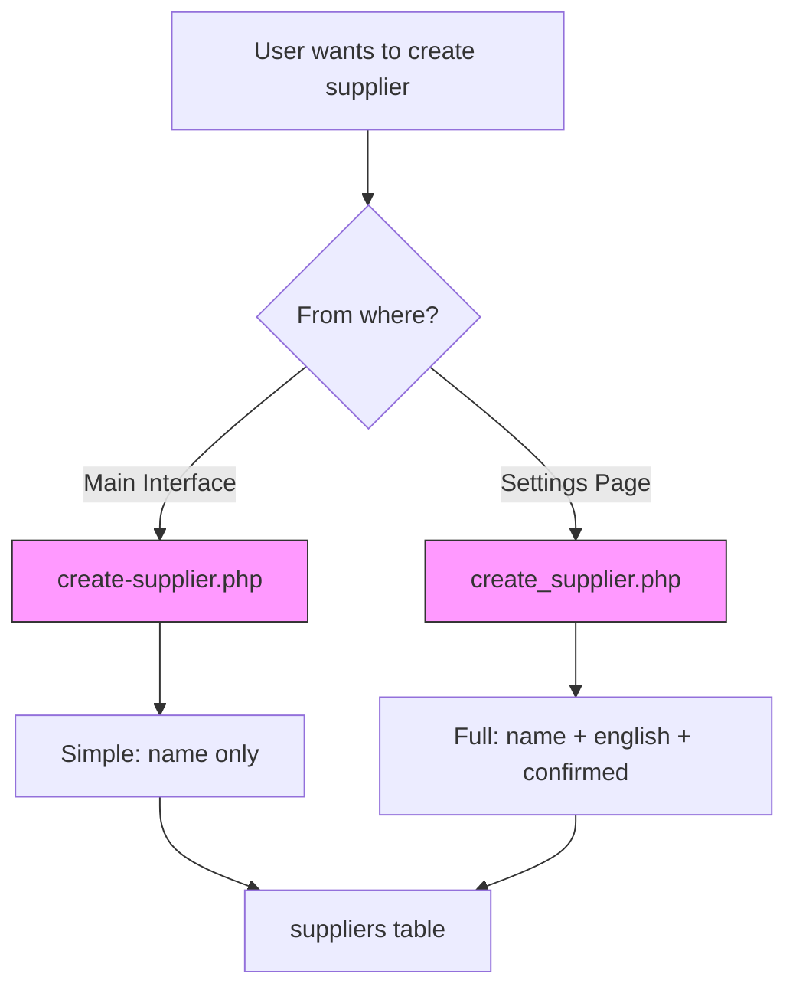
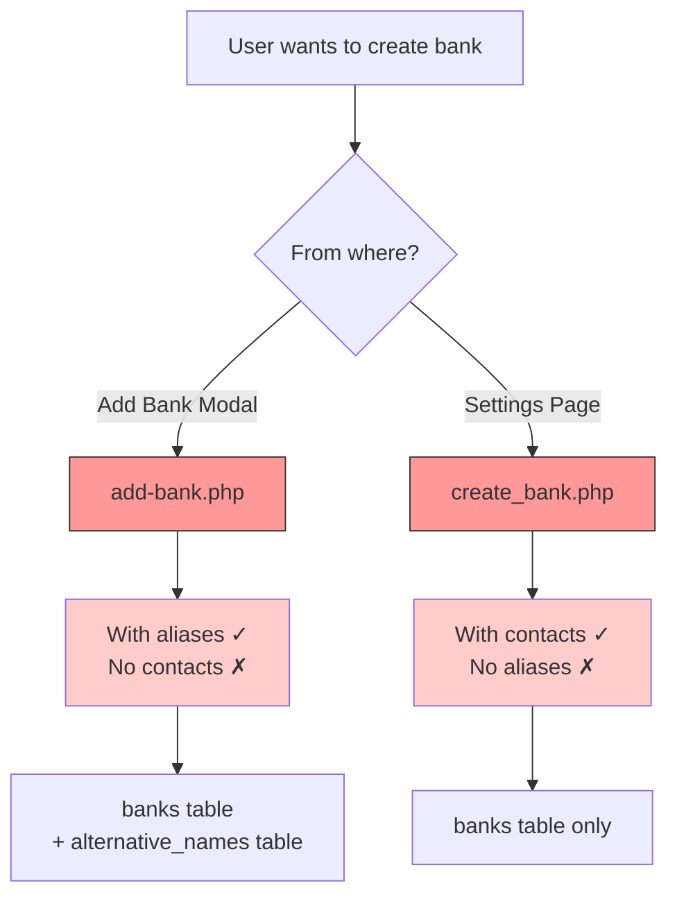

# تقرير جرد API Endpoints الشامل

> **التاريخ**: 2026-01-04  
> **المسار**: `c:\Users\Bakheet\Documents\Projects\BGL3\api\`  
> **العدد الإجمالي**: 33 endpoint  
> **التقييم**: 🟡 **MEDIUM Risk** - تكرار وعدم اتساق في naming

---

## 📊 الإحصائيات العامة

| المؤشر | القيمة |
|--------|--------|
| **إجمالي الملفات** | 33 |
| **إجمالي الحجم** | ~142 KB |
| **أكبر ملف** | `parse-paste.php` (31KB) |
| **أصغر ملف** | `export_suppliers.php` (665 bytes) |
| **Naming Conventions** | 2 (kebab-case + snake_case) ❌ |
| **Response Format** | JSON + HTML (Server-Driven) |

---

## 🗂️ التصنيف الوظيفي

### 1. CRUD Operations - Suppliers (6 endpoints)

| الملف | الحجم | Method | المستدعي | الوظيفة |
|------|------|--------|---------|---------|
| `create-supplier.php` | 1.4KB | POST | `records.controller.js:789` | إضافة سريعة (name فقط) |
| `create_supplier.php` | 1.3KB | POST | `views/settings.php:474` | إضافة كاملة (name + english + confirmed) |
| `update_supplier.php` | 1.4KB | POST | `views/settings.php:716` | تحديث بيانات مورد |
| `delete_supplier.php` | 726 bytes | POST | `views/settings.php:775` | حذف مورد |
| `get_suppliers.php` | 4.2KB | GET | `views/settings.php` (on load) | جدول HTML للموردين |
| `export_suppliers.php` | 665 bytes | GET |Manual download | تصدير Excel |

**المشاكل**:
- 🔴 **تكرار**: `create-supplier` vs `create_supplier` (وظائف مختلفة قليلاً)
- 🔴 **Naming Inconsistency**: kebab vs snake\_case
- 🟡 **عدم توحيد Response**: بعضها JSON، البعض HTML

**التوصية**: دمج create APIs في endpoint واحد بـ optional parameters.

---

### 2. CRUD Operations - Banks (6 endpoints)

| الملف | الحجم | Method | المستدعي | الوظيفة |
|------|------|--------|---------|---------|
| `add-bank.php` | 2.8KB | POST | `partials/add-bank-modal.php:273` | إضافة مع aliases |
| `create_bank.php` | 1.2KB | POST | `views/settings.php:455` | إضافة مع contact details |
| `update_bank.php` | 1.2KB | POST | `views/settings.php:671` | تحديث بيانات بنك |
| `delete_bank.php` | 722 bytes | POST | `views/settings.php:749` | حذف بنك |
| `get_banks.php` | 4.6KB | GET | `views/settings.php` (on load) | جدول HTML للبنوك |
| `export_banks.php` | 669 bytes | GET | Manual download | تصدير Excel |

**المشاكل**:
- 🔴 **تكرار حرج**: `add-bank` يدعم aliases، `create_bank` يدعم contacts - **لا يوجد واحد يدعم الاثنين!**
- 🔴 **Naming Inconsistency**: `add` vs `create`
- 🟡 **No unified**: كل واجهة لها API خاص

**التوصية**: API واحد فقط: `api/banks/create` يدعم **كل الحقول**.

---

### 3. Guarantee Actions (4 endpoints)

| الملف | الحجم | Method | المستدعي | الوظيفة | Business Logic؟ |
|------|------|--------|---------|---------|----------------|
| `extend.php` | 4.3KB | POST | `records.controller.js:462` | تمديد ضمان بسنة | ✅ Yes (date calc) |
| `reduce.php` | 4.4KB | POST | `records.controller.js:539` | تخفيض قيمة ضمان | ✅ Yes (amount validation) |
| `release.php` | 4.4KB | POST | `records.controller.js:500` | الإفراج عن ضمان | ✅ Yes (lock logic) |
| `save-and-next.php` | 15.9KB | POST | `records.controller.js:415` | حفظ قرار + التالي | ✅ Complex! |

#### تحليل `save-and-next.php` (الأكبر - 15.9KB)

**المسؤوليات** (383 سطر):
1. **Input Validation** (25-90): safeguard ضد ID/Name mismatch
2. **Supplier Resolution** (48-79): 2 strategies (exact + normalized)
3. **Change Detection** (92-168): comparing old vs new
4. **Timeline Recording** (174-260): snapshot + events
5. **Learning Feedback** (262-307): log confirmation + rejection
6. **Navigation Logic** (309-376): find next record
7. **Return JSON** with next record data

**المشاكل**:
- 🔴 **God Endpoint**: يفعل 7 أشياء مختلفة!
- 🔴 **Navigation في API**: منطق "Next Record" يجب أن يكون في Controller
- 🟡 **Complex Business Logic**: 383 سطر في endpoint واحد

**Complexity Score**: ~40 (يجب < 10)

---

### 4. Import/Parse (3 endpoints)

| الملف | الحجم | Method | المستدعي | الوظيفة |
|------|------|--------|---------|---------|
| `import.php` | 4.9KB | POST | `main.js:55` | استيراد Excel |
| `parse-paste.php` | **31.4KB** 🔴 | POST | `input-modals.controller.js:116` | تحليل نص ذكي |
| `manual-entry.php` | 1.4KB | POST | - | إدخال يدوي |

#### تحليل `parse-paste.php` (الأضخم - 31KB، 688 سطر!)

**الوظائف**:
1. **Multi-Pattern Extraction** (45-55): tries multiple regex patterns
2. **Tabular Data Parser** (60-196): parses TAB-separated tables
3. **Multi-Row Support** (310-353): handles multiple guarantees in one paste
4. **Field Extraction** (399-561): 8 حقول مختلفة
5. **Validation** (564-590)
6. **Database Creation** (593-658)
7. **Auto-Matching** (647-657): calls `SmartProcessingService`
8. **Logging** (23-40): detailed paste_debug.log

**الإيجابيات**:
- ✅ **محترف جداً**: covers كل الحالات
- ✅ **Logging**: excellent debugging
- ✅ **Multi-row support**: يتعامل مع batch paste

**المشاكل**:
- 🔴 **Too Large**: 688 سطر في ملف واحد
- 🔴 **Mixed Concerns**: Parsing + Validation + DB + Matching
- 🟡 **Regex Heavy**: 20+ regex patterns (hard to maintain)

**التوصية**: Extract إلى `TextParsingService` (موجود بالفعل لكن غير مستخدم here!)

---

### 5. Suggestions/Learning (3 endpoints)

| الملف | الحجم | Method | المستدعي | الوظيفة |
|------|------|--------|---------|---------|
| `suggestions-learning.php` | 1.8KB | GET | `records.controller.js:715` | اقتراحات موردين |
| `learning-action.php` | 1KB | POST | `views/settings.php:605` | تسجيل إجراء تعليمي |
| `learning-data.php` | 1.5KB | GET | `views/settings.php:547` | بيانات Learning للإحصائيات |

**الملاحظات**:
- ✅ **Clean**: APIs بسيطة وواضحة
- ✅ **Phase 4 Compliant**: تستخدم `UnifiedLearningAuthority`
- ✅ **Server-Driven**: `suggestions-learning` يعيد HTML partial

---

### 6. Data Retrieval (5 endpoints)

| الملف | الحجم | Method | المستدعي | Return Format | الوظيفة |
|------|------|--------|---------|--------------|----------|
| `get-record.php` | 14.9KB | GET | `records.controller.js:855` | **HTML** | record form HTML |
| `get-timeline.php` | 1.1KB | GET | `records.controller.js:877` | **HTML** | timeline HTML |
| `get-current-state.php` | 7.5KB | GET | Timeline controller | **HTML** | current guarantee snapshot |
| `get-history-snapshot.php` | 6.1KB | GET | Timeline controller | **HTML** | historical snapshot |
| `get_banks.php` | 4.6KB | GET | settings.php | **HTML** | banks table |
| `get_suppliers.php` | 4.2KB | GET | settings.php | **HTML** | suppliers table |

**النمط**: **Server-Driven UI** ✅

**الفوائد**:
- ✅ **Less JS Logic**: Frontend لا يُنشئ HTML
- ✅ **Consistent Rendering**: Server controls everything
- ✅ **SEO Friendly** (if needed)

**المشاكل**:
- 🟡 **Network Overhead**: كل navigation = full HTML download

---

### 7. Settings/Config (1 endpoint)

| الملف | الحجم | Method | الوظيفة |
|------|------|--------|---------|
| `settings.php` | 3.4KB | POST | حفظ إعدادات عامة |

---

### 8. Attachments (1 endpoint)

| الملف | الحجم | Method | الوظيفة |
|------|------|--------|---------|
| `upload-attachment.php` | 2.1KB | POST | رفع ملف مرفق |
| `save-note.php` | 1.3KB | POST | حفظ ملاحظة نصية |

---

## 🔍 تحليل الأنماط والمشاكل

### 1. Naming Convention Chaos

**المشكلة**: استخدام نمطين مختلفين بدون ترتيب

| Pattern | الملفات | النسبة |
|---------|---------|--------|
| **kebab-case** | `create-supplier`, `add-bank`, `save-and-next` | ~40% |
| **snake_case** | `create_supplier`, `create_bank`, `update_bank` | ~40% |
| **mixed** | `parse-paste` (kebab), `get_banks` (snake) | ~20% |

**السبب المرجح**: مطورين مختلفين في أوقات مختلفة.

**التوصية**: 
```
Standardize على kebab-case (RESTful convention):
- api/suppliers/create
- api/suppliers/update  
- api/suppliers/delete
- api/banks/create
...
```

---

### 2. Duplicate Functionality

#### أ. Supplier Creation



**المشكلة**: Different capabilities from different contexts!

---

#### ب. Bank Creation



**Result**: **لا يوجد API واحد complete!**

---

### 3. Business Logic في API Layer

**APIs التي تحتوي منطق أعمال معقد**:

| API | LOC | Business Logic | Should Be In |
|-----|-----|----------------|--------------|
| `save-and-next.php` | 383 | Supplier resolution<br/>Change detection<br/>Learning<br/>**Navigation** | `GuaranteeService`<br/>`NavigationService` |
| `parse-paste.php` | 688 | **Text parsing** (20+ regex)<br/>Table detection<br/>Multi-row handling | `TextParsingService` (exists!) |
| `get-record.php` | 343 | **Auto-matching logic**<br/>Supplier suggestions<br/>Bank matching | `MatchingService` |
| `extend.php` | 123 | Date calculation<br/>Timeline recording | `ActionService` |
| `reduce.php` | 126 | Amount validation<br/>Timeline recording | `ActionService` |
| `release.php` | 131 | Lock logic<br/>Timeline recording | `ActionService` |

**النتيجة**: APIs ليست thin wrappers، بل تحتوي على معظم المنطق!

**المشكلة**:
- ❌ **لا يمكن اختبارها**: Business logic مدفون في endpoint
- ❌ **تكرار**: نفس المنطق قد يُنسخ في APIs أخرى
- ❌ **Coupling**: تغيير منطق = تعديل API

---

### 4. Response Format Inconsistency

| Format | APIs | الاستخدام |
|--------|------|-----------|
| **JSON** | 18 | CRUD operations، Actions |
| **HTML Fragment** | 11 | Server-Driven UI (get-record، suggestions، tables) |
| **File Download** | 2 | export_banks، export_suppliers |
| **Mixed** | 2 | `save-and-next` (JSON + next record data) |

**الإيجابي**: Pattern واضح - JSON للـ actions، HTML للـ views.  
**السلبي**: بعض APIs ترجع JSON **و** HTML data في نفس Response.

---

### 5. Error Handling Quality

**الفحص على عينة من 10 APIs**:

| API | Try-Catch | HTTP Status Codes | User-Friendly Messages |
|-----|-----------|-------------------|----------------------|
| `create-supplier.php` | ✅ | ✅ (400, 500) | ✅ عربي |
| `save-and-next.php` | ✅ | ✅ (400, 500) | ✅ عربي |
| `parse-paste.php` | ✅ | ✅ (400, 500) | ✅ + Logging |
| `extend.php` | ✅ | ❌ (always 200) | ⚠️ HTML error |
| `get-record.php` | ✅ | ✅ (500) | ✅ HTML error |
| `add-bank.php` | ✅ | ✅ (400) | ✅ عربي |
| `update_bank.php` | ✅ | ❌ (no explicit codes) | ✅ عربي |

**النتيجة**: ~70% Good، 30% Needs improvement.

---

## 📐 Code Metrics

### Size Distribution

| Range | Count | Files |
|-------|-------|-------|
| **< 1KB** | 4 | export_*, delete_* |
| **1-2KB** | 13 | Most CRUD operations |
| **2-5KB** | 10 | add-bank، create-guarantee، get_* |
| **5-10KB** | 4 | extend، reduce، release، get-current-state |
| **10-20KB** | 2 | save-and-next، get-record |
| **> 20KB** | 1 | **parse-paste (31KB)** 🔴 |

**Average Size**: 4.3 KB  
**Median Size**: 2.1 KB  
**الاستنتاج**: معظم APIs معقولة، لكن 3 منها ضخمة جداً.

---

### Complexity Estimation

| API | Estimated Complexity | السبب |
|-----|---------------------|-------|
| `parse-paste.php` | **~60** 🔴 | 20+ regex، multi-path logic |
| `save-and-next.php` | **~40** 🔴 | 7 مسؤوليات مختلفة |
| `get-record.php` | **~25** 🟡 | Auto-matching + suggestions |
| `extend/reduce/release` | **~15** 🟡 | Timeline + validation |
| *Others* | < 10 ✅ | Simple CRUD |

**Target**: < 10 لكل endpoint

---

## 🔗 Dependency Analysis

### Inter-API Dependencies

**None Detected!** ✅  
- كل API مستقل (لا يستدعي APIs أخرى)

### Service Dependencies

**Top Used Services**:

| Service | Used By (APIs) | الوظيفة |
|---------|---------------|----------|
| `Database` | **ALL (33)** | اتصال قاعدة البيانات |
| `TimelineRecorder` | 8 | تسجيل الأحداث |
| `GuaranteeRepository` | 7 | CRUD للضمانات |
| `SmartProcessingService` | 2 | Auto-matching |
| `UnifiedLearningAuthority` | 3 | Suggestions |
| `BankNormalizer` | 4 | تطبيع أسماء البنوك |

**الملاحظة**: استخدام جيد للـ Services، لكن بعض APIs تكرر المنطق بدلاً من استدعاء Service.

---

## 🛡️ Security Analysis

### ✅ **Positive Findings**

1. **Prepared Statements**: جميع APIs تستخدم prepared statements ✅
2. **Input Sanitization**: استخدام `trim()`، `htmlspecialchars()` في معظم APIs ✅
3. **Type Casting**: `(int)$_GET['id']` في كل مكان ✅

### ⚠️ **Concerns**

| المشكلة | APIs المتأثرة | المخاطر |
|---------|---------------|----------|
| **No CSRF Protection** | ALL (33) | Medium Risk |
| **No Authentication** | ALL (33) | **High Risk** |
| **No Rate Limiting** | Import/Parse APIs | DoS potential |
| **File Upload Validation** | `upload-attachment.php` | Needs review |
| **No Input Whitelist** | `save-and-next` (`statusFilter`) | Low Risk |

**التوصية العاجلة**:
1. إضافة Middleware للـ authentication
2. CSRF tokens لكل POST request
3. Rate limiting للـ parse-paste، import

---

## 📊 Caller Matrix

### من JavaScript

| Caller JS File | APIs Called | Count |
|---------------|-------------|-------|
| `records.controller.js` | save-and-next، extend، reduce، release، create-supplier | 5 |
| `input-modals.controller.js` | create-guarantee، parse-paste، import | 3 |
| `main.js` | import | 1 |
| `views/settings.php` | create_bank، create_supplier، update_*، delete_*، learning-* | 9 |
| `partials/add-bank-modal.php` | add-bank | 1 |

**النمط**:
- `records.controller.js` → Main interface APIs
- `settings.php` → Settings/CRUD APIs
- Modals → Creation APIs

---

### من PHP (Server-Side)

| Caller | APIs Called |
|--------|-------------|
| `index.php` | **None** (direct DB access) |
| `get-record.php` | None (includes partials) |
| `get-timeline.php` | None |

**الملاحظة**: PHP files **لا تستدعي APIs**، يستخدمون Repositories مباشرة. ✅ Good!

---

## 🎯 التوصيات الاستراتيجية

### القصيرة المدى (أسبوع 1-2)

#### 1. **Naming Standardization** (Effort: Low, Impact: Medium)
```bash
# Rename to RESTful structure:
api/create-supplier.php    → api/suppliers/create.php
api/create_supplier.php    → (merge into above)
api/update_supplier.php    → api/suppliers/update.php
api/delete_supplier.php    → api/suppliers/delete.php
api/get_suppliers.php      → api/suppliers/list.php

# Same for banks api/banks/*
```

#### 2. **Merge Duplicate APIs** (Effort: Medium, Impact: High)

**Supplier Creation**:
```php
// api/suppliers/create.php (unified)
$officialName = $input['official_name'] ?? $input['name'];
$englishName = $input['english_name'] ?? null; // optional
$isConfirmed = $input['is_confirmed'] ?? 0; // optional
```

**Bank Creation**:
```php
// api/banks/create.php (unified)
$arabicName = $input['arabic_name'];
$englishName = $input['english_name'];
$shortName = $input['short_name'];
$department = $input['department'] ?? null; // optional
$poBox = $input['address_line1'] ?? null; // optional
$email = $input['contact_email'] ?? null; // optional
$aliases = $input['aliases'] ?? []; // optional
```

---

### المتوسطة المدى (أسبوع 3-4)

#### 3. **Extract Business Logic to Services** (Effort: High, Impact: Very High)

**Before** (save-and-next.php):
```php
// 383 lines of mixed logic
```

**After**:
```php
// api/guarantees/save-and-next.php (thin wrapper)
$service = new GuaranteeDecisionService();
$result = $service->saveDecision($guaranteeId, $supplierId);

$navigator = new GuaranteeNavigator();
$nextRecord = $navigator->getNext($currentId, $filter);

return json_encode([
    'success' => true,
    'next' => $nextRecord
]);
```

**New Services Needed**:
- `GuaranteeDecisionService` (save, validate, detect change)
- `GuaranteeNavigator` (prev/next logic)
- `TextParsingService` (already exists! use it in parse-paste)

---

#### 4. **Add Authentication & Security** (Effort: Medium, Impact: Critical)

```php
// middleware/authenticate.php
function requireAuth() {
    session_start();
    if (!isset($_SESSION['user_id'])) {
        http_response_code(401);
        echo json_encode(['error' => 'Unauthorized']);
        exit;
    }
}

// In each API:
require_once __DIR__ . '/../middleware/authenticate.php';
requireAuth();
```

---

### الطويلة المدى (شهر 1-2)

#### 5. **Full RESTful API Architecture**

```
api/
├── suppliers/
│   ├── create.php      (POST)
│   ├── read.php        (GET)
│   ├── update.php      (PUT/PATCH)
│   ├── delete.php      (DELETE)
│   └── list.php        (GET)
├── banks/
│   └── ... (same pattern)
├── guarantees/
│   ├── create.php
│   ├── read.php
│   ├── actions/
│   │   ├── extend.php
│   │   ├── reduce.php
│   │   └── release.php
│   └── navigation/
│       ├── next.php
│       └── previous.php
└── import/
    ├── excel.php
    └── paste.php
```

---

#### 6. **API Documentation** (OpenAPI/Swagger)

```yaml
# api-spec.yaml
openapi: 3.0.0
paths:
  /api/suppliers/create:
    post:
      summary: Create a new supplier
      requestBody:
        required: true
        content:
          application/json:
            schema:
              type: object
              required: [official_name]
              properties:
                official_name: {type: string}
                english_name: {type: string}
                is_confirmed: {type: boolean}
```

---

## 🏁 الخلاصة التنفيذية

### نقاط القوة ✅
1. **Server-Driven UI**: pattern نظيف وفعال
2. **Security Basics**: Prepared statements في كل مكان
3. **Error Handling**: معظم APIs لديها try-catch
4. **Service Integration**: استخدام جيد للـ Repositories

### نقاط الضعف 🔴
1. **Naming Chaos**: kebab vs snake، لا معيار
2. **Duplicate APIs**: 4 APIs مكررة (suppliers x2، banks x2)
3. **God Endpoints**: 3 APIs ضخمة جداً (> 10KB)
4. **Business Logic في View**: منطق معقد في API layer
5. **No Auth**: **كل APIs مفتوحة!** ⚠️

### الأولويات
1. 🔥 **Fix Security** (Week 1): Add authentication
2. 🔥 **Merge Duplicates** (Week 1-2): 4 APIs → 2
3. 🟡 **Extract Logic** (Week 3-4): Move business logic to Services
4. 🟢 **Standardize Naming** (Week 4+): RESTful structure

---

**التقرير التالي**: تحليل `app/Services/` (33 ملف)
