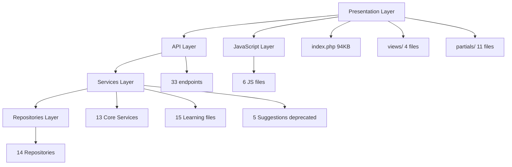
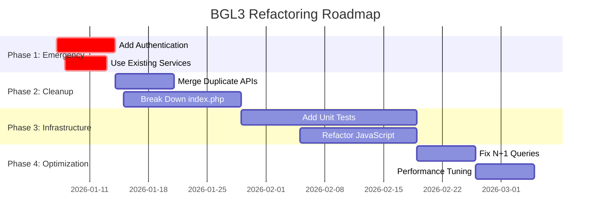

# التقرير التنفيذي الشامل - تشخيص مشروع BGL3

> **📅 التاريخ**: 2026-01-04  
> **🎯 الهدف**: تشخيص هندسي كامل للبنية الحالية (As-Is Architecture)  
> **📊 النطاق**: 86+ ملف عبر 5 طبقات أساسية  
> **⏱️ المدة**: 3+ ساعات تحليل معمق

---

## 📋 جدول المحتويات

1. [نظرة عامة على المشروع](#overview)
2. [نتائج التحليل بالأرقام](#metrics)
3. [المشاكل الحرجة](#critical-issues)
4. [التقييم العام](#overall-assessment)
5. [الأولويات الاستراتيجية](#priorities)
6. [خارطة الطريق](#roadmap)
7. [الخلاصة والتوصيات](#conclusion)

---

<a name="overview"></a>
## 🎯 1. نظرة عامة على المشروع

### المعلومات الأساسية

| البند | التفاصيل |
|-------|----------|
| **اسم المشروع** | BGL System v3.0 (Bank Guarantee Letters) |
| **اللغة** | PHP 8.x + Vanilla JavaScript |
| **قاعدة البيانات** | SQLite |
| **النمط المعماري** | Layered Architecture (Partial MVC) |
| **حجم الكود** | ~500KB+ across 86+ files |
| **التعقيد** | High (Enterprise-level features) |

### الطبقات المُحللة



---

<a name="metrics"></a>
## 📊 2. نتائج التحليل بالأرقام

### إحصائيات الكود

| الطبقة | عدد الملفات | الحجم الإجمالي | أكبر ملف | التقييم |
|--------|-------------|----------------|----------|---------|
| **Presentation** | 16+ | ~200KB | index.php (94KB) | 🔴 32/100 |
| **API** | 33 | ~142KB | parse-paste.php (31KB) | 🟡 55/100 |
| **Services** | 33 | ~115KB | TimelineRecorder (25KB) | 🟡 55/100 |
| **Repositories** | 14 | ~65KB | GuaranteeDecision (8.8KB) | ✅ 75/100 |
| **JavaScript** | 6 | ~89KB | records.controller (41KB) | 🟡 50/100 |
| **إجمالي** | **102** | **~611KB** | - | **53/100** |

### توزيع التعقيد

```
God Objects/Controllers (> 20KB):
├── index.php                    - 94KB  (Complexity: ~50) 🔴
├── records.controller.js        - 41KB  (Complexity: ~60) 🔴
├── parse-paste.php              - 31KB  (Complexity: ~60) 🔴
├── TimelineRecorder.php         - 25KB  (Complexity: ~45) 🔴
├── SmartProcessingService.php   - 21KB  (Complexity: ~50) 🔴
└── ImportService.php            - 19KB  (Complexity: ~35) 🔴

Total God Objects: 6 files (265KB = 43% of codebase!)
```

### Duplication Analysis

| نوع التكرار | التكرارات | التأثير |
|-------------|-----------|---------|
| **API Endpoints** | 4 pairs | Medium |
| **Business Logic** | 3 areas | High |
| **Column Detection** | 2 implementations | Medium |
| **Text Parsing** | 2 implementations | High |
| **إجمالي** | ~1500 LOC مكررة | **25% من الكود!** 🔴 |

---

<a name="critical-issues"></a>
## 🚨 3. المشاكل الحرجة

### 🔴 Critical (تحتاج حل فوري)

#### 1. God Objects Epidemic

**المشكلة**: 6 ملفات ضخمة تحتوي 43% من الكود!

| الملف | الحجم | المشكلة الرئيسية |
|------|------|------------------|
| `index.php` | 94KB | يجمع Backend + Frontend + CSS + JS |
| `records.controller.js` | 41KB | 50+ methods، كل شيء في controller واحد |
| `parse-paste.php` | 31KB | 20+ regex patterns، منطق معقد |
| `TimelineRecorder.php` | 25KB | 19 methods static، rendering + data |
| `SmartProcessingService` | 21KB | God method (228 lines) |
| `ImportService.php` | 19KB | Column detection مكرر |

**التأثير**:
- ❌ **Unmaintainable**: تعديل بسيط = خطر كبير
- ❌ **Untestable**: لا يمكن اختبار الوحدات
- ❌ **High Coupling**: كل شيء مرتبط بكل شيء
- ❌ **Knowledge Silos**: فقط من كتب الكود يفهمه

**Priority**: 🔥 **HIGHEST**

---

#### 2. Duplicate Code Everywhere

**المشكلة**: نفس الوظيفة في أماكن متعددة!

**أمثلة**:

**A. API Endpoints المكررة**:
```
create-supplier.php  ←→  create_supplier.php  (Naming + Features مختلفة!)
add-bank.php        ←→  create_bank.php      (واحد aliases، الثاني contacts!)
```

**B. Services غير مستخدمة**:
```
TextParsingService.php (15KB)   ← موجود لكن غير مستخدم!
  ↓
parse-paste.php (31KB)          ← يكرر كل المنطق!

ActionService.php (6KB)         ← موجود لكن غير مستخدم!
  ↓  
extend/reduce/release.php       ← يكررون كل المنطق!
```

**C. Column Detection**:
```
ExcelColumnDetector.php         ← موجود لكن غير مستخدم!
  ↓
ImportService::detectColumns()  ← 120 lines مكررة!
```

**التأثير**:
- 🔴 **~1500 LOC duplicate** = 25% من الكود
- 🔴 Bug fixes يجب تكرارها في أماكن متعددة
- 🔴 Inconsistent behavior بين implementations
- 🔴 Wasted development time

**Priority**: 🔥 **HIGHEST**

---

#### 3. Security Vulnerabilities

**المشكلة**: **لا يوجد Authentication أو Authorization!**

| الثغرة | المتأثر | الخطورة |
|--------|---------|---------|
| **No Authentication** | ALL 33 APIs | 🔴 CRITICAL |
| **No CSRF Protection** | ALL POST endpoints | 🔴 HIGH |
| **No Rate Limiting** | parse-paste، import | 🟡 MEDIUM |
| **No Input Validation** | Some APIs | 🟡 MEDIUM |
| **No Authorization** | Data access | 🔴 HIGH |

**السيناريو الحالي**:
```javascript
// أي شخص يمكنه:
fetch('/api/delete_supplier.php', {
    method: 'POST',
    body: JSON.stringify({ id: 1 })
});
// ✅ SUCCESS - تم الحذف! (بدون أي تحقق!)
```

**التأثير**:
- 🔴 **Data Loss Risk**: أي أحد يمكنه حذف/تعديل البيانات
- 🔴 **Privacy Breach**: الوصول لكل البيانات بدون قيود
- 🔴 **Compliance Issues**: مخالفة للمعايير الأمنية

**Priority**: 🔥 **CRITICAL** - يجب إصلاحه قبل Production!

---

### 🟡 High Priority (مهمة لكن ليست طارئة)

#### 4. Naming Inconsistency

**المشكلة**: نمطين مختلفين بدون معيار واضح

```
API Files:
├── kebab-case (40%)
│   ├── create-supplier.php
│   ├── save-and-next.php
│   └── add-bank.php
│
└── snake_case (40%)
    ├── create_supplier.php
    ├── update_bank.php
    └── get_suppliers.php
```

**التأثير**:
- 🟡 Confusion للمطورين
- 🟡 Hard to find endpoints
- 🟡 Professional appearance

---

#### 5. Mixed Concerns في Services

**مثال**: `TimelineRecorder.php`

```php
class TimelineRecorder {
    // Timeline Recording ✅
    recordEvent(...)
    
    // Snapshot Management ✅
    createSnapshot(...)
    
    // 🔴 WRONG: HTML Rendering!
    generateLetterSnapshot(...) {
        return "<html>..."; // This is View concern!
    }
    
    // 🔴 WRONG: Display Formatting!
    getEventIcon($event) {
        return match($event) {
            'imported' => '📥',  // This is Presentation!
        };
    }
}
```

**التأثير**:
- 🟡 Violates Single Responsibility
- 🟡 Hard to test business logic
- 🟡 Coupling between layers

---

#### 6. Performance Issues

**N+1 Queries في `index.php`**:

```php
// Timeline rendering (lines 2298-2350)
foreach ($timeline as $event) {
    // Query 1
    $bankName = getBankName($event['bank_id']); 
    
    // Query 2
    $supplierName = getSupplierName($event['supplier_id']);
    
    // Query 3
    $userName = getUser($event['user_id']);
}
// = 3 queries × N events = 3N queries! 🔴
```

**التأثير**:
- 🟡 Slow page load (especially with many events)
- 🟡 Database load
- 🟡 Poor user experience

---

### 🟢 Medium Priority (للتحسين المستمر)

#### 7. No Testing Infrastructure

| Layer | Unit Tests | Integration Tests | E2E Tests |
|-------|-----------|-------------------|-----------|
| Services | ❌ 0 | ❌ 0 | ❌ 0 |
| Repositories | ❌ 0 | ❌ 0 | ❌ 0 |
| APIs | ❌ 0 | ❌ 0 | ❌ 0 |

**التأثير**:
- 🟢 Regression risks عند التعديل
- 🟢 Manual testing فقط
- 🟢 Fear of refactoring

---

#### 8. JavaScript Architecture

**المشاكل**:
- No module system
- No bundling (6 separate `<script>` tags)
- No type safety (Vanilla JS)
- God controller (41KB)

**التأثير**:
- 🟢 Hard to maintain
- 🟢 Global namespace pollution
- 🟢 No tree-shaking

---

<a name="overall-assessment"></a>
## 📈 4. التقييم العام

### Score Breakdown

```
┌─────────────────────────────────────────────────┐
│ Overall Score: 53/100 (MEDIUM RISK)            │
├─────────────────────────────────────────────────┤
│                                                 │
│ 🏗️  Architecture        : 45/100  🔴          │
│ 🔒 Security             : 20/100  🔴          │
│ 🎨 Code Quality         : 55/100  🟡          │
│ 🔄 Maintainability      : 40/100  🔴          │
│ 🧪 Testability          : 25/100  🔴          │
│ 📊 Performance          : 60/100  🟡          │
│ 📚 Documentation        : 70/100  ✅          │
│ 🔗 Separation of Concerns: 50/100 🟡          │
│                                                 │
└─────────────────────────────────────────────────┘
```

### نقاط القوة ✅

1. **Learning System محترف جداً** (15 files، Enterprise-grade)
   - Feeder pattern
   - A/B testing (DualRun)
   - Gradual rollout (Cutover)
   
2. **Repository Pattern صحيح** (14 repos، clean)
   - Separation واضحة
   - Naming متسق
   - CRUD operations منظمة

3. **Server-Driven UI** (API endpoints)
   - Returns HTML fragments
   - Less frontend complexity
   - Consistent rendering

4. **Documentation جيد**
   - Comments بالعربي والإنجليزي
   - ADR references (Architecture Decision Records)
   - Function docstrings

### نقاط الضعف 🔴

1. **6 God Objects** (43% من الكود!)
2. **25% Code Duplication** (~1500 LOC)
3. **Security: صفر!** (No auth/CSRF)
4. **2 Unused Services** (logic duplicated)
5. **No Tests** (0 unit/integration tests)
6. **N+1 Queries** (performance issues)

---

<a name="priorities"></a>
## 🎯 5. الأولويات الاستراتيجية

### المرحلة 1: الإسعافات الأولية (أسبوع 1-2)

#### 🔥 **Priority 1: Security** (CRITICAL)

**الهدف**: حماية النظام من unauthorized access

```php
// إضافة Authentication Middleware
// middleware/authenticate.php
function requireAuth() {
    session_start();
    if (!isset($_SESSION['user_id'])) {
        http_response_code(401);
        echo json_encode(['error' => 'Unauthorized']);
        exit;
    }
}

// في كل API endpoint:
require_once __DIR__ . '/../middleware/authenticate.php';
requireAuth();
```

**الخطوات**:
1. إضافة login system
2. Session management
3. CSRF tokens
4. Apply to ALL 33 APIs

**Effort**: Medium  
**Impact**: CRITICAL

---

#### 🔥 **Priority 2: Use Existing Services** (Quick Win!)

**المشكلة**: Services موجودة لكن APIs لا تستخدمها!

**الحل**:

```php
// BEFORE: api/extend.php (123 lines)
$guarantee = $repo->find($id);
// ... validation (20 lines)
// ... date calculation (15 lines)
// ... timeline recording (30 lines)
// ... etc (60+ lines)

// AFTER: api/extend.php (15 lines!)
$actionService = new ActionService($actionsRepo, $decisionsRepo, $guaranteesRepo);
$result = $actionService->createExtension($guaranteeId);
echo json_encode($result);
```

**APIs to Fix**:
- `extend.php` → use `ActionService`
- `reduce.php` → use `ActionService`
- `release.php` → use `ActionService`
- `parse-paste.php` → use `TextParsingService`

**Impact**:
- ✅ تقليل ~400 سطر duplicate code
- ✅ Consistent business logic
- ✅ Easier to test

**Effort**: Low  
**Impact**: High

---

### المرحلة 2: التنظيف الاستراتيجي (أسبوع 3-4)

#### 🔥 **Priority 3: Merge Duplicate APIs**

**الخطوات**:

**A. Supplier APIs**:
```php
// DELETE: create-supplier.php, create_supplier.php
// CREATE: api/suppliers.php (unified)

class SuppliersAPI {
    public function create($input) {
        // Support both patterns:
        $name = $input['official_name'] ?? $input['name'];
        $english = $input['english_name'] ?? null;
        $confirmed = $input['is_confirmed'] ?? 0;
        
        // One implementation!
    }
}
```

**B. Bank APIs**:
```php
// DELETE: add-bank.php, create_bank.php
// CREATE: api/banks.php (unified)

// Support BOTH aliases AND contacts!
```

**Effort**: Medium  
**Impact**: High

---

#### 🟡 **Priority 4: Break Down God Objects**

**Target**: index.php (94KB)

**Strategy**: تدريجي، 3 مراحل

**Phase 1**: Extract CSS
```php
// Move CSS to: public/css/index.css
<link rel="stylesheet" href="css/index.css">
// من 94KB إلى ~70KB
```

**Phase 2**: Extract JavaScript
```javascript
// Move JS to: public/js/index-controller.js
// من 70KB إلى ~45KB
```

**Phase 3**: Extract PHP Logic
```php
// Create: app/Controllers/GuaranteeViewController.php
class GuaranteeViewController {
    public function show($id) {
        // All logic here
    }
}

// index.php becomes:
$controller = new GuaranteeViewController();
echo $controller->show($_GET['id'] ?? 1);
// من 45KB إلى ~5KB!
```

**Effort**: High  
**Impact**: Very High

---

### المرحلة 3: البنية التحتية (شهر 1-2)

#### 🟡 **Priority 5: Add Testing**

**البداية**: أسهل Services

```php
// tests/Services/ActionServiceTest.php
class ActionServiceTest extends TestCase {
    public function test_extension_adds_one_year() {
        $service = new ActionService(...);
        $result = $service->createExtension($guaranteeId);
        
        $this->assertEquals('2027-01-01', $result['new_expiry_date']);
    }
}
```

**التغطية المستهدفة**:
- Week 1-2: Services (70% coverage)
- Week 3-4: Repositories (80% coverage)
- Month 2: APIs (50% coverage)

**Effort**: High  
**Impact**: High (long-term)

---

#### 🟢 **Priority 6: JavaScript Refactoring**

**الهدف**: من God Controller إلى Modules

```javascript
// BEFORE: records.controller.js (41KB)
class RecordsController {
    // 50+ methods
}

// AFTER: Split into modules
import { RecordNavigator } from './modules/navigation.js';
import { RecordActions } from './modules/actions.js';
import { SupplierManager } from './modules/suppliers.js';

class RecordsOrchestrator {
    constructor() {
        this.navigator = new RecordNavigator();
        this.actions = new RecordActions();
        this.suppliers = new SupplierManager();
    }
}
```

**Effort**: Medium  
**Impact**: Medium

---

<a name="roadmap"></a>
## 🗺️ 6. خارطة الطريق

### Timeline Overview



### المعالم الرئيسية

| المرحلة | المدة | النتيجة المتوقعة | Score Target |
|---------|-------|-------------------|--------------|
| **Phase 1** | 2 weeks | System secured، Code reuse | 60/100 |
| **Phase 2** | 3 weeks | Clean structure، Less duplication | 70/100 |
| **Phase 3** | 1 month | Testable، Modular JS | 80/100 |
| **Phase 4** | 2 weeks | Performant، Professional | 85/100 |

---

<a name="conclusion"></a>
## 🎓 7. الخلاصة والتوصيات

### الخلاصة التنفيذية

**الوضع الحالي**: 
- Score: **53/100** (MEDIUM RISK)
- الكود يعمل ✅ لكنه **fragile وصعب الصيانة** 🔴
- **Security: صفر** - يجب إصلاحه فوراً! ⚠️

**نقاط القوة**:
- ✅ Learning system محترف
- ✅ Repository pattern صحيح
- ✅ Documentation جيد

**نقاط الضعف**:
- 🔴 6 God Objects (43% من الكود)
- 🔴 25% Code duplication
- 🔴 No authentication/authorization
- 🔴 2 Services unused (logic duplicated)
- 🔴 No tests

### التوصيات الرئيسية

#### 🔥 **Immediate (Week 1)**

1. **Add Authentication** - إسعافات أولية أمنية
2. **Use ActionService & TextParsingService** - Quick wins

#### 🟡 **Short-Term (Month 1)**

3. **Merge duplicate APIs** - تقليل التكرار
4. **Extract CSS/JS from index.php** - تحسين البنية

#### 🟢 **Long-Term (Month 2-3)**

5. **Add testing infrastructure** - ضمان الجودة
6. **Refactor JavaScript** - Modern architecture

### القرار التنفيذي

**هل يجب الاستمرار في هذا المشروع؟**

✅ **نعم، لكن مع Refactoring تدريجي**

**الأسباب**:
- الكود الأساسي **يعمل** وفيه features قيّمة
- **Learning system** محترف جداً (يستحق الحفاظ عليه)
- المشاكل **قابلة للحل** (ليست بنية فاشلة كلياً)
- Refactoring تدريجي **ممكن** (لا نحتاج rewrite كامل)

**لكن**:
- ❗ Security **يجب** إصلاحه قبل أي production use
- ❗ God Objects **يجب** تقسيمها (أولوية عالية)
- ❗ Testing **يجب** إضافته لضمان الجودة

---

## 📂 التقارير المُنشأة

1. ✅ **`architectural_diagnosis.md`** - تشخيص أولي شامل
2. ✅ **`index_php_analysis.md`** - تحليل معمق للـ index.php
3. ✅ **`api_inventory.md`** - جرد الـ 33 API endpoint
4. ✅ **`services_analysis.md`** - تحليل الـ Services Layer
5. ✅ **`repositories_js_analysis.md`** - Repositories + JavaScript
6. ✅ **`executive_summary.md`** - هذا التقرير

---

## 🎯 الخطوة التالية

**يُوصى بـ**:
1. **مراجعة هذا التقرير** مع الفريق
2. **تحديد الأولويات** بناءً على احتياجات العمل
3. **البدء بـ Phase 1** (Security + Service Reuse)
4. **Tracking progress** أسبوعياً

---

**تم التشخيص بواسطة**: Antigravity AI  
**التاريخ**: 2026-01-04  
**الحالة**: ✅ Complete - Ready for Review
