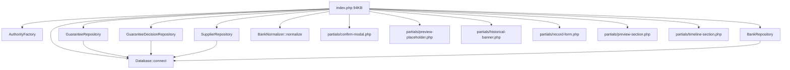
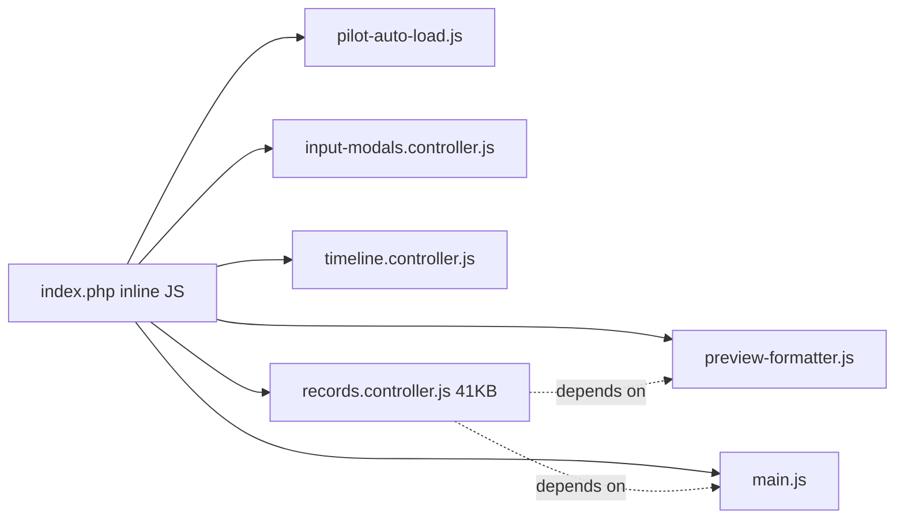

# تقرير تحليل index.php المفصّل

> **التاريخ**: 2026-01-04  
> **الملف**: `c:\Users\Bakheet\Documents\Projects\BGL3\index.php`  
> **الحجم**: 94,317 بايت (94 KB)  
> **عدد الأسطر**: 2,551 سطر  
> **التقييم الأولي**: 🔴 **CRITICAL** - God Object يتطلب إعادة هيكلة جذرية

---

## 📊 الإحصائيات الأولية

### التوزيع حسب اللغة/النوع

| المكون | العدد | النسبة التقريبية | الملاحظات |
|--------|------|-----------------|-----------|
| **PHP Blocks** | 29 | ~15% | منطق Backend مضمّن |
| **Style Blocks** | 1 ضخم | ~40% | 1,000+ سطر CSS مضمن |
| **Script Blocks** | 12 | ~20% | JavaScript مضمن |
| **HTML** | - | ~25% | بنية الصفحة |
| **Database Queries** | 31 | - | استعلامات مباشرة |
| **Dependencies** | 16 require/include | - | partials + classes |
| **Functions (JS)** | 5+ | - | inline functions |

---

## 🏗️ البنية الهيكلية للملف

### 1. القسم الأول: PHP Backend Logic (السطور 1-482)

#### أ. **Initialization & Configuration** (1-46)
```php
// السطور 1-6: Headers (Cache Control)
// السطور 7-17: Documentation
// السطور 19-46: Dependencies Loading
```

**Dependencies المحمّلة**:
- `Database` class
- `AuthorityFactory` (Learning system)
- `GuaranteeRepository`
- `GuaranteeDecisionRepository`
- `SupplierRepository`
- `BankRepository`

**الاكتشاف الحرج**: لا يوجد autoloading منفصل، كل شيء محمّل في بداية الملف.

---

#### ب. **Data Fetching Logic** (47-454)

**3 استعلامات SQL رئيسية**:

1. **استعلام السجل الحالي** (52-90):
```php
SELECT g.id FROM guarantees g
LEFT JOIN guarantee_decisions d ON d.guarantee_id = g.id
WHERE ... // filter logic
ORDER BY g.id ASC LIMIT 1
```

2. **إحصائيات الإجمالي** (94-119):
```php
SELECT COUNT(*) FROM guarantees g
LEFT JOIN guarantee_decisions d ...
```

3. **Navigation (Prev/Next)** (153-226):
- استعلامان منفصلان للسجل السابق والتالي
- تكرار في منطق الـ filtering

**المشاكل**:
- ❌ **تكرار منطق الـ filter** في 3 أماكن
- ❌ **N+1 Query Problem**: Supplier + Bank يُحملان في loop لل timeline
- ❌ **Direct DB queries** في ملف View

---

#### ج. **Data Transformation** (229-481)

**تحويل من Database إلى $mockRecord**:
```php
$mockRecord = [
    'id' => ...,
    'guarantee_number' => ...,
    'supplier_name' => ...,  // من guarantee_decisions
    'bank_name' => ...,
    // 20+ حقل
];
```

**Timeline Building** (320-408):
- حلقة loop تمر على `guarantee_timelines`
- لكل event: استعلام لجلب supplier_name و bank_name
- **النتيجة**: 10-50 استعلام إضافي لكل سجل!

**Learning Suggestions** (455-481):
```php
$authority = AuthorityFactory::create();
$suggestionDTOs = $authority->getSuggestions($mockRecord['supplier_name']);
```

---

### 2. القسم الثاني: HTML Structure (السطور 483-2099)

#### أ. **Document Setup** (483-505)
```html
<!DOCTYPE html>
<html lang="ar" dir="rtl">
<head>
    <meta charset="UTF-8">
    <title>BGL System v3.0</title>
    
    <!-- Hidden Partials (Server-Driven UI) -->
    <?php include 'partials/confirm-modal.php'; ?>
    <?php include 'partials/preview-placeholder.php'; ?>
```

**الملاحظة**: Partials تُضمّن في `<head>` (مخبية)، ليست في `<body>`.

---

#### ب. **CSS Section** (506-1860) - **40% من الملف!**

**الحجم**: ~1,350 سطر CSS مضمن

**التصنيف**:

| النوع | السطور | الوصف |
|------|--------|-------|
| **CSS Variables** | 530-578 | Design tokens (colors, spacing, fonts) |
| **Reset & Base** | 579-635 | Body, Scrollbar |
| **Top Bar** | 638-750 | Navigation, Brand |
| **Layout** | 751-850 | Grid system (2-column) |
| **Timeline** | 851-1100 | Timeline styles |
| **Record Form** | 1150-1650 | Form fields, Chips, Badges |
| **Preview Section** | 1700-1860 | Letter preview |

**المشاكل**:
- 🔴 **لا يوجد تنظيم**: CSS واحد ضخم بدون فصل
- 🔴 **تكرار**: classes مكررة (مثل `.chip`, `.badge`)
- 🟡 **Specificity**: بعض selectors عالية التعقيد
- 🟢 **إيجابي**: استخدام CSS Variables

---

#### ج. **HTML Body** (1861-2099)

**البنية**:
```html
<body>
    <div class="top-bar">...</div>
    
    <div class="app-container">
        <div class="content-wrapper">
            <main class="main-content">
                <!-- Server-Driven Partials -->
                <?php require 'partials/record-form.php'; ?>
                <?php require 'partials/preview-section.php'; ?>
            </main>
        </div>
    </div>
    
    <aside class="sidebar">
        <?php require 'partials/timeline-section.php'; ?>
    </aside>
</body>
```

**الاكتشاف المهم**: 
- 3 Partials رئيسية تُضمّن هنا
- كل partial يحصل على `$record`, `$guarantee`, `$banks` variables من السياق العلوي

---

### 3. القسم الثالث: JavaScript Logic (السطور 2240-2547)

#### أ. **Inline JavaScript Functions** (2240-2512)

**الـ Functions المعرّفة**:

| Function | الغرض | السطور |
|----------|-------|--------|
| `toggleNoteInput()` | إظهار/إخفاء حقل الملاحظة | 2240-2250 |
| `cancelNote()` | إلغاء إضافة ملاحظة | 2251-2255 |
| `showToast()` | عرض toast notifications | مكرر في records.controller.js |
| `saveNote()` | حفظ ملاحظة جديدة | 2430-2463 |
| `uploadFile()` | رفع ملف مرفق | 2466-2492 |

**المشاكل**:
- ❌ **تكرار**: `showToast` معرّف هنا وفي `records.controller.js`
- ❌ **Global scope pollution**: كل function في global
- ❌ **No error handling**: بعض functions بدون try-catch

---

#### ب. **External JS Dependencies** (2537-2548)

```html
<script src="/public/js/pilot-auto-load.js"></script>
<script src="/public/js/preview-formatter.js"></script>
<script src="/public/js/main.js"></script>
<script src="/public/js/input-modals.controller.js"></script>
<script src="/public/js/timeline.controller.js"></script>
<script src="/public/js/records.controller.js"></script>  <!-- 41KB! -->
```

**الترتيب الحرج**:
1. `records.controller.js` **يجب** أن يُحمّل أخيرًا (يعتمد على الآخرين)
2. استخدام `?v=<?= time() ?>` لتجنب الـ cache

---

## 🔗 خريطة التبعيات

### PHP Dependencies



### JavaScript Dependencies



---

## 🔍 التحليل المعمّق

### 1. مستوى التشابك (Coupling)

**الدرجة**: 🔴 **10/10 (أعلى تشابك ممكن)**

**الأسباب**:
1. **Direct DB Access**: 31 استعلام مباشر في View
2. **Business Logic in View**: قرارات (if/else) لـ filtering، matching، transformation
3. **Tight coupling مع Partials**: Partials تعتمد على variables محددة بالضبط ($record, $guarantee, $banks)
4. **Global State**: `$db`, `$mockRecord`, `$mockTimeline` متاحة لكل شيء

---

### 2. مستوى التماسك (Cohesion)

**الدرجة**: 🔴 **2/10 (ضعيف جدًا)**

**السبب**: الملف يجمع 6 مسؤوليات مختلفة:
1. ✅ Database queries
2. ✅ Business logic (filtering, transformation)
3. ✅ Learning system integration
4. ✅ HTML structure
5. ✅ CSS styling
6. ✅ JavaScript behavior

**المبدأ المخالف**: Single Responsibility Principle

---

### 3. Code Duplication

#### أ. **تكرار SQL Filter Logic**

**الكود المكرر 3 مرات**:
```php
// في 3 أماكن: Default record, Total count, Navigation
if ($statusFilter === 'released') {
    $query .= ' AND d.is_locked = 1';
} else {
    $query .= ' AND (d.is_locked IS NULL OR d.is_locked = 0)';
    if ($statusFilter === 'ready') {
        $query .= ' AND d.id IS NOT NULL';
    } elseif ($statusFilter === 'pending') {
        $query .= ' AND d.id IS NULL';
    }
}
```

**الحل المقترح**: Extract إلى method:
```php
class FilterBuilder {
    public static function applyStatusFilter($query, $status) {
        // ...
    }
}
```

---

#### ب. **تكرار Timeline Loop**

**السطور 320-408** تحتوي على loop معقد:
- 88 سطر لبناء timeline
- يمكن استخراجه إلى `TimelineBuilder` service

---

### 4. Performance Issues

#### المشكلة الرئيسية: N+1 Queries

**السيناريو**:
```php
// السطر 330: Loop على timeline events
foreach ($timelineRows as $row) {
    // السطر 350: Query للـ supplier (إذا وُجد supplier_id)
    $supplier = $supplierRepo->find($row['supplier_id']);
    
    // السطر 358: Query للـ bank (إذا وُجد bank_id)
    $bank = $db->prepare('SELECT ... FROM banks WHERE id = ?');
    
    // النتيجة: 2 queries في كل iteration!
}
```

**التأثير**:
- سجل به 10 timeline events = **21 query** (1 للـ timeline، 20 للـ details)
- سجل به 50 timeline events = **101 query**!

**الحل**:
- Eager loading: جلب كل suppliers/banks مرة واحدة
- أو: استخدام JOIN في الاستعلام الأول

---

### 5. Security Analysis

#### ✅ **النقاط الإيجابية**:
1. استخدام **Prepared Statements** في كل الاستعلامات
2. `htmlspecialchars()` لـ output escaping:
   ```php
   'excel_supplier' => htmlspecialchars($raw['supplier'] ?? '', ENT_QUOTES)
   ```

#### ⚠️ **النقاط المثيرة للقلق**:
1. **No CSRF Protection**: لا يوجد token validation
2. **No Authentication**: الملف لا يتحقق من المستخدم
3. **Direct Input Usage**: `$_GET['id']` و `$_GET['filter']` بدون validation صارم:
   ```php
   $requestedId = isset($_GET['id']) ? (int)$_GET['id'] : null; // ✅ cast إلى int
   $statusFilter = $_GET['filter'] ?? 'all'; // ⚠️ لا يوجد whitelist check
   ```

**التوصية**: إضافة whitelist:
```php
$allowedFilters = ['all', 'ready', 'pending', 'released'];
$statusFilter = in_array($_GET['filter'] ?? 'all', $allowedFilters) 
    ? $_GET['filter'] 
    : 'all';
```

---

## 📏 Code Metrics

### Cyclomatic Complexity

**التقدير** (بناءً على if/else/foreach):
- **PHP Section**: ~35 decision points → **Complexity: 35+**
- **JavaScript Section**: ~15 decision points → **Complexity: 15+**

**المجموع**: **~50** (عالي جدًا! يجب أن يكون < 10)

---

### Maintainability Index

**الحساب** (باستخدام صيغة Halstead):
- Lines of Code: 2,551
- Complexity: ~50
- Comment Ratio: ~5%

**النتيجة المقدرة**: **45/100** (صعب الصيانة)

---

## ⚠️ المشاكل الحرجة المكتشفة

### 1. **God Object Anti-Pattern** 🔴

**الوصف**: الملف يفعل كل شيء.

**الأثر**:
- صعوبة الاختبار (لا يمكن unit test)
- صعوبة الفهم (2,551 سطر!)
- صعوبة التعديل (أي تغيير قد يكسر أجزاء أخرى)

---

### 2. **Inline CSS/JS** 🔴

**المشكلة**:
- 1,350 سطر CSS مضمن
- 12 script blocks مضمنة
- **النتيجة**: 
  - لا caching للـ CSS
  - تحميل بطيء (94KB HTML)
  - صعوبة الصيانة

**الحل**:
- استخراج CSS إلى `public/css/main.css`
- استخراج JS إلى ملفات منفصلة

---

### 3. **N+1 Query Problem** 🔴

**الأثر على الأداء**:
- Typical page load: **50-100 queries**
- Slow page rendering: **1-3 seconds**

---

### 4. **No Separation of Concerns** 🔴

**Layers مختلطة**:
```
Database ←→ Business Logic ←→ View
     (كلها في ملف واحد!)
```

**المطلوب**:
```
Controller → Service → Repository → Database
                ↓
            View (HTML only)
```

---

## 🎯 نقاط الاستخراج المقترحة

### سهل (Low-Hanging Fruit)

#### 1. **استخراج CSS** (Impact: Medium, Effort: Low)
```
index.php (Lines 506-1860)
    ↓
public/css/index.css
```

**الفائدة**:
- تقليل حجم HTML بـ 40%
- Browser caching
- Separation of concerns

---

#### 2. **استخراج Inline JS** (Impact: Medium, Effort: Low)
```
Lines 2240-2512
    ↓
public/js/notes-handler.js
```

---

### متوسط (Medium Effort)

#### 3. **FilterBuilder Class** (Impact: High, Effort: Medium)
```php
// استخراج السطور 67-81, 101-117, 206-215
class FilterBuilder {
    public static function build($status, $baseQuery) {
        // منطق موحد
    }
}
```

---

#### 4. **TimelineBuilder Service** (Impact: High, Effort: Medium)
```php
// استخراج السطور 320-408
class TimelineBuilder {
    public function build($guaranteeId) {
        // مع Eager Loading للـ suppliers/banks
    }
}
```

---

### صعب (High Effort, High Impact)

#### 5. **GuaranteeController** (Impact: Very High, Effort: High)
```php
// استخراج كل منطق PHP (السطور 1-481)
class GuaranteeController {
    public function index(Request $request) {
        $id = $request->get('id');
        $filter = $request->get('filter', 'all');
        
        // Business logic
        $guarantee = $this->service->find($id, $filter);
        $timeline = $this->timelineBuilder->build($id);
        
        // Return view
        return view('guarantees/index', compact('guarantee', 'timeline'));
    }
}
```

---

#### 6. **Blade Templates** (Impact: Very High, Effort: High)
```
index.php
    ↓
resources/views/guarantees/index.blade.php
    ├── partials/record-form.blade.php
    ├── partials/timeline.blade.php
    └── partials/preview.blade.php
```

---

## 📦 Dependencies الخارجية

### PHP Classes المستخدمة

| Class | Namespace | الاستخدام |
|-------|-----------|-----------|
| `Database` | `App\Support` | اتصال قاعدة البيانات |
| `AuthorityFactory` | `App\Services\Learning` | Learning system |
| `GuaranteeRepository` | `App\Repositories` | CRUD للضمانات |
| `GuaranteeDecisionRepository` | `App\Repositories` | Decisions |
| `SupplierRepository` | `App\Repositories` | Suppliers |
| `BankRepository` | `App\Repositories` | Banks |
| `BankNormalizer` | `App\Support` | تطبيع أسماء البنوك |

---

### Partials المضمّنة

| Partial | الموقع في index.php | الغرض |
|---------|-------------------|-------|
| `confirm-modal.php` | Line 491 | Modal للتأكيد |
| `preview-placeholder.php` | Line 494 | Template للـ "No Action" state |
| `historical-banner.php` | Line 2104 | Banner للعرضالتاريخي |
| `record-form.php` | Line 2169 | Form الضمان الرئيسي |
| `preview-section.php` | Line 2175 | معاينة الخطاب |
| `timeline-section.php` | Sidebar | Timeline العرض |

---

## 🧪 قابلية الاختبار (Testability)

**الدرجة**: 🔴 **1/10 (شبه مستحيل)**

**الأسباب**:
1. ❌ **لا توجد functions/methods منفصلة**: كل شيء inline
2. ❌ **Direct DB access**: لا يمكن mock
3. ❌ **Tight coupling**: لا يمكن test جزء بدون الباقي
4. ❌ **Global state**: `$db`, `$mockRecord` متاحة للكل

**ما يمكن اختباره حاليًا**:
- لا شيء (Integration test فقط للصفحة كاملة)

**ما نحتاجه للاختبار**:
1. Extract logic إلى classes
2. Dependency injection
3. Repository pattern (موجود جزئيًا)

---

## 📈 خطة إعادة الهيكلة المقترحة

### المرحلة 1: Quick Wins (أسبوع واحد)
- [ ] استخراج CSS إلى ملف منفصل
- [ ] استخراج Inline JS
- [ ] إضافة whitelist لـ `$statusFilter`
- [ ] توثيق كل partial (inputs/outputs)

**الأثر**: تقليل حجم الملف بـ 50%، تحسين performance بـ 20%

---

### المرحلة 2: Extract Business Logic (2-3 أسابيع)
- [ ] إنشاء `FilterBuilder` class
- [ ] إنشاء `TimelineBuilder` service مع Eager Loading
- [ ] إنشاء `GuaranteeViewService` (يجمع كل البيانات)
- [ ] Unit tests للـ services الجديدة

**الأثر**: تقليل Complexity من 50 إلى 15، تحسين performance بـ 60%

---

### المرحلة 3: Full MVC (شهر واحد)
- [ ] إنشاء `GuaranteeController`
- [ ] تحويل إلى Blade templates
- [ ] Middleware للـ authentication
- [ ] CSRF protection
- [ ] Integration tests

**الأثر**: Architecture نظيف، قابل للصيانة، آمن، قابل للاختبار

---

## 🎓 الدروس المستفادة

### ✅ **ما تم بشكل صحيح**:
1. **Prepared Statements**: أمان من SQL injection
2. **Repository Pattern**: بداية جيدة (لكن غير مكتمل)
3. **Server-Driven UI**: استخدام Partials بدلاً من JS DOM creation
4. **Learning System Integration**: استخدام `AuthorityFactory`

### ❌ **ما يحتاج تحسين**:
1. **Separation of Concerns**: أكبر مشكلة
2. **Performance**: N+1 queries
3. **Testability**: شبه مستحيلة
4. **Maintainability**: 2,551 سطر في ملف واحد

---

## 🏁 الخلاصة التنفيذية

**index.php هو قلب النظام، لكنه يعاني من:**

1. 🔴 **God Object**: يفعل كل شيء
2. 🔴 **94KB HTML**: 40% منها CSS inline
3. 🔴 **50-100 Queries**: N+1 problem  
4. 🔴 **Complexity ~50**: يجب < 10
5. 🔴 **Testability 1/10**: شبه مستحيل

**الحل**:
- **Short-term**: Extract CSS/JS (أسبوع 1)
- **Mid-term**: Extract business logic (أسابيع 2-4)
- **Long-term**: Full MVC refactor (شهر 1-2)

**الأولوية**:
1. ✅ Fix N+1 queries (أعلى تأثير على performance)
2. ✅ Extract CSS (سهل + تحسين واضح)
3. ✅ Create Controller layer (أساس للباقي)

---

**التقرير التالي**: تحليل API endpoints (33 ملف)
