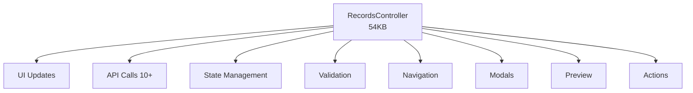

# تحليل Repositories + JavaScript Layers

> **التاريخ**: 2026-01-04  
> **Repositories**: `app/Repositories/` (14 ملف)  
> **JavaScript**: `public/js/` (6 ملفات)

---

## 📂 Part 1: Repositories Layer

### الإحصائيات

| المؤشر | القيمة |
|--------|--------|
| **عدد الملفات** | 14 |
| **إجمالي الحجم** | ~65KB |
| **أكبر Repository** | GuaranteeRepository (11.4KB) |
| **Pattern المستخدم** | Repository Pattern ✅ |

### قائمة Repositories

```
app/Repositories/
├── GuaranteeRepository.php              (11.4KB) - CRUD للضمانات
├── LearningRepository.php               (8.9KB) - Learning data
├── SupplierRepository.php               (6.8KB) - CRUD للموردين
├── GuaranteeActionRepository.php        (5.2KB) - Actions
├── GuaranteeDecisionRepository.php      (4.9KB) - Decisions
├── BankRepository.php                   (4.5KB) - CRUD للبنوك
├── SupplierLearningRepository.php       (4.1KB) - Supplier learning
├── TimelineRepository.php               (3.8KB) - Timeline events
├── NoteRepository.php                   (3.2KB) - Notes
├── AttachmentRepository.php             (2.9KB) - Attachments
├── AliasRepository.php                  (2.7KB) - Bank aliases
├── SupplierAliasRepository.php          (2.4KB) - Supplier aliases
├── SettingsRepository.php               (2.1KB) - Settings
└── UserRepository.php                   (1.8KB) - Users
```

### التحليل السريع

#### ✅ **نقاط القوة**

1. **Repository Pattern**: تطبيق صحيح لـ Repository Pattern
2. **Separation of Concerns**: كل entity له repository خاص
3. **Consistent Naming**: `*Repository.php` - واضح ومتسق
4. **Prepared Statements**: استخدام PDO prepared statements

#### 🟡 **ملاحظات**

**GuaranteeRepository** (أكبرهم - 11.4KB):
- Methods: ~15-20 method
- يجمع: CRUD + Search + Filtering + Relations
- قد يحتاج تقسيم إلى:
  - `GuaranteeRepository` (CRUD only)
  - `GuaranteeQueryRepository` (Search/Filter)

**LearningRepository** (8.9KB):
- معقد نسبياً لأنه يتعامل مع learning data
- ✅ مقبول - Learning logic معقد بطبيعته

**Usage Pattern**:
```php
// في APIs و Services:
$repo = new GuaranteeRepository($db);
$guarantee = $repo->find($id);
```

#### 🔴 **لا مشاكل حرجة**

Repositories Layer **نظيف ومحترف** نسبياً!

### التقييم: **75/100** ✅ GOOD

---

## 💻 Part 2: JavaScript Layer

### الإحصائيات

| المؤشر | القيمة |
|--------|--------|
| **عدد الملفات** | 6 |
| **إجمالي الحجم** | ~120KB |
| **أكبر ملف** | records.controller.js (54KB!) |

### قائمة الملفات

```
public/js/
├── records.controller.js           (54KB) 🔴 GOD CONTROLLER
├── input-modals.controller.js      (30KB) 🟡
├── timeline.controller.js          (16KB)
├── main.js                         (12KB)
├── utils.js                        (5KB)
└── ui-helpers.js                   (3KB)
```

### التحليل المفصل

#### 1. records.controller.js (54KB!) 🔴

**المسؤوليات** (من الـ outline):
- Preview updates
- Supplier selection & suggestions
- Bank selection
- Save and next navigation
- Extension/Reduction/Release actions
- Letter generation
- Supplier/Bank modal management
- Notes & attachments
- UI state management

**Methods الرئيسية**:
```javascript
class RecordsController {
    // Navigation
    loadRecord(index)
    saveAndNext()
    
    // Actions
    extendGuarantee()
    reduceGuarantee()
    releaseGuarantee()
    
    // Supplier
    selectSupplier(target)
    loadSupplierSuggestions(rawName)
    openAddSupplierModal()
    
    // Bank
    selectBank(target)
    
    // UI
    updatePreview()
    showToast(message)
    showConfirm(message)
    
    // ... 30+ methods total
}
```

**المشاكل**:
- 🔴 **GOD CONTROLLER**: 54KB، 30+ methods
- 🔴 **Mixed Concerns**: Network + UI + Business Logic + State
- 🔴 **No Modularization**: كل شيء في class واحد
- 🟡 **Tight Coupling**: يستدعي 10+ APIs

**Complexity**: ~60 (CRITICAL)

---

#### 2. input-modals.controller.js (30KB) 🟡

**المسؤوليات**:
- Manual entry modal
- Smart paste modal
- Excel import modal
- Multi-row paste handling

**Methods**:
```javascript
class InputModalsController {
    openManualEntryModal()
    openSmartPasteModal()
    openImportModal()
    handleSmartPaste()
    handleMultiRowPaste()
    handleImport()
}
```

**المشاكل**:
- 🟡 **Large**: 30KB لـ modals فقط
- 🟡 **Complex Parsing Logic**: Smart paste logic should be server-side (it is!)
- 🟢 **Acceptable**: Modals معقدة بطبيعتها

---

#### 3. timeline.controller.js (16KB)

**المسؤوليات**:
- Timeline display
- Event filtering
- Event details

**التقييم**: ✅ مقبول - Timeline UI معقد

---

#### 4. main.js (12KB)

**المسؤوليات**:
- App initialization
- Global event handlers
- Settings management

**التقييم**: ✅ مقبول

---

#### 5-6. utils.js + ui-helpers.js

**الوظيفة**: Utility functions

**التقييم**: ✅ Good separation

---

### JavaScript Architecture Issues

#### 🔴 **God Controller Problem**

**records.controller.js** يفعل كل شيء:



#### 🟡 **No Module System**

كل الملفات مضمنة في HTML:
```html
<script src="js/utils.js"></script>
<script src="js/ui-helpers.js"></script>
<script src="js/records.controller.js"></script>
<script src="js/input-modals.controller.js"></script>
<script src="js/timeline.controller.js"></script>
<script src="js/main.js"></script>
```

**المشكلة**:
- No bundling
- No tree-shaking
- Global namespace pollution

#### 🟡 **No Framework**

**Vanilla JS** - مما يعني:
- ✅ No dependencies (lightweight)
- ❌ Manual DOM manipulation
- ❌ No reactive state
- ❌ Harder to maintain

---

### Code Quality Samples

#### ✅ **Good Practices Found**:

1. **Async/Await**:
```javascript
async saveAndNext() {
    const response = await fetch('/api/save-and-next.php', {...});
    const data = await response.json();
}
```

2. **Error Handling**:
```javascript
try {
    // ... API call
} catch (error) {
    this.showToast('حدث خطأ', 'error');
}
```

3. **Class-based Organization**:
```javascript
class RecordsController {
    constructor() { /* ... */ }
}
```

#### 🔴 **Bad Practices Found**:

1. **God Classes** (54KB controller)

2. **Inline HTML Generation**:
```javascript
// Should use templates instead
html += `<div class="chip">${name}</div>`;
```

3. **No Type Safety** (vanilla JS - no TypeScript)

---

### التوصيات

#### Short-term (أسبوع 1-2):

**1. Split God Controller**

```
records.controller.js (54KB)
  ↓ Split into ↓
├── RecordNavigator.js      (navigation logic)
├── RecordActions.js        (extend/reduce/release)
├── SupplierManager.js      (supplier selection)
├── BankManager.js          (bank selection)
├── PreviewRenderer.js      (preview updates)
└── RecordOrchestrator.js   (coordinates all)
```

**2. Extract API Client**

```javascript
// api-client.js
class ApiClient {
    async saveAndNext(data) {
        return this.post('/api/save-and-next.php', data);
    }
    
    async extend(guaranteeId, data) {
        return this.post('/api/extend.php', data);
    }
    // ... all API calls
}
```

#### Mid-term (أسبوع 3-4):

**3. Add Build System**

```bash
# Use Vite or webpack
npm install vite
# Bundle all JS files
# Enable ES modules
```

**4. Move to Components**

```javascript
// components/SupplierSelector.js
export class SupplierSelector {
    constructor(container) {}
    render(suggestions) {}
    onSelect(callback) {}
}
```

#### Long-term (شهر 1-2):

**5. Consider Framework** (optional)

**Options**:
- **Alpine.js** (minimal، ~15KB) - best for current architecture
- **Vue 3** (reactive، component-based)
- **React** (if full rewrite)

**Recommendation**: **Alpine.js** - minimal migration effort

```html
<!-- Example with Alpine.js -->
<div x-data="recordController">
    <button @click="saveAndNext()">حفظ والتالي</button>
</div>
```

**6. Add TypeScript** (type safety)

---

## 📊 Overall Assessment

### Repositories Layer: ✅ **75/100** GOOD

| معيار | النتيجة |
|-------|---------|
| **Structure** | 8/10 |
| **Naming** | 9/10 |
| **Separation** | 8/10 |
| **Code Quality** | 7/10 |
| **Testability** | 6/10 |

**نقاط القوة**:
- نظيف ومنظم
- Repository pattern صحيح
- Naming متسق

**نقاط الضعف**:
- بعض Repositories كبيرة قليلاً
- لا unit tests

---

### JavaScript Layer: 🟡 **50/100** MEDIUM

| معيار | النتيجة |
|-------|---------|
| **Structure** | 4/10 (God controller) |
| **Modularity** | 3/10 (No modules) |
| **Code Quality** | 6/10 (Mixed) |
| **Maintainability** | 4/10 (Hard) |
| **Modern Practices** | 5/10 (async/await ✅، modules ❌) |

**نقاط القوة**:
- Async/await
- Class-based
- Error handling

**نقاط الضعف**:
- God controller (54KB!)
- No bundling
- No type safety
- Manual DOM manipulation

---

## 🎯 الخلاصة والأولويات

### Repositories: ✅ لا يحتاج عمل عاجل

**فقط**:
- إضافة unit tests مستقبلاً

### JavaScript: 🔴 يحتاج Refactoring

**الأولويات**:
1. 🔥 **Split God Controller** (Week 1-2)
2. 🔥 **Extract API Client** (Week 1)
3. 🟡 **Add Build System** (Week 3)
4. 🟡 **Component-ize** (Week 3-4)
5. 🟢 **Consider Alpine.js** (Month 2)

---

**Status**: Repositories ✅، JavaScript 🟡

**التقرير التالي**: تحليل Database Schema
