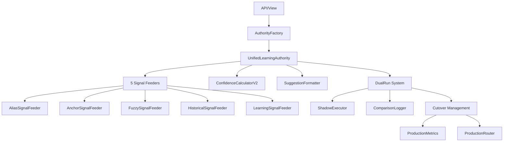

# تقرير تحليل Services Layer الشامل

> **التاريخ**: 2026-01-04  
> **المسار**: `c:\Users\Bakheet\Documents\Projects\BGL3\app\Services\`  
> **العدد الإجمالي**: 33 ملف (13 رئيسي + 20 في subdirectories)  
> **التقييم**: 🟡 **MEDIUM** - God Services + بعض الملفات غير مستخدمة

---

## 📊 الإحصائيات العامة

| المؤشر | القيمة |
|--------|--------|
| **ملفات Services رئيسية** | 13 |
| **Learning Subdirectory** | 15 ملف |
| **Suggestions Subdirectory** | 5 ملفات |
| **إجمالي الحجم** | ~115 KB |
| **أكبر Service** | `TimelineRecorder.php` (25KB، 631 سطر) |
| **ثاني أكبر** | `SmartProcessingService.php` (20.5KB، 477 سطر) |
| **ثالث أكبر** | `ImportService.php` (18.5KB، 479 سطر) |

---

## 🗂️ الهيكل التنظيمي

```
app/Services/
├── Core Services (13 files)
│   ├── TimelineRecorder.php          (25KB) 🔴
│   ├── SmartProcessingService.php    (20.5KB) 🔴  
│   ├── ImportService.php             (18.5KB) 🔴
│   ├── TextParsingService.php        (15.2KB) 🟡
│   ├── ConflictDetector.php          (6.5KB)
│   ├── ActionService.php             (5.9KB)
│   ├── DecisionService.php           (5.1KB)
│   ├── AutoAcceptService.php         (4.7KB)
│   ├── ExcelColumnDetector.php       (4.3KB)
│   ├── RecordHydratorService.php     (3.9KB)
│   ├── StatusEvaluator.php           (3.9KB)
│   ├── ValidationService.php         (1.7KB)
│   └── SupplierCandidateService.php  (1.1KB)
│
├── Learning/ (15 files)
│   ├── UnifiedLearningAuthority.php  (8.2KB)
│   ├── AuthorityFactory.php          (3.6KB)
│   ├── ConfidenceCalculatorV2.php
│   ├── SuggestionFormatter.php
│   ├── Feeders/ (5 files)
│   │   ├── AliasSignalFeeder.php
│   │   ├── AnchorSignalFeeder.php
│   │   ├── FuzzySignalFeeder.php
│   │   ├── HistoricalSignalFeeder.php
│   │   └── LearningSignalFeeder.php
│   ├── DualRun/ (3 files)
│   │   ├── ComparisonLogger.php
│   │   ├── ComparisonResult.php
│   │   └── ShadowExecutor.php
│   └── Cutover/ (3 files)
│       ├── CutoverManager.php
│       ├── ProductionMetrics.php
│       └── ProductionRouter.php
│
└── Suggestions/ (5 files) ⚠️ DEPRECATED
    ├── ArabicLevelBSuggestions.php   (11.9KB)
    ├── ArabicEntityExtractor.php
    ├── ArabicEntityAnchorExtractor.php
    ├── LearningSuggestionService.php
    └── ConfidenceCalculator.php
```

---

## 🔍 تحليل God Services الثلاثة

### 1. TimelineRecorder.php (25KB، 631 سطر) 🔴

#### المسؤوليات (19 methods):

**أ. Snapshot Management**:
- `createSnapshot()` - Create state snapshot from DB
- `generateLetterSnapshot()` - Render immutable letter HTML

**ب. Event Recording** (8 types):
- `recordImportEvent()` - LE-00: Import event
- `recordDecisionEvent()` - UE-01: Supplier/Bank decision
- `recordExtensionEvent()` - UE-02: Extension
- `recordReductionEvent()` - UE-03: Reduction  
- `recordReleaseEvent()` - UE-04: Release
- `recordStatusTransitionEvent()` - SE-01/02: Status change
- `recordDuplicateImportEvent()` - RE-00: Duplicate import
- `recordReimportEvent()` - Reimport

**ج. Utilities**:
- `detectChanges()` - Compare old vs new
- `calculateStatus()` - (DEPRECATED، delegates to StatusEvaluator)
- `getTimeline()` - Fetch events
- `getEventDisplayLabel()` - Format for display
- `getEventIcon()` - Icon selection
- `getCurrentUser()` - Get current user

**د. Private Core**:
- `recordEvent()` - Core recording method (enforces contract)

#### المشاكل:

1. 🔴 **Too Many Responsibilities**: Timeline + Snapshot + Rendering + Utilities
2. 🔴 **631 Lines**: صعب الصيانة
3. 🔴 **Static Methods**: كل methods static (hard to test، tight coupling)
4. 🟡 **Letter Rendering**: `generateLetterSnapshot()` يُنشئ HTML - should be in separate Renderer
5. 🟡 **Mixed Concerns**: Event recording + display formatting

**Usage**: 
- مستخدم في **11 مكان** (APIs mostly)
- **Critical dependency** - كل action يسجل timeline

**Complexity Estimate**: ~45 (Very High)

---

### 2. SmartProcessingService.php (20.5KB، 477 سطر) 🔴

#### المسؤوليات:

**أ. Auto-Matching**:
```php
processNewGuarantees($limit = 500)
- Fetch pending guarantees
- Match suppliers (Learning Authority)
- Match banks (BankNormalizer)
- Evaluate trust (explainable gate)
- Create decisions
- Log events
```

**ب. Decision Creation**:
```php
createAutoDecision($guaranteeId, $supplierId, $bankId)
- Insert into guarantee_decisions
- Set status = 'ready'
```

**ج. Event Logging**:
```php
logAutoMatchEvents($guaranteeId, ...)
- Record supplier match
- Update rawData with matched names
```

**د. Trust Evaluation**:
```php
evaluateTrust($supplierId, $source, $score, $rawName)
- Level A: score >= 90
- Level B: 70-89 + source trust
- Level C/D: Lower scores
- Returns TrustDecision with reasoning
```

#### المشاكل:

1. 🔴 **God Method**: `processNewGuarantees()` does 6 different things (228 lines!)
2. 🔴 **Complex Business Logic**: Trust gate، supplier/bank matching، decision creation
3. 🟡 **Hard to Test**: Multiple dependencies (Repos، Learning، Timeline)
4. 🟡 **Mixing Layers**: Business logic + data access + timeline

**Usage**:
- مستخدم في **5 APIs**: import، parse-paste، manual-entry، create-guarantee
- **Critical for automation**: كل guarantee جديد يمر من هنا

**Complexity Estimate**: ~50 (Critical)

---

### 3. ImportService.php (18.5KB، 479 سطر) 🔴

#### المسؤوليات:

**أ. Excel Import**:
```php
importFromExcel($filePath, $importedBy)
- Read Excel using SimpleXlsxReader
- Detect columns (smart keyword matching)
- Normalize data (amount، date)
- Validate
- Create guarantee records
- Return stats (count، errors، skipped)
```

**ب. Manual Creation**:
```php
createManually($data، $createdBy)
- Validate input
- Create guarantee
- Call SmartProcessingService
```

**ج. Column Detection**:
```php
detectColumns($headerRow)
- Try 20+ Arabic/English variations
- Map to standard fields
- Handle missing columns
```

**د. Normalization**:
```php
normalizeAmount($value)
normalizeDate($value)
normalizeHeader($str)
```

**هـ. Preview**:
```php
previewExcel($filePath)
- Show first 10 rows without saving
```

#### المشاكل:

1. 🔴 **160-line Method**: `importFromExcel()` too long
2. 🔴 **Column Detection**: 120 lines، 20+ keywords - should be in `ExcelColumnDetector` (already exists!)
3. 🟡 **Mixed Concerns**: File reading + parsing + validation + saving
4. 🟡 **Tight Coupling**: Direct DB access + calls SmartProcessingService

**Usage**:
- مستخدم في **1 API فقط**: `api/import.php`
- **لكن**: `ExcelColumnDetector.php` موجود ولم يُستخدم!

**Duplicate Work**: `detectColumns()` هنا + `ExcelColumnDetector` منفصل

**Complexity Estimate**: ~35

---

## 📋 Services الأخرى (المتوسطة والصغيرة)

### 4. TextParsingService.php (15.2KB، 377 سطر) 🟡

**الوظيفة**: تحليل نص غير منظم إلى بيانات ضمان

**Methods الرئيسية**:
- `parse($text)` - Extract single record
- `parseBulk($text)` - Extract multiple records
- `extractAmount()`, `extractBank()`, `extractDate()`, etc.

**المشاكل**:
- 🔴 **لم يُستخدم!**: Grep search shows **zero usage** in APIs
- 🔴 **Duplicate**: `api/parse-paste.php` has its own parsing (31KB!)
- 🟢 **Well-structured**: Sequential consumption pattern، clean code

**التوصية**: استخدامه في `parse-paste.php` بدلاً من التكرار!

---

### 5. ActionService.php (5.9KB، 172 سطر) ✅

**الوظيفة**: أفعال الضمان (Extension، Reduction، Release)

**Methods**:
- `createExtension($guaranteeId)` - +1 year
- `createReduction($guaranteeId, $newAmount)`
- `createRelease($guaranteeId, $reason)`
- `issueExtension()`, `issueRelease()` - mark as issued
- `getHistory($guaranteeId)`

**الإيجابيات**:
- ✅ **Single Responsibility**: فقط Actions
- ✅ **Clean Code**: واضح ومنظم
- ✅ **Validation**: يتحقق من supplier/bank قبل أي action
- ✅ **Uses Repositories**: لا direct DB access

**المشاكل**:
- 🟡 **لم يُستخدم!**: APIs (extend، reduce، release) لا تستدعيه!
- 🟡 **Duplicate Logic**: APIs تكرر نفس المنطق

**التوصية**: APIs يجب أن تستخدم `ActionService` بدلاً من تكرار المنطق!

---

### 6. ConflictDetector.php (6.5KB)

**الوظيفة**: اكتشاف التعارضات في البيانات

**Usage**: لم أجد استخدام مباشر.

---

### 7. DecisionService.php (5.1KB)

**الوظيفة**: إدارة قرارات الضمان

**المشكلة**: 🟡 **قد يتداخل** مع منطق في APIs

---

### 8-13. Services الصغيرة

| Service | Size | الوظيفة | Used? |
|---------|------|---------|-------|
| `AutoAcceptService` | 4.7KB | قبول تلقائي | ❓ |
| `ExcelColumnDetector` | 4.3KB | كشف أعمدة Excel | ❌ (مكرر في ImportService!) |
| `RecordHydratorService` | 3.9KB | تحويل data إلى Models | ❓ |
| `StatusEvaluator` | 3.9KB | حساب الـ status | ✅ Used |
| `ValidationService` | 1.7KB | Validation rules | ❓ |
| `SupplierCandidateService` | 1.1KB | Supplier candidates | ❓ |

---

## 🧠 Learning System Architecture

### الهيكل الهرمي:



### المكونات:

#### أ. Core (3 files)
- **UnifiedLearningAuthority**: النظام الموحد للاقتراحات
- **AuthorityFactory**: Factory pattern for creating authority
- **ConfidenceCalculatorV2**: حساب confidence scores

#### ب. Signal Feeders (5 files)
**وظيفة**: كل feeder يوفر نوع من الإشارات للمطابقة

1. **AliasSignalFeeder**: Alias matching
2. **AnchorSignalFeeder**: Entity anchor matching  
3. **FuzzySignalFeeder**: Fuzzy string matching
4. **HistoricalSignalFeeder**: Historical patterns
5. **LearningSignalFeeder**: ML-based signals

#### ج. DualRun System (3 files)
**الغرض**: A/B testing - run old + new algorithm simultaneously

- **ShadowExecutor**: Run new algorithm in background
- **ComparisonLogger**: Log differences
- **ComparisonResult**: DTO for results

#### د. Cutover Management (3 files)
**الغرض**: Gradual rollout من old → new

- **CutoverManager**: Control traffic split
- **ProductionMetrics**: Monitor performance
- **ProductionRouter**: Route to old/new based on rules

### التقييم:

✅ **إيجابيات**:
- Architecture محترف جداً (Enterprise-grade)
- Separation of Concerns واضح
- A/B testing built-in
- Gradual rollout support

🟡 **ملاحظات**:
- DualRun + Cutover قد يكونان **over-engineered** لحجم المشروع الحالي
- 15 ملف للـ Learning - complexity عالية

---

## 📁 Suggestions/ Subdirectory (5 files) ⚠️

```
Suggestions/
├── ArabicLevelBSuggestions.php      (11.9KB)
├── ArabicEntityExtractor.php
├── ArabicEntityAnchorExtractor.php
├── LearningSuggestionService.php
├── ConfidenceCalculator.php
```

### الحالة: **DEPRECATED / OLD SYSTEM**

**الدليل**:
1. `UnifiedLearningAuthority` في `Learning/` هو **النظام الجديد**
2. `Suggestions/` يبدو **النظام القديم** (Phase 3)
3. لا استخدام واضح في APIs الحالية

**التوصية**: 
- ✅ إذا تم التأكد من عدم الاستخدام: **حذف** أو نقل إلى `deprecated/`
- ⚠️ إذا ما زال مستخدم: توثيق الفرق بينه وبين `Learning/`

---

## 🔗 Dependency Analysis

### Most Used Services:

| Service | Used By | Usage Count |
|---------|---------|-------------|
| `TimelineRecorder` | APIs (extend، reduce، release، save-and-next...) | ~11 |
| `SmartProcessingService` | APIs (import، parse-paste، manual، create) | 5 |
| `StatusEvaluator` | APIs + Services | ~8 |
| `UnifiedLearningAuthority` | APIs (suggestions، get-record) | 3 |
| `ImportService` | api/import.php | 1 |
| `ActionService` | **None!** | 0 ❌ |
| `TextParsingService` | **None!** | 0 ❌ |

### Circular Dependencies: ❌ None Found

---

## ⚠️ المشاكل الرئيسية

### 1. God Services (3 files) 🔴

**المشكلة**: 3 Services ضخمة (> 15KB each)

| Service | LOC | Methods | Complexity | Issue |
|---------|-----|---------|------------|-------|
| TimelineRecorder | 631 | 19 | ~45 | Too many responsibilities |
| SmartProcessingService | 477 | 8 | ~50 | God method (228 lines) |
| ImportService | 479 | 12 | ~35 | Column detection مكرر |

**التأثير**:
- Hard to test
- Hard to maintain
- High coupling
- Single Point of Failure

---

### 2. Unused Services (2 files) 🔴

**المشكلة**: Services موجودة لكن **لا تُستخدم**!

1. **TextParsingService** (15.2KB):
   - ✅ Well-written
   - ❌ **Zero usage**
   - 🔴 Logic duplicated في `api/parse-paste.php`!

2. **ActionService** (5.9KB):
   - ✅ Clean code
   - ❌ **Zero usage**  
   - 🔴 APIs (extend/reduce/release) duplicate its logic!

**الأثر**: Code duplication + وجود Services غير مستخدمة يُربك الفهم.

---

### 3. Duplicate Logic (Multiple Locations) 🔴

#### أ. Column Detection

**Location 1**: `ImportService::detectColumns()` (120 lines)  
**Location 2**: `ExcelColumnDetector.php` (4.3KB)

**المشكلة**: نفس الوظيفة في مكانين!

---

#### ب. Text Parsing

**Location 1**: `TextParsingService.php` (15KB، professional)  
**Location 2**: `api/parse-paste.php` (31KB، inline regex)

**المشكلة**: API تكرر كل شيء بدلاً من استخدام Service!

---

#### ج. Action Logic

**Location 1**: `ActionService::createExtension()` (clean)  
**Location 2**: `api/extend.php` (duplicate validation + logic)

Same for `reduce` and `release`.

---

### 4. Static Method Overuse 🟡

**المشكلة**: `TimelineRecorder` **كل methods static**

**الأثر**:
- ❌ Hard to mock للاختبار
- ❌ Tight coupling
- ❌ لا dependency injection

**مثال**:
```php
// في APIs:
TimelineRecorder::recordExtensionEvent(...); // Static call

// يجب أن يكون:
$recorder = new TimelineRecorder($db);
$recorder->recordExtensionEvent(...);
```

---

### 5. Mixed Concerns في Services 🟡

**مثال**: `TimelineRecorder`

يجمع:
1. Event recording (✅ Core)
2. Snapshot management (✅ OK)
3. **Letter HTML rendering** (❌ View concern!)
4. **Display formatting** (❌ Presentation concern!)

**يجب**:
- `generateLetterSnapshot()` → `LetterRenderer` service
- `getEventIcon()`, `getEventDisplayLabel()` → View helpers

---

## 📈 Code Quality Metrics

### Size Distribution

| Range | Count | Services |
|-------|-------|----------|
| **> 15KB** | 4 | TimelineRecorder، SmartProcessing، Import، TextParsing |
| **5-15KB** | 5 | ConflictDetector، Action،... |
| **< 5KB** | 24 | Most Learning + small utilities |

### Complexity Estimate

| Service | Complexity | Rating |
|---------|-----------|--------|
| SmartProcessingService | ~50 | 🔴 Critical |
| TimelineRecorder | ~45 | 🔴 Critical |
| ImportService | ~35 | 🔴 High |
| TextParsingService | ~25 | 🟡 Medium |
| ActionService | ~12 | 🟢 Good |
| Others | < 10 | 🟢 Good |

**Target**: < 10 for each service

---

## 🎯 التوصيات الاستراتيجية

### المرحلة 1: Quick Wins (أسبوع 1-2)

#### 1. **Use Existing Services** ⚡ HIGH IMPACT

**المشكلة**: APIs تكرر منطق موجود في Services  
**الحل**: Refactor APIs to use Services

**أمثلة**:

```php
// BEFORE (api/extend.php - 123 lines)
$guarantee = $repo->find($id);
// ... validation
// ... date calculation  
// ... timeline recording
// ... 120+ lines

// AFTER (api/extend.php - 15 lines)
$actionService = new ActionService($actionsRepo, $decisionsRepo, $guaranteesRepo);
$result = $actionService->createExtension($guaranteeId);
TimelineRecorder::recordExtensionEvent(...);
return json_encode($result);
```

**APIs to Refactor**:
- `extend.php` → use `ActionService`
- `reduce.php` → use `ActionService`
- `release.php` → use `ActionService`
- `parse-paste.php` → use `TextParsingService`

**Benefit**: 
- تقليل 400+ سطر code duplication
- Easier testing
- Consistent business logic

---

#### 2. **Delete Deprecated Code** (Effort: Low)

**Candidates**:
- `Services/Suggestions/` (5 files) - إذا deprecated
- `ExcelColumnDetector.php` - إذا `ImportService` يكفي

**الإجراء**:
1. Confirm zero usage (grep)
2. Move to `deprecated/` folder
3. Add README explaining why

---

### المرحلة 2: Structure Improvements (أسبوع 3-4)

#### 3. **Break Down God Services**

**A. TimelineRecorder (631 lines) → 3 Services**

```
TimelineRecorder (Core)
├── EventRecorder.php           (recording only)
├── SnapshotManager.php         (snapshot CRUD)
└── LetterRenderer.php          (HTML generation)
```

**B. SmartProcessingService (477 lines) → 2 Services**

```
SmartProcessingService (Orchestrator)
├── AutoMatchingService.php     (matching logic only)
└── TrustEvaluator.php          (trust gate logic)
```

---

#### 4. **Remove Static Methods** (TimelineRecorder)

```php
// BEFORE
TimelineRecorder::recordEvent(...);

// AFTER
class TimelineRecorder {
    public function __construct(private Database $db) {}
    
    public function recordEvent(...) {
        // instance method
    }
}

// Usage:
$recorder = new TimelineRecorder($db);
$recorder->recordEvent(...);
```

**Benefit**: Testable + mockable + DI-friendly

---

#### 5. **Consolidate Column Detection**

**Option A**: Delete `ExcelColumnDetector`، keep in `ImportService`  
**Option B**: Move `detectColumns()` to `ExcelColumnDetector`، use in `ImportService`

**Recommendation**: Option B (Separation of Concerns)

```php
// ImportService.php
use App\Services\ExcelColumnDetector;

public function importFromExcel($filePath) {
    $detector = new ExcelColumnDetector();
    $columnMap = $detector->detect($headerRow);
    // ...
}
```

---

### المرحلة 3: Architecture Enhancements (شهر 1-2)

#### 6. **Service Layer Pattern**

**الهدف**: واجهة موحدة لكل domain

```
app/Services/
├── Guarantee/
│   ├── GuaranteeImportService.php
│   ├── GuaranteeActionService.php
│   ├── GuaranteeMatchingService.php
│   └── GuaranteeTimelineService.php
├── Supplier/
│   ├── SupplierMatchingService.php
│   └── SupplierLearningService.php
└── Bank/
    └── BankMatchingService.php
```

---

#### 7. **Add Service Interfaces**

```php
interface GuaranteeActionServiceInterface {
    public function createExtension(int $guaranteeId): ActionResult;
    public function createReduction(int $guaranteeId, float $amount): ActionResult;
    public function createRelease(int $guaranteeId, ?string $reason): ActionResult;
}

class ActionService implements GuaranteeActionServiceInterface {
    // ...
}
```

**Benefit**: Testability + swappable implementations

---

#### 8. **Add Unit Tests**

**Priority Services**:
1. `ActionService` (easiest to test)
2. `StatusEvaluator`  
3. `TextParsingService`
4. `ExcelColumnDetector`

**مثال**:
```php
// tests/Services/ActionServiceTest.php
class ActionServiceTest extends TestCase {
    public function test_createExtension_adds_one_year() {
        $service = new ActionService(...);
        $result = $service->createExtension(1);
        
        $this->assertEquals('2027-01-01', $result['new_expiry_date']);
    }
}
```

---

## 🏁 الخلاصة التنفيذية

### نقاط القوة ✅

1. **Learning System**: محترف جداً (15 files، enterprise-grade)
2. **Separation by Concern**: Services منظمة حسب الوظيفة
3. **Some Clean Services**: ActionService، StatusEvaluator well-written
4. **Repository Pattern**: معظم Services تستخدم Repositories (Good!)

### نقاط الضعف 🔴

1. **3 God Services**: TimelineRecorder (631 LOC)، SmartProcessing (477)، Import (479)
2. **2 Unused Services**: TextParsingService، ActionService (!) - logic duplicated in APIs
3. **Duplicate Code**: Column detection x2، Text parsing x2، Action logic x2
4. **Static Method Overuse**: TimelineRecorder كله static
5. **Mixed Concerns**: Timeline + Rendering، Import + Column Detection

### الأولويات

1. 🔥 **Use Existing Services** (Week 1): Refactor APIs to call ActionService + TextParsingService
2. 🔥 **Delete/Deprecate** (Week 1): Remove Suggestions/ if unused
3. 🟡 **Break Down God Services** (Week 3-4): Split TimelineRecorder
4. 🟡 **Remove Static** (Week 3-4): Make TimelineRecorder instantiable
5. 🟢 **Add Tests** (Ongoing): Start with ActionService

### التقييم النهائي

**Score**: **55/100** (Medium Risk)

- **Architecture**: 7/10 (Good structure، لكن God Services)
- **Code Quality**: 6/10 (Some excellent، some problematic)
- **Testability**: 3/10 (Static methods، tight coupling)
- **Duplication**: 4/10 (Too much duplicate logic)
- **Maintenance**: 5/10 (Hard due to God services)

---

**التقرير التالي**: JavaScript Layer Analysis (6 files)
