# LOGIC FLOW MAP

## 🌊 PRIMARY DATA FLOWS

### FLOW 1: Guarantee Import → Auto-Match → Decision

```mermaid
graph TD
    A[Excel Upload api/import.php] --> B{Parse Rows}
    B --> C[Create Guarantee Record]
    C --> D[GuaranteeRepository.create]
    D --> E[Store raw_data as JSON]
    E --> F[TimelineRecorder.recordImportEvent]
    F --> G[SmartProcessingService.processNewGuarantees]
    G --> H{Get Supplier Suggestions}
    H --> I[UnifiedLearningAuthority.getSuggestions]
    I --> J[Aggregate Signals from Feeders]
    J --> K{Evaluate Trust}
    K -->|Trusted| L[Get Bank Match]
    K -->|Not Trusted| M[Leave as Pending]
    L --> N{Bank Matched?}
    N -->|Yes| O[Create Auto-Decision]
    N -->|No| M
    O --> P[Set status="ready"]
    P --> Q[Log Timeline Events]
    Q --> R[Update raw_data.bank with official name]
    M --> S[Status remains "pending"]
```

**Decision Points**:

| Point | Location | Logic | Outcomes |
|-------|----------|-------|----------|
| Parse Valid? | import.php | Column detection + validation | Continue / Reject row |
| Trust Threshold | SmartProcessingService.evaluateTrust | Score ≥ 90%, no conflicts, valid source | Auto-approve / manual review |
| Bank Match | SmartProcessingService | BankNormalizer exact match | Set bank_id / null |

**State Mutations**:

1. **Guarantee Creation** (GuaranteeRepository.php:52-89)
   - Inserts into `guarantees` table
   - Stores raw_data as JSON
   - Re-fetches to ensure consistency

2. **Auto-Decision Creation** (SmartProcessingService.php:230-240)
   - Inserts into `guarantee_decisions`
   - Sets `status="ready"`, `supplier_id`, `bank_id`
   - Marks `decision_source="auto_match"`, `confidence_score=<calculated>`

3. **Bank Name Mutation** (SmartProcessingService.php:305-322)
   - ⚠️ **CRITICAL MUTATION**: Updates `guarantees.raw_data['bank']` to official bank name
   - This is the ONLY place raw_data.bank is mutated post-import

4. **Timeline Recording** (SmartProcessingService.php:242-378)
   - Creates events in `guarantee_history` table
   - Separate events for supplier match and bank match

---

### FLOW 2: Manual Decision (Save and Next)

```mermaid
graph TD
    A[User Chooses Supplier] --> B[api/save-and-next.php]
    B --> C{Supplier ID/Name Mismatch?}
    C -->|Mismatch| D[NULL out stale ID, trust name]
    C -->|Match| E{Supplier ID exists?}
    E -->|No| F{Can Resolve by Name?}
    F -->|Exact Match| G[Use Found ID]
    F -->|Normalized Match| G
    F -->|No Match| H[Return Error: Supplier Required]
    E -->|Yes| I[TimelineRecorder.createSnapshot]
    G --> I
    I --> J[Update/Create guarantee_decisions]
    J --> K{Data Changed?}
    K -->|Yes| L[Clear active_action]
    K -->|No| M[Keep active_action]
    L --> N[Record Decision Event]
    M --> N
    N --> O[Record Status Transition]
    O --> P{Top Suggestion ≠ Chosen?}
    P -->|Yes| Q[Log 'reject' for top suggestion]
    P -->|No| R[Skip rejection log]
    Q --> S[Log 'confirm' for chosen]
    R --> S
    S --> T[Load Next Record]
    T --> U[Return JSON]
```



**Critical Logic** (save-and-next.php):

- **Lines 34-46**: ID/Name Mismatch Safeguard
  - Fetches official_name for supplier_id
  - Compares normalized names
  - Nullifies ID if mismatch (prevents poisoning)

- **Lines 48-79**: Supplier Resolution
  - Strategy A: Exact match on official_name
  - Strategy B: Normalized match
  - NO AUTO-CREATE (line 66 comment)

- **Lines 93-168**: Change Detection
  - Compares old vs new supplier_id
  - Compares old vs new bank (though bank shouldn't change here)
  - Builds change description strings

- **Lines 176-260**: Timeline Discipline
  - Snapshot BEFORE update (line 177)
  - Update database (lines 179-215)
  - Record decision event (line 248)
  - Record status transition (line 256)

- **Lines 262-307**: Learning Feedback Loop
  - **ALWAYS** logs 'confirm' for chosen supplier (lines 273-281)
  - **IMPLICIT REJECTION** (lines 283-303):
    - Gets current suggestions from UnifiedLearningAuthority
    - If top suggestion ≠ chosen supplier:
      - Logs 'reject' with top suggestion's ID and confidence
    - This implements negative learning automatically

**State Mutations**:

1. `guarantee_decisions` table (lines 184-215)
   - UPDATE if exists → sets supplier_id, status, decided_at
   - INSERT if new → creates full decision record
   - Note: bank_id already set by auto-match, not changed here

2. `active_action` cleared if data changed (lines 221-238)
   - Rationale (ADR-007): Old letter snapshot invalid if data changed

3. **TWO** learning tables:
   - `learning_confirmations` (via LearningRepository.logDecision)
   - Logs both 'confirm' and 'reject' actions

---

### FLOW 3: Guarantee Actions (Extend / Reduce / Release)

All three follow **IDENTICAL** pattern:


**Lifecycle Gate** (extend.php:30-45, reduce.php:34-49, release.php:30-45):
- Query: `SELECT status FROM guarantee_decisions WHERE guarantee_id = ?`
- Reject if `status !== 'ready'`
- Error message: "لا يمكن [action] ضمان غير مكتمل"

**Timeline Discipline** (all three files, lines ~48-77):
1. **Snapshot**: Call `TimelineRecorder::createSnapshot($guaranteeId)`
2. **Update**: Mutate data
   - Extend: Update `raw_data['expiry_date']`
   - Reduce: Update `raw_data['amount']`
   - Release: Set `is_locked=1` in guarantee_decisions
3. **Record**: Call specific recording method
   - `recordExtensionEvent()`
   - `recordReductionEvent()`
   - `recordReleaseEvent()`

**Letter Snapshot Generation** (TimelineRecorder.php:83-137):
- Fetches current guarantee + decision data
- Builds `$record` array with **AFTER** state (new values)
- Sets `$record['active_action']` = action type
- Uses `ob_start()` to capture output
- Includes `partials/preview-section.php`
- Returns captured HTML as string
- ⚠️ **SIDE EFFECT**: Preview partial renders based on `active_action` value

**State Mutations**:

| Action | Table | Field | Mutation | Location |
|--------|-------|-------|----------|----------|
| Extend | guarantees | raw_data | expiry_date += 1 year | extend.php:63-66 |
| Reduce | guarantees | raw_data | amount = new_amount | reduce.php:63-67 |
| Release | guarantee_decisions | is_locked, locked_reason | 1, 'released' | release.php:68 |
| All | guarantee_decisions | active_action, active_action_set_at | action_type, NOW() | All:69-71 |
| All | guarantee_history | (new row) | Full event record | TimelineRecorder |

---

### FLOW 4: Supplier Suggestion Generation


**Feeders** (registered in AuthorityFactory):
- Type varies based on implementation
- Each feeder queries different data sources
- Returns array of SignalDTO objects

**Signal Structure** (SignalDTO):
- `supplier_id`: ID of suggested supplier
- `signal_type`: Source type (e.g., 'exact_match', 'fuzzy', 'historical')
- `raw_strength`: Base confidence (0.0 - 1.0)
- `metadata`: Additional context

**Confidence Calculation** (ConfidenceCalculatorV2.php):
- Aggregates multiple signals for same supplier
- Applies weights based on signal type
- Adjusts for confirmation/rejection counts
- Caps at configured maximum
- ⚠️ **FORMULA NOT VISIBLE** in files examined (implementation details hidden)

**Thresholds** (Settings.php:36-42):
- `MATCH_AUTO_THRESHOLD` = 0.90 → Auto-accept
- `MATCH_REVIEW_THRESHOLD` = 0.70 → Minimum to display
- Below 0.70 → Hidden from user

---

### FLOW 5: Bank Auto-Matching


**Bank Matching Logic** (SmartProcessingService.php):

**Deterministic Algorithm**:
1. Normalize raw bank name using BankNormalizer
2. Exact match on `banks.arabic_name`
3. Fallback: Match on `bank_alternative_names.normalized_name`
4. No fuzzy matching (unlike suppliers)
5. No confidence score (binary: match or no match)

**Critical Difference from Supplier Matching**:
- **Suppliers**: Fuzzy matching + confidence scores + learning
- **Banks**: Exact matching only + binary result

**Mutation** (SmartProcessingService.php:305-322):
```php
updateBankNameInRawData(int $guaranteeId, string $matchedBankName)
{
    // Fetch current raw_data
    // Decode JSON
    // Set raw_data['bank'] = $matchedBankName
    // Update via GuaranteeRepository.updateRawData()
}
```

⚠️ **IMPORTANT**: This is the ONLY place raw_data is mutated for bank names.

---

## 🔄 STATE MACHINE

### Guarantee Lifecycle States

```
┌─────────────┐
│   IMPORTED  │ (raw_data exists, no decision)
│  (pending)  │
└──────┬──────┘
       │
       ├─→ [Auto-Match Success] ─→ ┌──────────┐
       │                            │  READY   │ (supplier_id + bank_id set)
       │                            └────┬─────┘
       │                                 │
       └─→ [Auto-Match Fail] ─────→ ┌───┴──────────┐
                                     │   PENDING    │ (awaiting manual decision)
                                     └───┬──────────┘
                                         │
                                         │ [User Decision]
                                         ↓
                                     ┌────────────┐
                                     │   READY    │
                                     └─────┬──────┘
                                           │
                                           ├─→ [Extend] ─→ READY (expiry updated)
                                           ├─→ [Reduce] ─→ READY (amount updated)
                                           └─→ [Release] ─→ ┌──────────┐
                                                             │ RELEASED │ (is_locked=1)
                                                             └──────────┘
                                                             (Terminal State)
```

**State Determinants**:

| State | Condition | Table.Field |
|-------|-----------|-------------|
| PENDING | decision.supplier_id IS NULL OR decision.bank_id IS NULL | guarantee_decisions |
| READY | decision.supplier_id IS NOT NULL AND decision.bank_id IS NOT NULL AND is_locked = 0 | guarantee_decisions |
| RELEASED | is_locked = 1 | guarantee_decisions |

**State Calculation** (index.php:179-180, StatusEvaluator):
```php
$statusToSave = \App\Services\StatusEvaluator::evaluate($supplierId, $bankId);
```

Logic:
- If supplier_id AND bank_id → 'ready'
- Else → 'pending'

⚠️ **CONTRADICTION**: Status stored in DB, but also calculated on-the-fly in multiple places.

---

### Active Action State (Phase 3 Addition)

```
NULL (no preview)
  │
  ├─→ [User clicks Extend] ─→ 'extension'
  ├─→ [User clicks Reduce] ─→ 'reduction'
  └─→ [User clicks Release] ─→ 'release'
      │
      └─→ [Any data change] ─→ NULL (cleared per ADR-007)
```

**Purpose**: Points to which letter preview to show in UI.

**Mutation Points**:
1. **Set**: extend.php:69, reduce.php:70, release.php:71
2. **Clear**: save-and-next.php:232 (when data changes)

**Usage** (index.php:277):
```php
$mockRecord['active_action'] = $decision->activeAction;
```

UI reads this to determine which preview to render.

---

## ⚙️ WHERE DECISIONS ARE MADE

### Decision Point 1: Auto-Match Trust Gate
**Location**: SmartProcessingService.php:380-474  
**Method**: `evaluateTrust()`

**Inputs**:
- $supplierId
- $source (match type)
- $score (confidence)
- $rawName (original input)

**Logic**:
1. Check for conflicting aliases (SupplierLearningRepository.findConflictingAliases)
2. If conflicts exist → NOT TRUSTED
3. Check if score ≥ 90%
4. Check if source is valid ('alias' or 'exact_match')
5. Return TrustDecision object with `isTrusted` + `reason`

**Outcomes**:
- Trusted → Auto-create decision, set status=ready
- Not Trusted → Leave status=pending

---

### Decision Point 2: Supplier Resolution Strategy
**Location**: save-and-next.php:48-79

**Strategy A** (line 53-56): Exact Match
```sql
SELECT id FROM suppliers WHERE official_name = ?
```

**Strategy B** (line 59-62): Normalized Match
```sql
SELECT id FROM suppliers WHERE normalized_name = ?
```

**Fallback** (line 65): Error - No Auto-Create

---

### Decision Point 3: Timeline Event Subtype
**Location**: TimelineRecorder.php:526-610  
**Method**: `getEventDisplayLabel()`

**Input**: event array with `event_type`, `event_subtype`, `event_details`

**Logic Tree**:
1. Parse event_details to check for bank-only changes
2. If only bank changed → "تطابق تلقائي" (override subtype)
3. Else use event_subtype mapping
4. Fallback to event_type mapping
5. Default: "تحديث"

**Purpose**: Determines display label and icon for timeline entry.

---

## 🗄️ WHERE STATE IS MUTATED

### Mutation Table

| Location | What Changes | Table | Field(s) | When |
|----------|--------------|-------|----------|------|
| GuaranteeRepository:67 | Insert guarantee | guarantees | ALL | Import |
| GuaranteeRepository:103 | Update raw data | guarantees | raw_data | Extend/Reduce |
| SmartProcessingService:315 | Update bank name | guarantees | raw_data['bank'] | Auto-match |
| GuaranteeDecisionRepository:60-80 | Create decision | guarantee_decisions | ALL | Auto or manual |
| GuaranteeDecisionRepository:88-114 | Update decision | guarantee_decisions | supplier_id, bank_id, status, etc. | Manual decision |
| GuaranteeDecisionRepository:122-128 | Lock decision | guarantee_decisions | is_locked, locked_reason | Release |
| GuaranteeDecisionRepository:150-157 | Set active action | guarantee_decisions | active_action, active_action_set_at | Extend/Reduce/Release |
| save-and-next.php:190-214 | Update/insert decision | guarantee_decisions | supplier_id, status, decided_at | Save |
| save-and-next.php:232 | Clear active action | guarantee_decisions | active_action = NULL | Data change |
| TimelineRecorder:318-334 | Insert event | guarantee_history | ALL | Any action |
| LearningRepository:68-85 | Log learning | learning_confirmations | ALL | Manual decision |

**Critical Observations**:

1. **raw_data Mutations**:
   - Only via GuaranteeRepository.updateRawData() (centralized)
   - Called from: extend.php, reduce.php, SmartProcessingService

2. **active_action Mutations**:
   - Set: extend/reduce/release endpoints
   - Cleared: save-and-next when data changes

3. **Timeline Always Appends**:
   - Never updates existing events
   - Insert-only (audit log pattern)

4. **Multiple Learning Tables**:
   - `learning_confirmations` (via LearningRepository)
   - `supplier_decisions_log` (via SupplierLearningRepository)
   - ⚠️ **DUPLICATION**: Same concept, different tables

---

## 🌀 EXECUTION PATHS

### Path A: Happy Path (Full Auto-Match)
1. User uploads Excel → `api/import.php`
2. Rows parsed → Guarantees created → Timeline import events
3. SmartProcessingService runs
4. For each guarantee:
   - Supplier matched with 95% confidence, no conflicts
   - Bank matched (exact)
   - Decision created with status='ready'
   - Timeline events logged
   - raw_data.bank updated
5. User opens index.php
6. Record shows as "ready" with supplier and bank pre-filled
7. User clicks "Extend"
8. Expiry extended, active_action set, timeline event created
9. User clicks "Release"
10. Locked, timeline event created
11. Record filtered out (status='released')

---

###Path B: Manual Intervention Path
1. User uploads Excel
2. SmartProcessingService runs
3. Top suggestion: 85% confidence (below auto threshold)
4. Status remains 'pending'
5. User opens index.php
6. Sees suggestions, clicks top one
7. save-and-next.php:
   - Logs 'confirm' for chosen
   - No implicit rejection (chosen = top)
   - Creates decision
   - Sets status='ready'
8. Continues as happy path from step 6

---

### Path C: Rejection Path
1. User uploads Excel
2. Auto-match suggests "شركة النورس" with 90% confidence
3. Status set to 'ready' (auto-approved)
4. User reviews, realizes it's wrong
5. User changes to "شركة الفجر" (different supplier)
6. save-and-next.php:
   - Detects change (old ≠ new)
   - Logs 'reject' for "شركة النورس" (implicit)
   - Logs 'confirm' for "شركة الفجر"
   - Updates decision
   - **Clears active_action** (data changed)
7. Timeline shows "اختيار القرار" (manual decision)

---

## 🔗 CROSS-FILE DEPENDENCIES

### Global Variables
- `$db` - Used in TimelineRecorder.php (lines 22, 84, 300, etc.)
- Assumed to exist from requiring context

### Include Chains
```
index.php
  ├─ includes app/Support/autoload.php
  ├─ includes partials/*.php (for UI)
  └─ uses Database::connect()

api/*.php
  ├─ requires app/Support/autoload.php
  ├─ requires app/Services/TimelineRecorder.php (explicit)
  └─ uses Database::connect()

TimelineRecorder.php:132
  └─ includes partials/preview-section.php (for HTML snapshot)
```

### Service Dependencies (Injection)
- UnifiedLearningAuthority receives feeders viare gisterFeeder()`
- SmartProcessingService instantiates repositories directly (constructor)
- API endpoints instantiate services inline (no DI container)

---

## Summary: How Data Actually Flows

1. **Entry Points**: `api/import.php`, `api/parse-paste.php`, `api/manual-entry.php`
2. **Storage**: `guarantees` table (raw_data as JSON)
3. **Auto-Processing**: SmartProcessingService queries pending → matches → creates decisions
4. **Manual Processing**: User interactions via save-and-next.php
5. **Actions**: extend/reduce/release mutate data + record timeline
6. **Timeline**: All changes append to guarantee_history (never update)
7. **Learning**: Records to learning_confirmations (dual logging with supplier_decisions_log)
8. **State**: Derived from guarantee_decisions table (supplier_id, bank_id, is_locked, active_action)
9. **Display**: index.php queries all tables, merges into `$mockRecord`, renders HTML

**Critical Dependencies**:
- Database (SQLite) = source of truth
- Timeline = audit trail (append-only)
- raw_data (JSON) = flexible schema for guarantee details
- guarantee_decisions = current state pointer
